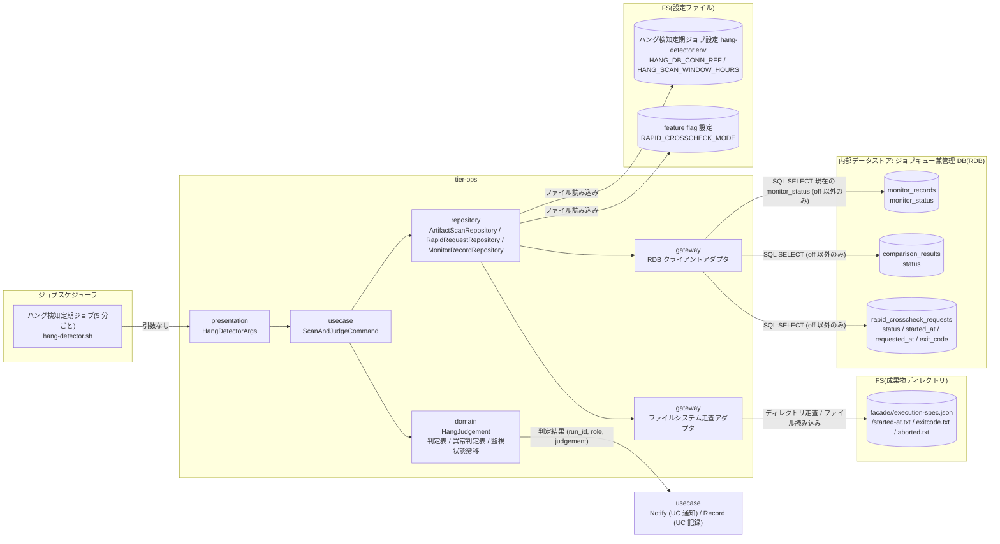
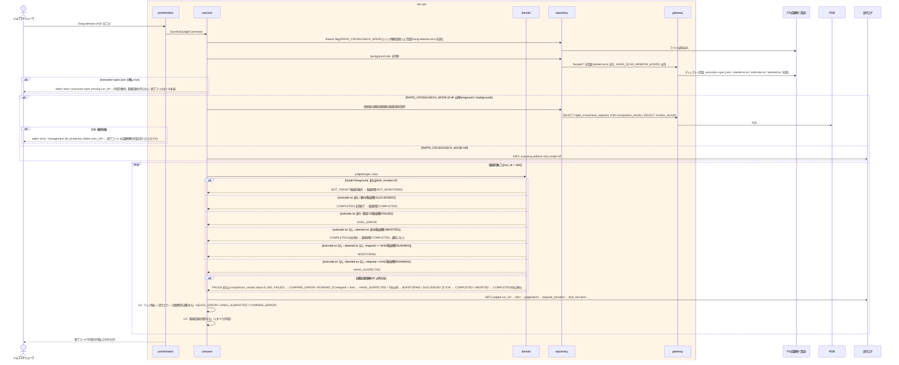

# background 実行の経過時間と終了状態を判定する

## 概要

ジョブスケジューラの定期ジョブ(5 分ごと)として起動された `hang-detector.sh` が、成果物ディレクトリを走査して background role(started-at.txt あり)と、RAPID_CROSSCHECK_MODE が off 以外(foreground / background)のとき `rapid_crosscheck_requests` の未終端依頼を列挙し、slot 実行の状態をファイル正本(exitcode.txt / aborted.txt の有無と値。条件「slot 実行の状態導出規則」)から導出し、経過時間(now - started-at)と `execution-spec.json` の `hang_detect_limit_minutes` から、監視対象外(NOT_TARGET)/ 正常終了または中止済み(COMPLETED)/ 実行エラー(EXEC_ERROR)/ 監視中(MONITORING)/ ハング疑い(HANG_SUSPECTED)と速報比較依頼の比較異常(COMPARE_ERROR)を判定する(hang_judgement 6 値 = RDRA バリエーション「ハング検知判定結果」の 6 値。cli-command-contract.yaml `shared_rules.state_codes.hang_judgement`)。hang_detect_limit_minutes が 0 の role と foreground role は監視対象外。`execution-spec.json` が無い run は判定対象外(`warn:` を出して飛ばし、監視記録も作らない)。exitcode.txt が無く `aborted.txt` がある background slot は、RAPID_CROSSCHECK_MODE によらず中止済み(COMPLETED)として監視記録を終端し通知しない。判定結果の通知は UC「ハング疑い・実行エラー・比較異常を通知する」、記録は UC「監視記録を保存する」が担う(3 UC で `hang-detector.sh` の 1 回の実行を構成する)。

## データフロー



| レイヤー | データモデル | 変換内容 |
|---------|------------|---------|
| presentation | HangDetectorArgs(`--verbose`) | 引数検証(引数なしが正常) |
| usecase | ScanAndJudgeCommand | feature flag を読む → 成果物走査 → (off 以外なら)未終端依頼の取得 → 対象ごとに判定 → 通知 UC / 記録 UC へ渡す |
| domain | MonitorTarget(run_id, role, job_id, target_type, started_at, exit_code, limit_minutes, mode, slot_status) / HangJudgement(NOT_TARGET / COMPLETED / EXEC_ERROR / MONITORING / HANG_SUSPECTED / COMPARE_ERROR の 6 値) | slot 実行の状態導出(exitcode.txt / aborted.txt の有無・値 → RUNNING / SUCCEEDED / FAILED / ABORTED)、判定表(導出状態 × 経過時間と上限)、異常判定表(依頼状態 × 比較結果)、対象除外(limit 0 / foreground → NOT_TARGET) |
| repository | ArtifactScanRepository | `facade/*/` のうち started-at.txt が `HANG_SCAN_WINDOW_HOURS` 以内の run を列挙し、execution-spec.json から job_id / role ごとの mode / hang_detect_limit_minutes を読み、`<role>/exitcode.txt` / `<role>/aborted.txt` の有無と値を読む。execution-spec.json が無い run は `warn: execution-spec missing run_id=...` を stderr に出して判定対象外にする(job_id / mode の出所が無いため。監視記録も作らない)。RAPID_CROSSCHECK_MODE によらず slot 実行の状態は成果物ファイルだけから導出する(管理 DB の `slot_executions.status` は条件付き UPDATE で一度だけ終端値を書いた複製(abort-blue / abort-green で ABORTED にした後に実装が走り切って exitcode.txt を公開した経路では ABORTED のまま残り、導出値と異なる)であり、判定には読まない) |
| repository | RapidRequestRepository(off 以外のみ) | `rapid_crosscheck_requests` の status ∈ {REQUESTED, CLAIMED, RUNNING} と、監視記録が未終端(記録なし / MONITORING / HANG_SUSPECTED_NOTIFIED)の FAILED / SUCCEEDED / ABORTED を取得し、`comparison_results.status` を結合 |
| repository | MonitorRecordRepository(off 以外のみ) | 現在の monitor_status を読む(終端済み = COMPLETED / EXEC_ERROR_NOTIFIED / COMPARE_ERROR_NOTIFIED / NOT_MONITORED は走査対象から除く。HANG_SUSPECTED_NOTIFIED は未終端として再判定する) |

## 処理フロー



## バリエーション一覧

| バリエーション名 | 値 | 処理内容 | 適用 tier | 適用箇所 |
|----------------|---|---------|----------|---------|
| ハング検知判定結果 | 監視対象外 | hang_judgement=NOT_TARGET。foreground または hang_detect_limit_minutes=0。監視状態 NOT_MONITORED | tier-ops | `is_target` |
| ハング検知判定結果 | 正常終了または中止済み | hang_judgement=COMPLETED。exitcode.txt=0(正常終了)、または exitcode.txt が無く aborted.txt がある(中止済み。RAPID_CROSSCHECK_MODE によらない)。監視状態を COMPLETED にし通知しない | tier-ops | `judge_background_role` |
| ハング検知判定結果 | 監視中 | hang_judgement=MONITORING。exitcode.txt も aborted.txt もなし・経過時間 ≤ 上限。通知しない | tier-ops | `judge_background_role` |
| ハング検知判定結果 | ハング疑い | hang_judgement=HANG_SUSPECTED。exitcode.txt も aborted.txt もなし・経過時間 > 上限。warning 通知へ | tier-ops | `judge_background_role` |
| ハング検知判定結果 | 実行エラー | hang_judgement=EXEC_ERROR。exitcode.txt 非 0。error 通知へ | tier-ops | `judge_background_role` |
| ハング検知判定結果 | 比較異常 | hang_judgement=COMPARE_ERROR。速報比較依頼の FAILED / 比較 NG(下記「速報クロスチェック監視判定」) | tier-ops | `judge_rapid_request` |
| 速報クロスチェック監視判定 | 速報クロスチェック異常(FAILED / 比較 NG) | hang_judgement=COMPARE_ERROR。依頼 FAILED または comparison_results.status ∈ {NG, FAILED}。error 通知へ | tier-ops | `judge_rapid_request` |
| 速報クロスチェック監視判定 | ハング疑い(RUNNING 継続) | hang_judgement=HANG_SUSPECTED。依頼 RUNNING かつ経過時間 > 上限。warning 通知へ。状態は変更しない | tier-ops | `judge_rapid_request` |
| 速報クロスチェック監視判定 | 正常 | 依頼 SUCCEEDED かつ比較結果 OK(COMPLETED)、依頼 ABORTED(中止済み → COMPLETED)、または REQUESTED / CLAIMED / RUNNING で上限以内(MONITORING) | tier-ops | `judge_rapid_request` |
| ハング検知上限設定 | 60 分(導入時既定) | execution-spec.json の `slots.<role>.hang_detect_limit_minutes` を使う(速報比較依頼は hang-detector.env の RAPID_HANG_DETECT_LIMIT_MINUTES) | tier-ops | `judge_background_role` / `judge_rapid_request` |
| ハング検知上限設定 | ジョブごとの調整値 | 同上(run 開始時に確定した値。以後のジョブマップ変更は反映しない) | tier-ops | `judge_background_role` |
| ハング検知上限設定 | 0(検知対象外) | 監視対象外 | tier-ops | `is_target` |
| slot 実行モード | background | 監視対象 | tier-ops | `is_target` |
| slot 実行モード | foreground | 監視対象外(ジョブスケジューラが直接監視する) | tier-ops | `is_target` |
| slot 実行モード | off | 成果物ディレクトリが無いため走査に現れない | tier-ops | `scan_artifacts` |
| 速報クロスチェックモード | foreground / background | 成果物走査 + 管理 DB の依頼走査(両値の挙動は同じ) | tier-ops | `ScanAndJudgeCommand` |
| 速報クロスチェックモード | off | 管理 DB に接続せず成果物走査のみ | tier-ops | `ScanAndJudgeCommand` |
| run role(成果物ディレクトリ区分) | blue / green | 成果物走査の対象 role | tier-ops | `scan_artifacts` |
| run role(成果物ディレクトリ区分) | rapid-crosscheck | 管理 DB の依頼として走査(成果物ディレクトリではなく依頼レコードを正とする) | tier-ops | `judge_rapid_request` |
| run role(成果物ディレクトリ区分) | final-crosscheck | 走査対象外(確報は runner の同期 polling で監視される) | tier-ops | `scan_artifacts` |
| Runner Result 成果物種別 | started-at.txt / exitcode.txt / aborted.txt | 経過時間(started-at.txt)と導出状態(exitcode.txt / aborted.txt)の判定に使う | tier-ops | `judge_background_role` |
| 設定所有区分 | ハング検知定期ジョブ設定 | hang-detector.env(HANG_DB_CONN_REF / 運用チューニング値)。所有者は基盤適用設計者 | tier-ops | `ScanAndJudgeCommand` |
| ジョブスケジューラ起動ジョブ種別 | ハング検知定期ジョブ | 業務ジョブとは別のジョブ定義から `hang-detector.sh` を定期起動(5 分ごと)する。引数なし・常駐しない | tier-ops | `hang-detector.sh`(presentation) |

## 分岐条件一覧

| 条件名 | 判定ルール | 適用 tier | 適用箇所 | BDD Scenario |
|--------|----------|----------|---------|-------------|
| slot 実行の状態導出規則 | exitcode.txt があれば 0 = SUCCEEDED / 非 0 = FAILED。無く aborted.txt があれば ABORTED。どちらも無ければ RUNNING。両方あるときは exitcode.txt を優先する(中止後に実装が終了した場合)。RAPID_CROSSCHECK_MODE によらず成果物ファイルから導出する | tier-ops | `derive_slot_status`(domain) | aborted.txt がある slot 実行は中止済みとして終端する(SPEC-010-01) |
| ハング検知判定 | 導出状態 SUCCEEDED(exitcode.txt=0)→ COMPLETED(正常終了)/ FAILED(exitcode.txt 非 0)→ EXEC_ERROR / ABORTED(exitcode.txt なし・aborted.txt あり)→ COMPLETED(中止済み。通知しない)/ RUNNING かつ elapsed ≤ limit → MONITORING / RUNNING かつ elapsed > limit → HANG_SUSPECTED。elapsed = floor((now - started-at.txt) / 60 分) | tier-ops | `judge_background_role`(domain) | 上限超過をハング疑いと判定する / 非 0 終了を実行エラーと判定する / 0 終了は通知対象外 / aborted.txt がある slot 実行は中止済みとして終端する(SPEC-010-01) |
| ハング検知対象の除外 | execution-spec.json の role の mode が foreground、または hang_detect_limit_minutes が 0 なら NOT_TARGET(監視対象外 → NOT_MONITORED) | tier-ops | `is_target`(domain) | foreground と limit 0 は監視対象外 |
| execution-spec.json 欠落 | started-at.txt があるのに execution-spec.json が無い run は契約違反状態(execution-spec.json は実装実行前に一度だけ書かれる)。job_id / mode の出所が無いため判定せず、stderr に `warn: execution-spec missing run_id=...` を出して飛ばす(監視記録も作らない。終了コードは 0 のまま) | tier-ops | `ArtifactScanRepository` | execution-spec.json が無い run は判定対象外にする |
| 速報比較依頼の異常判定 | 依頼 FAILED または comparison_results.status ∈ {NG, FAILED} → COMPARE_ERROR / RUNNING かつ elapsed(started_at 起点)> RAPID_HANG_DETECT_LIMIT_MINUTES(hang-detector.env。既定 60)→ HANG_SUSPECTED(状態は変更しない)/ SUCCEEDED かつ OK → COMPLETED / ABORTED(未終端の監視記録がある依頼のみ走査。abort-rapid-crosscheck による中止と、abort-blue / abort-green による未着手依頼(REQUESTED)の中止を含む)→ COMPLETED(中止済み)/ REQUESTED・CLAIMED・上限以内の RUNNING → MONITORING | tier-ops | `judge_rapid_request`(domain) | FAILED の速報比較依頼を比較異常と判定する / ハング疑い通知後に中止された速報比較依頼を終端する |
| 速報クロスチェック有効判定 | RAPID_CROSSCHECK_MODE=off なら管理 DB に接続せず、成果物ディレクトリだけを走査する。foreground / background(off 以外)なら管理 DB の依頼・監視記録も走査する | tier-ops | `ScanAndJudgeCommand` / `ArtifactScanRepository` | off では管理 DB なしで成果物だけを走査する |
| 成果物公開判定 | 確定名の exitcode.txt / aborted.txt が存在するときだけ「あり」とみなす。`exitcode.txt.tmp` / `aborted.txt.tmp` は無視する | tier-ops | ファイルシステム走査アダプタ | 上限超過をハング疑いと判定する(`.tmp` は無視) |

## 計算ルール一覧

| 計算名 | 入力情報 | 計算式/ロジック | 出力情報 | 適用 tier |
|--------|---------|---------------|---------|----------|
| 現在時刻(now) | システム時刻(ホストのローカルタイムゾーン)、テスト専用環境変数 `RELAY_GATE_NOW` | `RELAY_GATE_NOW`(UTC ISO 8601 Z 付きで受け取り、ローカル時刻へ変換して使う。cli-command-contract.yaml environment_variables で宣言。本番未設定)が設定されていればその変換値、未設定ならシステム時刻。判定・detected_at・judged_at のすべてに同じ now(ローカル時刻。ISO 8601 秒精度・指示子なし)を使う | 判定入力 | tier-ops |
| 経過時間 | Runner Result.started-at.txt(中身は UTC ISO 8601 Z 付き。読み取り時にローカル時刻へ変換する)、現在時刻(ローカル時刻) | elapsed_minutes = floor((now - started_at) / 60 秒)(両者を同じローカル時刻軸に揃えてから差を取る) | 監視記録.経過時間 | tier-ops |
| 経過時間(速報比較依頼) | 速報比較依頼.started_at(RUNNING)または requested_at(未開始)、現在時刻 | 同上。started_at が NULL なら requested_at 起点(継続監視のみに使い、ハング疑いには使わない。仮採用) | 監視記録.経過時間 | tier-ops |
| 上限の解決(background slot) | 実行設定(execution-spec).`slots.<role>.hang_detect_limit_minutes` | role(blue / green)の値。execution-spec.json 自体が無い run は既定値で続行せず判定対象外にする(`warn: execution-spec missing run_id=...`。job_id / mode の出所が無いため)。ファイルはあるがキーが無い場合は契約違反として同じく判定対象外(`warn: execution-spec invalid run_id=... key=slots.<role>.hang_detect_limit_minutes`) | 監視記録.hang_detect_limit_minutes | tier-ops |
| 上限の解決(速報比較依頼) | hang-detector.env の `RAPID_HANG_DETECT_LIMIT_MINUTES` | 既定 60(仮採用: 依頼は run の execution-spec.json ではなくクロスチェック側の設定値を使う) | 監視記録.hang_detect_limit_minutes | tier-ops |
| 走査範囲 | started-at.txt、HANG_SCAN_WINDOW_HOURS(既定 72。仮採用) | now - started_at ≤ HANG_SCAN_WINDOW_HOURS の run だけを走査する(監視記録が終端の run は除く) | 走査対象 | tier-ops |
| exitcode.txt の解釈 | exitcode.txt(数値 1 行) | 整数(0〜999)として読む。整数でなければ EXEC_ERROR とし、通知の exit_code は `-`(値なし。asyncapi.yaml `HangAlertMail.exit_code` の pattern `^([0-9]{1,3}\|-)$` に合わせる。`-1` は使わない)にして実行ログに `WARN invalid exitcode run_id=... role=... value=...` を残す(仮採用: 契約違反を異常として扱う) | 判定入力 | tier-ops |

## 状態遷移一覧

| 状態モデル | 遷移元 | 遷移先 | トリガー | 事前条件 | 事後処理 | 適用 tier |
|-----------|--------|--------|---------|---------|---------|----------|
| 監視状態 | `[*]` | 監視対象外(NOT_MONITORED) | 定期ジョブが監視記録を作成 | role の mode が foreground、または hang_detect_limit_minutes=0 | 通知しない。UC「監視記録を保存する」で記録 | tier-ops |
| 監視状態 | `[*]` | 監視中(MONITORING) | 定期ジョブが監視記録を作成 | background slot または速報比較依頼で limit > 0、exitcode.txt 未出力かつ elapsed ≤ limit | 通知しない。記録 | tier-ops |
| 監視状態 | `[*]` | 正常終了(COMPLETED) | 定期ジョブが監視記録を作成 | 初回判定時に既に exitcode.txt=0、または exitcode.txt が無く aborted.txt がある(依頼は SUCCEEDED かつ OK / ABORTED)。契約 monitor_status_transitions の「(初回判定)→ COMPLETED」 | 通知しない。COMPLETED の監視記録を UPSERT(状態.tsv「監視状態」に無い遷移。rdra-feedback 候補) | tier-ops |
| 監視状態 | 監視中(MONITORING) | 正常終了(COMPLETED) | 定期ジョブの判定 | exitcode.txt=0(依頼は SUCCEEDED かつ OK)、または中止済み(exitcode.txt が無く aborted.txt がある / 依頼 ABORTED) | 通知しない。記録 | tier-ops |
| 監視状態 | ハング疑い通知済み(HANG_SUSPECTED_NOTIFIED) | 正常終了(COMPLETED) | 定期ジョブの判定 | 通知後に exitcode.txt=0(通知後正常終了。依頼は通知後に SUCCEEDED かつ OK)、または通知後に中止済み(aborted.txt / 依頼 ABORTED) | 警告時の経過時間(elapsed_minutes_at_alert)を残したまま COMPLETED にする | tier-ops |

- ハング疑い通知後(HANG_SUSPECTED_NOTIFIED)の対象は終端ではなく、次回以降の定期ジョブで引き続き走査・再判定する。中止済み(aborted.txt / 依頼 ABORTED)を正常終了(COMPLETED)で終端する遷移と、通知後正常終了(HANG_SUSPECTED_NOTIFIED → COMPLETED)は状態.tsv「監視状態」に定義された遷移である(監視記録を終端にして hang-detect-trend.sh の run_count に永続的に数えない)
- (監視中 → ハング疑い通知済み / 実行エラー通知済み / 比較異常通知済み、ハング疑い通知済み → 実行エラー通知済み / 比較異常通知済み は UC「ハング疑い・実行エラー・比較異常を通知する」に記載)

## 関連 RDRA モデル

| モデル種別 | 要素名 | 関連 |
|-----------|--------|------|
| 業務 | 実行監視業務 | この UC が属する業務 |
| BUC | background 実行監視フロー | この UC を含む BUC |
| アクター | 運用者 | 受益者 |
| 情報 | slot 実行 | 監視対象(background)。状態は成果物ファイル正本(exitcode.txt / aborted.txt)から導出する |
| 情報 | Runner Result | started-at.txt / exitcode.txt / aborted.txt(中止時のみ) |
| 情報 | 実行設定(execution-spec) | `slots.<role>.mode` と `slots.<role>.hang_detect_limit_minutes` |
| 情報 | ハング検知上限設定 | 上限値 |
| 情報 | 速報比較依頼(rapid_crosscheck_request) | 監視対象(off 以外)。ABORTED(abort-blue / abort-green による未着手依頼の中止を含む)は中止済み終端 |
| 情報 | 比較結果(comparison_result) | NG / FAILED の判定入力(off 以外) |
| 情報 | feature flag 設定 | RAPID_CROSSCHECK_MODE(foreground / background / off)の読み取り |
| 情報 | ハング検知定期ジョブ設定 | hang-detector.env。管理 DB 接続参照名 HANG_DB_CONN_REF(off 以外で使用)と運用チューニング値の出所 |
| 情報 | 監視記録 | 現在の monitor_status の読み取り |
| 状態 | 監視状態 | `[*]` → NOT_MONITORED / MONITORING、MONITORING → COMPLETED(正常終了・中止済み)、HANG_SUSPECTED_NOTIFIED → COMPLETED(通知後正常終了・通知後の中止済み) |
| バリエーション | ハング検知判定結果 | 6 値(監視対象外 / 正常終了または中止済み / 監視中 / ハング疑い / 実行エラー / 比較異常)= hang_judgement |
| バリエーション | Runner Result 成果物種別 | started-at.txt / exitcode.txt / aborted.txt |
| バリエーション | 速報クロスチェックモード | foreground / background / off |
| バリエーション | ジョブスケジューラ起動ジョブ種別 | ハング検知定期ジョブ(hang-detector.sh の定期起動) |
| バリエーション | ハング検知上限設定 | 60 分(導入時既定)/ ジョブごとの調整値 / 0(検知対象外) |
| バリエーション | slot 実行モード | background のみ監視対象(foreground は対象外、off は走査に現れない) |
| バリエーション | run role(成果物ディレクトリ区分) | blue / green は成果物走査、rapid-crosscheck は依頼走査、final-crosscheck は対象外 |
| バリエーション | 速報クロスチェック監視判定 | 3 値(速報クロスチェック異常 / ハング疑い(RUNNING 継続)/ 正常) |
| バリエーション | 設定所有区分 | ハング検知定期ジョブ設定(hang-detector.env。所有者: 基盤適用設計者) |
| 条件 | slot 実行の状態導出規則 | exitcode.txt / aborted.txt からの状態導出 |
| 条件 | ハング検知判定 | 判定表(aborted.txt がある対象は中止済みとして終端) |
| 条件 | ハング検知対象の除外 | foreground / limit 0 |
| 条件 | 速報比較依頼の異常判定 | 依頼状態 × 比較結果 |
| 条件 | 速報クロスチェック有効判定 | off では DB に触れない |
| 条件 | 成果物公開判定 | 確定名のみを読む |
| 画面 | hang-detect 判定出力(→ CLI 出力) | `--verbose` 時の `info: judged ...` と実行ログ |
| イベント | 定期監視ジョブの起動 | ジョブスケジューラ |
| イベント | 未完了依頼の走査 | 管理 DB の SELECT |
| 外部システム | ジョブスケジューラ | 起動元 |
| 内部データストア | ジョブキュー兼管理 DB(RDB) | 依頼・監視記録(relay-gate 内部の構成要素。外部システムではない) |

## 関連 USDM

| REQ ID | SPEC ID | 対応 BDD Scenario |
|--------|---------|------------------|
| REQ-008 | SPEC-008-01 | 上限超過をハング疑いと判定する(SPEC-008-01) / 非 0 終了を実行エラーと判定する(SPEC-008-01) / 0 終了は通知対象外(SPEC-008-01) |
| REQ-008 | SPEC-008-02 | FAILED の速報比較依頼を比較異常と判定する(SPEC-008-02) |
| REQ-008 | SPEC-008-03 | off では管理 DB なしで成果物だけを走査する(SPEC-008-03) / ハング疑い通知後に中止された slot 実行を終端する(SPEC-008-03) |
| REQ-010 | SPEC-010-01 | aborted.txt がある slot 実行は中止済みとして終端する(SPEC-010-01) / off でも aborted.txt がある slot 実行は中止済みとして終端する(SPEC-010-01) |
| REQ-003 | SPEC-003-04 | 上限超過をハング疑いと判定する(SPEC-008-01) |

## E2E 完了条件(BDD)

### 正常系

```gherkin
Feature: background 実行の経過時間と終了状態を判定する

  Scenario: 上限超過をハング疑いと判定する(SPEC-008-01)
    Given 成果物 facade/20260830T113000-JOB001-3f9a1c2e/execution-spec.json に job_id=JOB001 slots.green.mode=background slots.green.hang_detect_limit_minutes=60 がある
    And facade/20260830T113000-JOB001-3f9a1c2e/green/started-at.txt の中身が 2026-08-30T11:30:05Z で exitcode.txt が無い(exitcode.txt.tmp は存在する)
    And RELAY_GATE_NOW=2026-08-30T12:45:00Z である
    When ジョブスケジューラが hang-detector.sh を起動する
    Then run_id=20260830T113000-JOB001-3f9a1c2e role=green の判定は HANG_SUSPECTED、elapsed_minutes=74、hang_detect_limit_minutes=60 である
    And 実行ログに "INFO judged run_id=20260830T113000-JOB001-3f9a1c2e role=green judgement=HANG_SUSPECTED elapsed_minutes=74 limit_minutes=60" が残る
    And 終了コード 0 で終了する

  Scenario: 上限内は継続監視と判定する(SPEC-008-01)
    Given 同じ run の green/exitcode.txt が無く、RELAY_GATE_NOW=2026-08-30T12:00:00Z である
    When hang-detector.sh を起動する
    Then 判定は MONITORING、elapsed_minutes=29、hang_detect_limit_minutes=60 で通知は行われない

  Scenario: 非 0 終了を実行エラーと判定する(SPEC-008-01)
    Given 同じ run の green/exitcode.txt の中身が 1 である
    When hang-detector.sh を起動する
    Then 判定は EXEC_ERROR、exit_code=1 である

  Scenario: 0 終了は通知対象外(SPEC-008-01)
    Given 同じ run の green/exitcode.txt の中身が 0 である
    When hang-detector.sh を起動する
    Then 判定は COMPLETED で通知は行われず、監視状態は COMPLETED になる

  Scenario: foreground と limit 0 は監視対象外
    Given execution-spec.json に slots.blue.mode=foreground slots.blue.hang_detect_limit_minutes=0 と slots.green.mode=background slots.green.hang_detect_limit_minutes=0 がある
    And blue/started-at.txt と green/started-at.txt があり exitcode.txt が無い
    When hang-detector.sh を起動する
    Then blue と green の判定はともに NOT_TARGET(監視対象外)で、経過時間にかかわらず通知せず、監視状態は NOT_MONITORED になる

  Scenario: aborted.txt がある slot 実行は中止済みとして終端する(SPEC-010-01)
    Given RAPID_CROSSCHECK_MODE=background で monitor_records に run_id=20260830T113000-JOB001-3f9a1c2e role=green monitor_status=MONITORING の行がある
    And green/exitcode.txt は無く、abort-green.sh が書いた green/aborted.txt(中身 2026-08-30T12:40:00Z)があり、RELAY_GATE_NOW=2026-08-30T12:45:00Z(上限超過相当)である
    When hang-detector.sh を起動する
    Then slot 実行の状態は ABORTED と導出され、判定は COMPLETED(中止済み)で warning メールは送られず、監視状態は COMPLETED になる
    And 以後の定期実行で同じ run_id / role にメールは送られない

  Scenario: off でも aborted.txt がある slot 実行は中止済みとして終端する(SPEC-010-01)
    Given RAPID_CROSSCHECK_MODE=off で管理 DB が存在しない
    And green/exitcode.txt は無く green/aborted.txt があり、RELAY_GATE_NOW=2026-08-30T12:45:00Z(上限超過相当)である
    When hang-detector.sh を起動する
    Then 管理 DB に接続せず、green の判定は成果物ファイルだけから COMPLETED(中止済み)になり、メールは送られない

  Scenario: ハング疑い通知後に中止された slot 実行を終端する(SPEC-008-03)
    Given RAPID_CROSSCHECK_MODE=background で monitor_records に run_id=20260830T113000-JOB001-3f9a1c2e role=green monitor_status=HANG_SUSPECTED_NOTIFIED の行がある
    And その後 abort-green.sh により green/aborted.txt が書かれ、green/exitcode.txt は無い
    When hang-detector.sh を起動する
    Then 判定は COMPLETED(中止済み)で監視記録は monitor_status=COMPLETED で終端し、以後の定期実行で再判定されない

  Scenario: aborted.txt と exitcode.txt が両方あるときは exitcode.txt を優先する
    Given green/aborted.txt があり、その後に実装が終了して green/exitcode.txt の中身が 1 になった
    When hang-detector.sh を起動する
    Then slot 実行の状態は FAILED と導出され、判定は EXEC_ERROR、exit_code=1 である

  Scenario: execution-spec.json が無い run は判定対象外にする
    Given facade/20260830T113000-JOB002-9a8b7c6d/green/started-at.txt があり execution-spec.json が無い
    When hang-detector.sh を起動する
    Then stderr に "warn: execution-spec missing run_id=20260830T113000-JOB002-9a8b7c6d path: $RELAY_GATE_ARTIFACT_ROOT/facade/20260830T113000-JOB002-9a8b7c6d/execution-spec.json" が出て、この run の判定・通知・監視記録は行われない
    And 他の run の判定は継続し、終了コード 0 で終了する

  Scenario: FAILED の速報比較依頼を比較異常と判定する(SPEC-008-02)
    Given RAPID_CROSSCHECK_MODE=background である
    And rapid_crosscheck_requests に run_id=20260830T113000-JOB001-3f9a1c2e job_id=JOB001 status=FAILED exit_code=3 の行があり comparison_results に status=NG の行がある
    When hang-detector.sh を起動する
    Then run_id=20260830T113000-JOB001-3f9a1c2e role=rapid-crosscheck の判定は COMPARE_ERROR である

  Scenario: ハング疑い通知後の速報比較依頼も再判定する(SPEC-008-02)
    Given RAPID_CROSSCHECK_MODE=background で monitor_records に run_id=20260830T113000-JOB001-3f9a1c2e role=rapid-crosscheck monitor_status=HANG_SUSPECTED_NOTIFIED の行がある
    And rapid_crosscheck_requests の該当行が status=FAILED exit_code=3 になり comparison_results に status=NG の行がある
    When hang-detector.sh を起動する
    Then 該当依頼は走査対象に含まれ、role=rapid-crosscheck の判定は COMPARE_ERROR である

  Scenario: ハング疑い通知後に中止された速報比較依頼を終端する
    Given RAPID_CROSSCHECK_MODE=background で monitor_records に run_id=20260830T113000-JOB001-3f9a1c2e role=rapid-crosscheck monitor_status=HANG_SUSPECTED_NOTIFIED の行がある
    And rapid_crosscheck_requests の該当行が abort-rapid-crosscheck.sh により status=ABORTED になっている
    When hang-detector.sh を起動する
    Then 該当依頼は走査対象に含まれ(status=ABORTED かつ未終端の監視記録がある)、role=rapid-crosscheck の判定は COMPLETED(中止済み)で監視状態は COMPLETED になる

  Scenario: off では管理 DB なしで成果物だけを走査する(SPEC-008-03)
    Given RAPID_CROSSCHECK_MODE=off で管理 DB が存在しない
    And facade/20260830T113000-JOB001-3f9a1c2e/green/started-at.txt が 2026-08-30T11:30:05Z で exitcode.txt も aborted.txt も無く、execution-spec.json に job_id=JOB001 slots.green.mode=background slots.green.hang_detect_limit_minutes=60 がある
    And RELAY_GATE_NOW=2026-08-30T12:00:00Z である
    When hang-detector.sh を起動する
    Then 管理 DB への接続は行われず、green の判定は成果物ファイルだけから MONITORING elapsed_minutes=29 になる
    And 実行ログに "INFO scanning artifacts only mode=off" が残り終了コード 0 で終了する
```

### 異常系

```gherkin
  Scenario: RAPID_CROSSCHECK_MODE=background で管理 DB に接続できない
    Given RAPID_CROSSCHECK_MODE=background でハング検知定期ジョブ設定(hang-detector.env)の HANG_DB_CONN_REF=relaygate-db が解決できない接続先を指す
    When hang-detector.sh を起動する
    Then 成果物の判定は行われ、終了コード 6 で stderr に "error: management db connection failed conn_ref=relaygate-db" が出る

  Scenario: started-at.txt の形式が不正
    Given green/started-at.txt の中身が "yesterday" である
    When hang-detector.sh を起動する
    Then この role は判定せず stderr に "warn: started-at is invalid run_id=20260830T113000-JOB001-3f9a1c2e role=green value=yesterday" を出し、実行ログに "WARN started-at is invalid run_id=20260830T113000-JOB001-3f9a1c2e role=green value=yesterday" を残し、他の対象の判定は継続する

  Scenario: exitcode.txt が整数でない
    Given green/exitcode.txt の中身が "abc" である
    When hang-detector.sh を起動する
    Then 判定は EXEC_ERROR で、通知に載せる exit_code は "-" であり、実行ログに "WARN invalid exitcode run_id=20260830T113000-JOB001-3f9a1c2e role=green value=abc" が残る
```

## ティア別仕様

- [実行監視・復旧ティア](tier-ops.md)

### 統合 API Spec

- [CLI コマンド契約](../../../_cross-cutting/api/cli-command-contract.yaml)(`hang-detector.sh`)
- [AsyncAPI Spec](../../../_cross-cutting/api/asyncapi.yaml)(本 UC は `rapid-crosscheck-requests` を参照するのみ。publish は UC「ハング疑い・実行エラー・比較異常を通知する」の `hang-alert-mail`)
