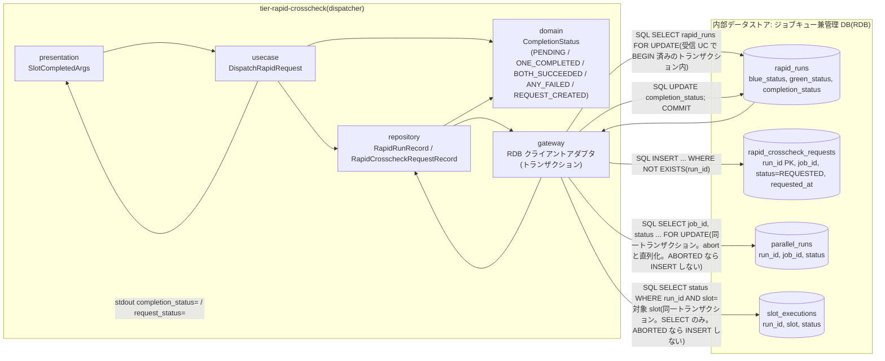
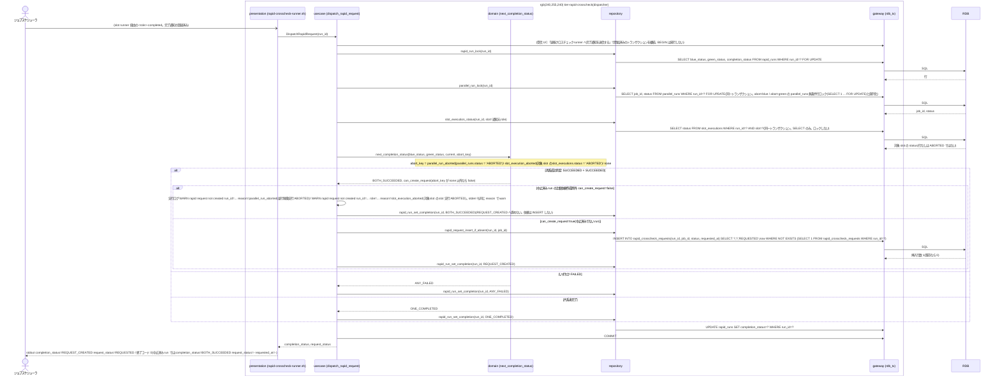

# 両系成功時に速報比較依頼を作成する

## 概要

速報クロスチェック runner(dispatcher)が完了通知を受けて rapid_run の blue_status / green_status を更新した後、速報実行の完了状況を PENDING → ONE_COMPLETED → BOTH_SUCCEEDED / ANY_FAILED → REQUEST_CREATED へ進める。blue と green の両方が成功(exit_code 0)したときに限り、完了順にかかわらず rapid_crosscheck_requests を run_id 主キーで 1 件だけ REQUESTED で INSERT する。いずれかが失敗した場合は比較依頼を作成せず終了する。run が中止済み(`parallel_runs.status` が ABORTED、**または**完了通知の対象 slot(通知元 role の slot。blue の通知なら slot='blue' の行)の `slot_executions.status` が ABORTED = 対象 slot に aborted.txt が公開済みのミラー)の場合は、両系成功でも速報比較依頼を作成せず、完了事実(blue_status / green_status / 成果物 URI / 受信日時)だけを記録して実行ログに警告を残す(条件「中止済み run の比較依頼作成除外」。判断主体は本 dispatcher で、slot runner は自 slot の中止状態を判断しない。並行稼働実行は foreground slot の結果を中継した時点で COMPLETED になるため、foreground 完了後に background slot を abort-blue / abort-green で中止した run は対象 slot の slot 実行 ABORTED の側で除外される)。判定材料は同一トランザクションで読む: parallel_runs は `FOR UPDATE` で読んで abort-blue / abort-green の parallel_runs 無条件行ロック(SELECT 1 ... FOR UPDATE)と直列化し、対象 slot の slot_executions は SELECT のみで読む。判定と INSERT は 1 トランザクション・条件付き INSERT で行い重複を防ぐ。速報の結果はジョブスケジューラ応答に影響させず、確報側(final_*)には触れない。

## データフロー



| レイヤー | データモデル | 変換内容 |
|---------|------------|---------|
| presentation | SlotCompletedArgs | 受信 UC と同じ起動(完了通知の登録に続けて実行) |
| usecase | DispatchRapidRequest | 行ロック → parallel_runs.status 参照(FOR UPDATE)→ 対象 slot の slot_executions.status 参照(SELECT のみ)→ 判定 → 条件付き INSERT(中止済み run では行わない)→ completion_status 更新を 1 トランザクションで実行 |
| domain | CompletionStatus | blue_status × green_status の判定表(下記)で次の完了状況を決める。純粋関数。run の中止済み判定(並行稼働実行 ABORTED / 対象 slot の slot 実行 ABORTED / いずれでもない)との組で依頼作成の可否を決める(判定表は「処理フロー」末尾。arch LP-010) |
| repository | RapidRunRecord / RapidCrosscheckRequestRecord / ParallelRunRecord / SlotExecutionRecord | rapid_runs の SELECT FOR UPDATE / UPDATE、parallel_runs の SELECT(job_id, status)FOR UPDATE、slot_executions の SELECT(status。対象 slot の行)、rapid_crosscheck_requests の INSERT |
| gateway | RDB アダプタ | 受信 UC で BEGIN 済みのトランザクションを継続し、本 UC が COMMIT / ROLLBACK と SQL 実行を行う |

## 処理フロー



### 依頼作成の判定表(条件「両系成功判定」×「中止済み run の比較依頼作成除外」。arch LP-010)

縦軸 = run の中止済み判定(3 値: 並行稼働実行 ABORTED / 対象 slot の slot 実行 ABORTED / いずれでもない)、横軸 = blue_status × green_status の両系成功判定。依頼を作成するのは「いずれでもない × 両系成功」の 1 セルだけ。判定材料は同一トランザクションで読んだ `parallel_runs.status`(FOR UPDATE)と、完了通知の対象 slot(通知元 role の slot)の `slot_executions.status`(SELECT のみ。abort-blue / abort-green が aborted.txt 公開と同一トランザクションで ABORTED に更新済みのミラー)。

| run の中止済み判定 \ 両系成功判定 | 両系成功(SUCCEEDED × SUCCEEDED) | いずれか失敗(どちらかが FAILED) | 片系未完了(どちらかが NULL) |
|---|---|---|---|
| 並行稼働実行 ABORTED(`parallel_runs.status = 'ABORTED'`) | **作成しない** → BOTH_SUCCEEDED のまま。実行ログ `WARN rapid request not created run_id=... reason=parallel_run_aborted`、終了コード 0 | 作成しない → ANY_FAILED | 作成しない → ONE_COMPLETED(完了事実だけ記録) |
| 対象 slot の slot 実行 ABORTED(parallel_runs は ABORTED でなく、対象 slot の `slot_executions.status = 'ABORTED'`) | **作成しない** → BOTH_SUCCEEDED のまま。実行ログ `WARN rapid request not created run_id=... role=... reason=slot_execution_aborted`、終了コード 0 | 作成しない → ANY_FAILED | 作成しない → ONE_COMPLETED(完了事実だけ記録) |
| いずれでもない(parallel_runs が RUNNING / STARTED / COMPLETED 等で、対象 slot の slot_executions が ABORTED でない。行なしを含む) | 依頼を INSERT → completion_status=REQUEST_CREATED | 作成しない → ANY_FAILED | 作成しない → ONE_COMPLETED(待機) |

典型経路: 並行稼働実行は foreground slot の結果を中継した時点で COMPLETED になるため、foreground 完了後に background slot を abort-blue / abort-green で中止した run は「対象 slot の slot 実行 ABORTED」の行で除外される。中止した run を `background-rerun.sh --role rapid-crosscheck` でリランした場合は新 run_id(parallel_runs は RUNNING、slot_executions 行なし)で依頼が作成される。

ロック順(arch LP-021 と整合。デッドロックなし): dispatcher は rapid_runs(FOR UPDATE)→ parallel_runs(FOR UPDATE)→ slot_executions(対象 slot の行の SELECT)→ rapid_crosscheck_requests(INSERT)。abort-blue / abort-green は slot_executions → parallel_runs(`SELECT 1 ... FOR UPDATE`。無条件の行ロック。COMPLETED でも取る)→ parallel_runs 条件付き UPDATE → rapid_crosscheck_requests(REQUESTED のみ)。worker は rapid_crosscheck_requests → parallel_runs。abort が先に COMMIT すれば dispatcher は COMMIT 後の状態(parallel_runs ABORTED または対象 slot の slot_executions ABORTED)を読んで依頼を作らず、dispatcher が先なら abort の parallel_runs 行ロック(FOR UPDATE)が dispatcher の COMMIT を待ってから rapid_crosscheck_requests の REQUESTED を 1 件 ABORTED にする(競合窓の保険。本条件と併用。正本は `_cross-cutting/datastore/rdb-schema.yaml` の `_review_notes`)。「abort が先なら作らない」は abort の slot_executions UPDATE が 1 件(slot が RUNNING のまま中止できた)ときの保証で、0 件(runner の終端 UPDATE が先に COMMIT 済み)のときは slot はファイル正本でも SUCCEEDED / FAILED(exitcode.txt 優先)であり、完了通知で依頼が作成されるのは正しい振る舞い。

## バリエーション一覧

| バリエーション名 | 値 | 処理内容 | 適用 tier | 適用箇所 |
|----------------|---|---------|----------|---------|
| 実装スロット | blue | blue_status を判定入力にする | tier-rapid-crosscheck | next_completion_status |
| 実装スロット | green | green_status を判定入力にする | tier-rapid-crosscheck | next_completion_status |
| 速報クロスチェックのプロセス役割 | runner(dispatcher) | 本 UC の実行主体。依頼作成のみ行い比較は行わない | tier-rapid-crosscheck | dispatch_rapid_request |
| 速報クロスチェックのプロセス役割 | worker | REQUESTED の依頼を後続で claim する(別 UC) | tier-rapid-crosscheck | — |
| クロスチェック依頼状態 | REQUESTED | 作成時の初期状態 | tier-rapid-crosscheck | rapid_request_insert_if_absent |
| クロスチェック種別 | 速報クロスチェック | rapid_crosscheck_requests に作成する。確報依頼は作らない | tier-rapid-crosscheck | dispatch_rapid_request |
| 速報クロスチェックモード | foreground / background | 完了通知を受けて本 UC を実行する(両値で同じ挙動) | tier-rapid-crosscheck | rapid-crosscheck-runner.sh |
| 速報クロスチェックモード | off | 完了通知も依頼も存在しないため本 UC は起動されない(中止済み run の比較依頼作成除外は速報有効時だけに適用) | tier-rapid-crosscheck | rapid-crosscheck-runner.sh |

## 分岐条件一覧

| 条件名 | 判定ルール | 適用 tier | 適用箇所 | BDD Scenario |
|--------|----------|----------|---------|-------------|
| 両系成功判定 | blue_status × green_status の表: SUCCEEDED × SUCCEEDED → BOTH_SUCCEEDED(依頼作成)。どちらかが FAILED → ANY_FAILED(作成しない)。どちらかが NULL → ONE_COMPLETED(待機)。ただし条件「中止済み run の比較依頼作成除外」に該当する run(並行稼働実行 ABORTED、または対象 slot の slot 実行 ABORTED)は両系成功でも依頼を作成しない | tier-rapid-crosscheck | next_completion_status(domain) | 後に完了した側の通知で依頼が 1 件作成される / blue が失敗なら依頼を作成しない |
| 中止済み run の比較依頼作成除外 | 同一トランザクション内で読んだ `parallel_runs.status`(`SELECT job_id, status ... FOR UPDATE`)が `ABORTED`、**または**完了通知の対象 slot(通知元 role の slot。blue の通知なら slot='blue' の行)の `slot_executions.status`(`SELECT status ... WHERE run_id = ? AND slot = ?`。SELECT のみ)が `ABORTED`(aborted.txt 公開済みのミラー)なら、両系成功でも rapid_crosscheck_requests を INSERT しない。判定表は縦軸 3 値(並行稼働実行 ABORTED / 対象 slot の slot 実行 ABORTED / いずれでもない)× 横軸両系成功判定で、依頼を作成するのは「いずれでもない × 両系成功」だけ(処理フロー末尾。arch LP-010)。並行稼働実行は foreground slot の結果を中継した時点で COMPLETED になるため、foreground 完了後に background slot を abort-blue / abort-green で中止した典型経路は対象 slot の slot 実行 ABORTED の側で除外する。完了事実(blue_status / green_status / 成果物 URI / 受信日時)は記録し、completion_status は BOTH_SUCCEEDED のまま(REQUEST_CREATED へ進めない)。実行ログは判定キーで分ける: `WARN rapid request not created run_id=... reason=parallel_run_aborted`(並行稼働実行 ABORTED)/ `WARN rapid request not created run_id=... role=... reason=slot_execution_aborted`(対象 slot の slot 実行 ABORTED)。stderr も同様に `warn: rapid request not created run_id=... reason=parallel_run_aborted` / `warn: rapid request not created run_id=... role=... reason=slot_execution_aborted`(継続)。stdout `request_status=-` / `requested_at=-`、終了コード 0。parallel_runs の FOR UPDATE により abort-blue / abort-green の parallel_runs 無条件行ロック(SELECT 1 ... FOR UPDATE)と直列化し、abort が先なら COMMIT 後の ABORTED を読み、dispatcher が先なら abort 側が REQUESTED の依頼を ABORTED にする(競合窓の保険。併用)。判断主体は本 dispatcher で、slot runner は自 slot の中止状態(aborted.txt)を判断せず通常どおり通知する(条件「完了通知の系統独立」)。RAPID_CROSSCHECK_MODE=off では完了通知も依頼も存在しないため速報有効時だけに適用する。中止した run を background-rerun --role rapid-crosscheck でリランした場合は新 run_id(parallel_runs RUNNING、slot_executions 行なし)で依頼が作成される。判定材料の slot_executions.status は条件「slot 実行の状態導出規則」により abort 後に実装が走り切って exitcode.txt を公開しても ABORTED のまま残る(再同期しない) | tier-rapid-crosscheck | next_completion_status(domain)/ dispatch_rapid_request(usecase)/ parallel_run_lock・slot_execution_status(repository) | 並行稼働実行が ABORTED の run では完了通知を受けても依頼を作成しない / ABORTED の run で両系成功になっても依頼を作成せず警告を残す / parallel_runs が COMPLETED で対象 slot の slot 実行が ABORTED の run では完了通知を受けても依頼を作成しない / foreground の blue 完了後に abort-green で中止した green が走り切って完了通知を送っても依頼を作成せず警告を残す / 中止した run のリランでは新しい run_id で依頼が作成される / abort-blue で ABORTED にした slot の実装が走り切って exitcode.txt を公開しても slot_executions.status は ABORTED のままである |
| 比較依頼の一意性 | rapid_crosscheck_requests の主キー run_id と `INSERT ... WHERE NOT EXISTS` により 1 run_id に 1 件。同一トランザクション内で rapid_runs を行ロック(FOR UPDATE)して両通知の同時到着でも 1 件 | tier-rapid-crosscheck | rapid_request_insert_if_absent(repository)/ dispatch_rapid_request(usecase) | green 先行・blue 後続でも依頼は 1 件 |
| 依頼状態遷移規則 | 依頼は REQUESTED で作成する(以降の遷移は worker) | tier-rapid-crosscheck | rapid_request_insert_if_absent | 後に完了した側の通知で依頼が 1 件作成される |
| 速報と確報のモデル分離 | rapid_runs / rapid_crosscheck_requests のみ更新。final_crosscheck_requests を作成・変更しない | tier-rapid-crosscheck | dispatch_rapid_request | 後に完了した側の通知で依頼が 1 件作成される |
| 速報結果の位置付け | 依頼の作成有無・失敗は slot runner の終了コードやジョブスケジューラ応答に影響しない(送信側 UC の gateway が非 0 を吸収) | tier-rapid-crosscheck | rapid-crosscheck-runner.sh(presentation の終了コードは通知元にだけ返る) | blue が失敗なら依頼を作成しない |
| 速報クロスチェック有効判定 | 本コマンドは RAPID_CROSSCHECK_MODE が off 以外(foreground / background)のときだけ slot runner から起動される。off では起動されず DB に触れない | tier-rapid-crosscheck | rapid-crosscheck-runner.sh | — |

## 計算ルール一覧

| 計算名 | 入力情報 | 計算式/ロジック | 出力情報 | 適用 tier |
|--------|---------|---------------|---------|----------|
| 完了状況の遷移 | blue_status, green_status(NULL / SUCCEEDED / FAILED), parallel_runs.status, 対象 slot の slot_executions.status | 両方 NULL → PENDING、片方のみ非 NULL かつ SUCCEEDED → ONE_COMPLETED、いずれか FAILED → ANY_FAILED、両方 SUCCEEDED → BOTH_SUCCEEDED、INSERT 成功後 → REQUEST_CREATED(run が中止済み = parallel_runs.status が ABORTED、または対象 slot の slot_executions.status が ABORTED、なら INSERT せず BOTH_SUCCEEDED のまま) | rapid_runs.completion_status | tier-rapid-crosscheck |
| requested_at | 現在時刻 | ホストのローカルタイムゾーンの ISO 8601 秒精度(タイムゾーン指示子なし。run_id の時刻部と同じ時刻軸) | rapid_crosscheck_requests.requested_at | tier-rapid-crosscheck |
| job_id の確定 | 通知の `--job-id`、parallel_runs.job_id | parallel_runs.job_id を正とする。通知の値は照合のみで、不一致なら `warn: job_id mismatch run_id=... notified=... recorded=...` を出して parallel_runs の値を採用する | rapid_crosscheck_requests.job_id | tier-rapid-crosscheck |

## 状態遷移一覧

| 状態モデル | 遷移元 | 遷移先 | トリガー | 事前条件 | 事後処理 | 適用 tier |
|-----------|--------|--------|---------|---------|---------|----------|
| 速報実行の完了状況 | 両系未完了(PENDING) | 片系完了(ONE_COMPLETED) | 先に完了した側の通知 | その側が SUCCEEDED | completion_status 更新 | tier-rapid-crosscheck |
| 速報実行の完了状況 | 両系未完了(PENDING) | いずれか失敗(ANY_FAILED) | 先に完了した側の通知 | その側が FAILED | 依頼を作成しない | tier-rapid-crosscheck |
| 速報実行の完了状況 | 片系完了(ONE_COMPLETED) | 両系成功(BOTH_SUCCEEDED) | 後に完了した側の通知 | 両方 SUCCEEDED | 続けて依頼作成 | tier-rapid-crosscheck |
| 速報実行の完了状況 | 片系完了(ONE_COMPLETED) | いずれか失敗(ANY_FAILED) | 後に完了した側の通知 | 後の側が FAILED | 依頼を作成しない | tier-rapid-crosscheck |
| 速報実行の完了状況 | 両系成功(BOTH_SUCCEEDED) | 比較依頼作成済み(REQUEST_CREATED) | 条件付き INSERT 成功 | rapid_crosscheck_requests に run_id が無い。かつ run が中止済みでない(parallel_runs.status が ABORTED でなく、対象 slot の slot_executions.status も ABORTED でない。中止済みの run は条件「中止済み run の比較依頼作成除外」により本遷移を行わず BOTH_SUCCEEDED に留まる) | 同一トランザクションで COMMIT | tier-rapid-crosscheck |
| クロスチェック依頼 | `[*]` | REQUESTED | 両系成功判定 | run_id 主キーで未作成。run が中止済みでない(parallel_runs.status が ABORTED でなく、対象 slot の slot_executions.status も ABORTED でない) | worker の取得待ち | tier-rapid-crosscheck |

## 関連 RDRA モデル

| モデル種別 | 要素名 | 関連 |
|-----------|--------|------|
| 業務 | クロスチェック業務 | この UC が属する業務 |
| BUC | 速報クロスチェックフロー | この UC を含む BUC(アクティビティ: 比較依頼の作成判定) |
| アクター | 運用者 | 受益者(自動) |
| 情報 | 完了通知 | 判定の入力 |
| 情報 | 速報実行(rapid_run) | 更新する |
| 情報 | 速報比較依頼(rapid_crosscheck_request) | 作成する |
| 情報 | 並行稼働実行(parallel_run) | run_id / job_id の相関元。status(ABORTED か否か)を同一トランザクションで `FOR UPDATE` で参照する(abort-blue / abort-green の parallel_runs 無条件行ロック(SELECT 1 ... FOR UPDATE)と直列化) |
| 情報 | slot 実行 | 完了通知の対象 slot(通知元 role の slot)の slot_executions.status(ABORTED か否か)を同一トランザクションで参照する(SELECT のみ。aborted.txt 公開済みのミラー。tier-rapid-crosscheck) |
| 情報 | 実行ログ | 完了状況の更新・依頼作成と `WARN rapid request not created run_id=... reason=parallel_run_aborted` / `WARN rapid request not created run_id=... role=... reason=slot_execution_aborted` を残す |
| 情報 | 速報クロスチェック設定 | dispatcher が rapid-crosscheck.env を読む。属性: 管理 DB 接続参照名(RAPID_DB_CONN_REF。値は置かず参照名のみ)、lease 期間(秒。RAPID_LEASE_SEC)、worker の poll 間隔(秒。RAPID_POLL_INTERVAL_SEC)。本 UC は管理 DB 接続参照名だけを使う(tier-rapid-crosscheck) |
| 状態 | 速報実行の完了状況 | 遷移する |
| 状態 | クロスチェック依頼 | 初期遷移(REQUESTED) |
| 状態 | slot 実行 | 参照のみ(対象 slot が ABORTED なら依頼を作成しない。遷移は行わない。tier-rapid-crosscheck) |
| 条件 | 両系成功判定 | 適用(条件「中止済み run の比較依頼作成除外」に該当する run は両系成功でも除外) |
| 条件 | 中止済み run の比較依頼作成除外 | 適用(判定キー = 並行稼働実行 ABORTED または対象 slot の slot 実行 ABORTED。判定材料 = parallel_runs.status と slot_executions.status。判断主体は本 UC の dispatcher) |
| 条件 | slot 実行の状態導出規則 | 参照のみ(判定材料 slot_executions.status が abort 後も ABORTED のまま残る根拠。遷移・導出は行わない) |
| 条件 | 比較依頼の一意性 | 適用 |
| 条件 | 依頼状態遷移規則 | 適用 |
| 条件 | 速報と確報のモデル分離 | 適用 |
| 画面 | rapid-crosscheck runner 判定出力(→ CLI 出力) | stdout の completion_status / request_status |
| イベント | rapid_run 更新と比較依頼登録 | 管理 DB(RDB)へのトランザクション |
| 内部データストア | ジョブキュー兼管理 DB(RDB) | 書き込み先(relay-gate 内部の構成要素。外部システムではない) |

## 関連 USDM

| REQ ID | SPEC ID | 対応 BDD Scenario |
|--------|---------|-----------------|
| REQ-005 | SPEC-005-02 | 後に完了した側の通知で依頼が 1 件作成される(SPEC-005-02) / green 先行・blue 後続でも依頼は 1 件(SPEC-005-02) / blue が失敗なら依頼を作成しない(SPEC-005-02) / 並行稼働実行が ABORTED の run では完了通知を受けても依頼を作成しない(SPEC-005-02) / parallel_runs が COMPLETED で対象 slot の slot 実行が ABORTED の run では完了通知を受けても依頼を作成しない(SPEC-005-02) / foreground の blue 完了後に abort-green で中止した green が走り切って完了通知を送っても依頼を作成せず警告を残す(SPEC-005-02) / ABORTED の run で両系成功になっても依頼を作成せず警告を残す(SPEC-005-02) / 中止した run のリランでは新しい run_id で依頼が作成される(SPEC-005-02) / abort-blue で ABORTED にした slot の実装が走り切って exitcode.txt を公開しても slot_executions.status は ABORTED のままである(SPEC-005-02) |
| REQ-007 | SPEC-007-01 | 後に完了した側の通知で依頼が 1 件作成される(SPEC-005-02) ※ REQUESTED で作成 |
| REQ-011 | SPEC-011-02 | 後に完了した側の通知で依頼が 1 件作成される(SPEC-005-02) ※ rapid_run の相関 |

> 機械可読の正本は `spec-event.yaml` の `use_cases[].usdm`(本表と同内容)。「対応 BDD Scenario」列は本 UC の `Scenario:` 名(接尾の SPEC ID を含む完全名)を「 / 」で区切って列挙し、Scenario 名以外の補足は「※」以降に置く。区切りは人が読む用で、Scenario 名自体に「 / 」を含むものがあるため機械分割には使わず、機械照合は `spec-event.yaml` の `scenarios[]` を使う。

## E2E 完了条件(BDD)

### 正常系

```gherkin
Feature: 両系成功時に速報比較依頼を作成する

  Scenario: 後に完了した側の通知で依頼が 1 件作成される(SPEC-005-02)
    Given RAPID_CROSSCHECK_MODE=background で parallel_runs に run_id=20260830T113000-JOB001-3f9a1c2e, job_id=JOB001 の行がある(rapid_runs / rapid_crosscheck_requests の FK 先。job_id の正本)
    And rapid_runs に run_id=20260830T113000-JOB001-3f9a1c2e, blue_status=SUCCEEDED, green_status=NULL, completion_status=ONE_COMPLETED の行がある
    And rapid_crosscheck_requests に run_id=20260830T113000-JOB001-3f9a1c2e の行が無い
    When `rapid-crosscheck-runner.sh green-completed --run-id 20260830T113000-JOB001-3f9a1c2e --job-id JOB001 --exit-code 0 --artifact-uri file:///var/relay-gate/facade/20260830T113000-JOB001-3f9a1c2e/green` を実行する
    Then 終了コードは 0 で stdout に `completion_status=REQUEST_CREATED` と `request_status=REQUESTED` が出る
    And rapid_crosscheck_requests に run_id=20260830T113000-JOB001-3f9a1c2e, job_id=JOB001, status=REQUESTED, requested_at がローカル ISO 8601(タイムゾーン指示子なし)の行がちょうど 1 件ある
    And final_crosscheck_requests は変更されない

  Scenario: 中止した run のリランでは新しい run_id で依頼が作成される(SPEC-005-02)
    Given parallel_runs に run_id=20260830T113000-JOB001-3f9a1c2e, job_id=JOB001, status=ABORTED の行(運用者が abort-blue / abort-green で中止した run)があり、rapid_crosscheck_requests に同 run_id の行は無い
    And 運用者が background-rerun で中止した run をリランし、parallel_runs に run_id=20260830T150000-JOB001-5e5e5e5e, parent_run_id=20260830T113000-JOB001-3f9a1c2e, job_id=JOB001, status=RUNNING の行と、rapid_runs に同 run_id, blue_status=SUCCEEDED, green_status=NULL, completion_status=ONE_COMPLETED の行がある
    When `rapid-crosscheck-runner.sh green-completed --run-id 20260830T150000-JOB001-5e5e5e5e --job-id JOB001 --exit-code 0 --artifact-uri file:///var/relay-gate/facade/20260830T150000-JOB001-5e5e5e5e/green` を実行する
    Then 終了コードは 0 で stdout に `completion_status=REQUEST_CREATED` と `request_status=REQUESTED` が出る
    And rapid_crosscheck_requests に run_id=20260830T150000-JOB001-5e5e5e5e, status=REQUESTED の行が 1 件あり、run_id=20260830T113000-JOB001-3f9a1c2e の行は無いままである

  Scenario: green 先行・blue 後続でも依頼は 1 件(SPEC-005-02)
    Given parallel_runs に run_id=20260830T113000-JOB001-3f9a1c2e, job_id=JOB001 の行と、rapid_runs に同 run_id, blue_status=NULL, green_status=NULL, completion_status=PENDING の行がある
    When `rapid-crosscheck-runner.sh green-completed ... --exit-code 0 ...` を実行し、続けて `rapid-crosscheck-runner.sh blue-completed ... --exit-code 0 ...` を実行する
    Then 1 回目の stdout は `completion_status=ONE_COMPLETED`、2 回目の stdout は `completion_status=REQUEST_CREATED` である
    And rapid_crosscheck_requests の run_id=20260830T113000-JOB001-3f9a1c2e の行数は 1 である

  Scenario: 成功が先・失敗が後でも依頼を作成しない
    Given parallel_runs に run_id=20260830T113000-JOB001-3f9a1c2e, job_id=JOB001 の行と、rapid_runs に同 run_id, blue_status=NULL, green_status=NULL, completion_status=PENDING の行がある
    When `rapid-crosscheck-runner.sh blue-completed ... --exit-code 0 ...` を実行し、続けて `rapid-crosscheck-runner.sh green-completed ... --exit-code 3 ...` を実行する
    Then 1 回目の stdout は `completion_status=ONE_COMPLETED`、2 回目の stdout は `completion_status=ANY_FAILED` と `request_status=-` である
    And rapid_crosscheck_requests に run_id=20260830T113000-JOB001-3f9a1c2e の行は無い

  Scenario: 両通知が同時に到着しても依頼は 1 件
    Given parallel_runs に run_id=20260830T113000-JOB001-3f9a1c2e, job_id=JOB001 の行と、rapid_runs に同 run_id, completion_status=PENDING の行がある
    When blue-completed(exit_code=0)と green-completed(exit_code=0)を同時に実行する
    Then 両方の終了コードは 0 で、rapid_crosscheck_requests の run_id=20260830T113000-JOB001-3f9a1c2e の行数は 1 である
```

### 異常系

```gherkin
  Scenario: blue が失敗なら依頼を作成しない(SPEC-005-02)
    Given parallel_runs に run_id=20260830T113000-JOB001-3f9a1c2e, job_id=JOB001 の行と、rapid_runs に同 run_id, blue_status=FAILED, green_status=NULL, completion_status=ANY_FAILED の行がある
    When `rapid-crosscheck-runner.sh green-completed --run-id 20260830T113000-JOB001-3f9a1c2e --job-id JOB001 --exit-code 0 --artifact-uri file:///var/relay-gate/facade/20260830T113000-JOB001-3f9a1c2e/green` を実行する
    Then 終了コードは 0 で stdout に `completion_status=ANY_FAILED` と `request_status=-` が出る
    And rapid_crosscheck_requests に run_id=20260830T113000-JOB001-3f9a1c2e の行は無い
    And green の Runner Result(exitcode.txt=`0`)とジョブスケジューラ応答は変わらない

  Scenario: 両系とも失敗なら依頼を作成しない
    Given parallel_runs に run_id=20260830T113000-JOB001-3f9a1c2e, job_id=JOB001 の行と、rapid_runs に同 run_id, blue_status=FAILED, green_status=NULL, completion_status=ANY_FAILED の行がある
    When `rapid-crosscheck-runner.sh green-completed --run-id 20260830T113000-JOB001-3f9a1c2e --job-id JOB001 --exit-code 6 --artifact-uri file:///var/relay-gate/facade/20260830T113000-JOB001-3f9a1c2e/green` を実行する
    Then 終了コードは 0 で stdout に `completion_status=ANY_FAILED` と `request_status=-` が出る
    And rapid_runs.green_status は `FAILED` になり、rapid_crosscheck_requests に run_id=20260830T113000-JOB001-3f9a1c2e の行は無い

  Scenario: 並行稼働実行が ABORTED の run では完了通知を受けても依頼を作成しない(SPEC-005-02)
    Given RAPID_CROSSCHECK_MODE=background で parallel_runs に run_id=20260830T113000-JOB001-3f9a1c2e, job_id=JOB001, status=ABORTED の行がある(運用者が abort-green を実行済み)
    And rapid_runs に同 run_id, blue_status=NULL, green_status=NULL, completion_status=PENDING の行がある
    When 中止後に走り切った green runner が `rapid-crosscheck-runner.sh green-completed --run-id 20260830T113000-JOB001-3f9a1c2e --job-id JOB001 --exit-code 0 --artifact-uri file:///var/relay-gate/facade/20260830T113000-JOB001-3f9a1c2e/green` を起動する
    Then 終了コードは 0 で stdout に `slot_status=SUCCEEDED`、`completion_status=ONE_COMPLETED`、`request_status=-` が出る
    And rapid_runs.green_status は `SUCCEEDED`、green_artifact_uri は `file:///var/relay-gate/facade/20260830T113000-JOB001-3f9a1c2e/green`、green_completed_at はローカル ISO 8601 の値である(完了事実だけを記録する)
    And rapid_crosscheck_requests に run_id=20260830T113000-JOB001-3f9a1c2e の行は無い

  Scenario: ABORTED の run で両系成功になっても依頼を作成せず警告を残す(SPEC-005-02)
    Given parallel_runs に run_id=20260830T113000-JOB001-3f9a1c2e, job_id=JOB001, status=ABORTED の行がある
    And rapid_runs に同 run_id, blue_status=SUCCEEDED, green_status=NULL, completion_status=ONE_COMPLETED の行があり、rapid_crosscheck_requests に同 run_id の行は無い
    When `rapid-crosscheck-runner.sh green-completed --run-id 20260830T113000-JOB001-3f9a1c2e --job-id JOB001 --exit-code 0 --artifact-uri file:///var/relay-gate/facade/20260830T113000-JOB001-3f9a1c2e/green` を実行する
    Then 終了コードは 0 で stdout に `completion_status=BOTH_SUCCEEDED`、`request_status=-`、`requested_at=-` が出る
    And stderr に `warn: rapid request not created run_id=20260830T113000-JOB001-3f9a1c2e reason=parallel_run_aborted` が出る
    And 実行ログ rapid-crosscheck-runner.sh.log に `WARN rapid request not created run_id=20260830T113000-JOB001-3f9a1c2e reason=parallel_run_aborted` が残る
    And rapid_runs.green_status は `SUCCEEDED`、completion_status は `BOTH_SUCCEEDED` のまま(REQUEST_CREATED にならない)で、rapid_crosscheck_requests に同 run_id の行は無い
    And green の Runner Result(exitcode.txt=`0`)と green runner の終了コードは変わらない

  Scenario: parallel_runs が COMPLETED で対象 slot の slot 実行が ABORTED の run では完了通知を受けても依頼を作成しない(SPEC-005-02)
    Given RAPID_CROSSCHECK_MODE=background で parallel_runs に run_id=20260830T113000-JOB001-3f9a1c2e, job_id=JOB001, status=COMPLETED の行がある(foreground の blue が完了し facade が中継済み)
    And slot_executions に同 run_id の slot=blue status=SUCCEEDED と slot=green status=ABORTED の行があり、facade/20260830T113000-JOB001-3f9a1c2e/green/aborted.txt が公開済みである(運用者が abort-green を実行済み)
    And rapid_runs に同 run_id, blue_status=SUCCEEDED, green_status=NULL, completion_status=ONE_COMPLETED の行があり、rapid_crosscheck_requests に同 run_id の行は無い
    When 後から green の完了通知 `rapid-crosscheck-runner.sh green-completed --run-id 20260830T113000-JOB001-3f9a1c2e --job-id JOB001 --exit-code 0 --artifact-uri file:///var/relay-gate/facade/20260830T113000-JOB001-3f9a1c2e/green` を受ける
    Then 終了コードは 0 で stdout に `completion_status=BOTH_SUCCEEDED`、`request_status=-`、`requested_at=-` が出る
    And rapid_runs.green_status は `SUCCEEDED`、green_artifact_uri と green_completed_at が記録される(完了事実だけを記録する)
    And rapid_crosscheck_requests に run_id=20260830T113000-JOB001-3f9a1c2e の行は無く、parallel_runs の status は COMPLETED のままである
    And stderr に `warn: rapid request not created run_id=20260830T113000-JOB001-3f9a1c2e role=green reason=slot_execution_aborted` が出る

  Scenario: foreground の blue 完了後に abort-green で中止した green が走り切って完了通知を送っても依頼を作成せず警告を残す(SPEC-005-02)
    Given RAPID_CROSSCHECK_MODE=background で run_id=20260830T113000-JOB001-3f9a1c2e, job_id=JOB001 の foreground の blue が exitcode.txt=`0` で完了して facade が結果を中継し、parallel_runs の status が COMPLETED、slot_executions(run_id, blue).status=SUCCEEDED、rapid_runs が blue_status=SUCCEEDED, green_status=NULL, completion_status=ONE_COMPLETED である
    And その後、運用者が background の green に `abort-green.sh --run-id 20260830T113000-JOB001-3f9a1c2e` を実行して yes と答え、facade/20260830T113000-JOB001-3f9a1c2e/green/aborted.txt が公開され、slot_executions(run_id, green).status=ABORTED になった(parallel_runs は COMPLETED のまま)
    When 中止後も green の実装が走り切って exitcode.txt=`0` を公開し、green runner が `rapid-crosscheck-runner.sh green-completed --run-id 20260830T113000-JOB001-3f9a1c2e --job-id JOB001 --exit-code 0 --artifact-uri file:///var/relay-gate/facade/20260830T113000-JOB001-3f9a1c2e/green` を起動する
    Then 終了コードは 0 で stdout に `completion_status=BOTH_SUCCEEDED`、`request_status=-`、`requested_at=-` が出て、rapid_crosscheck_requests に同 run_id の行は無い
    And 実行ログ rapid-crosscheck-runner.sh.log に `WARN rapid request not created run_id=20260830T113000-JOB001-3f9a1c2e role=green reason=slot_execution_aborted` が残る
    And rapid_runs.green_status は `SUCCEEDED`、completion_status は `BOTH_SUCCEEDED` のまま(REQUEST_CREATED にならない)で、green の Runner Result(exitcode.txt=`0`)と green runner の終了コードは変わらない

  Scenario: abort-blue で ABORTED にした slot の実装が走り切って exitcode.txt を公開しても slot_executions.status は ABORTED のままである(SPEC-005-02)
    Given RAPID_CROSSCHECK_MODE=background で run_id=20260830T113000-JOB001-3f9a1c2e, job_id=JOB001 の background の blue に運用者が `abort-blue.sh --run-id 20260830T113000-JOB001-3f9a1c2e` を実行して yes と答え、facade/20260830T113000-JOB001-3f9a1c2e/blue/aborted.txt が公開され、slot_executions(run_id, blue).status=ABORTED になった
    When 中止後も blue の実装が走り切って exitcode.txt=`0` を公開し、blue runner の終端 UPDATE(`WHERE status='RUNNING'`)が 0 件で終わった後に管理 DB を確認する
    Then slot_executions(run_id, blue).status は `ABORTED` のままである(ファイル正本の導出値 SUCCEEDED へ再同期しない。条件「slot 実行の状態導出規則」)
    And blue/exitcode.txt の中身は `0` のままである

  Scenario: INSERT 中に管理 DB が失敗する
    Given parallel_runs と rapid_runs に run_id=20260830T113000-JOB001-3f9a1c2e の行(job_id=JOB001, blue_status=SUCCEEDED, green_status=NULL)があり、管理 DB が INSERT で失敗する
    When `rapid-crosscheck-runner.sh green-completed ... --exit-code 0 ...` を実行する
    Then 終了コードは 6 で stderr に `error: management db transaction failed run_id=20260830T113000-JOB001-3f9a1c2e` が出る
    And トランザクションは ROLLBACK され、rapid_runs.green_status は NULL のまま、rapid_crosscheck_requests に行は無い
```

## ティア別仕様

- [速報クロスチェックティア](tier-rapid-crosscheck.md)

### 統合 API Spec

- [CLI コマンド契約](../../../_cross-cutting/api/cli-command-contract.yaml)(`rapid-crosscheck-runner.sh blue-completed|green-completed`)
- [AsyncAPI Spec](../../../_cross-cutting/api/asyncapi.yaml)(channel `rapid-crosscheck-requests` を publish)
