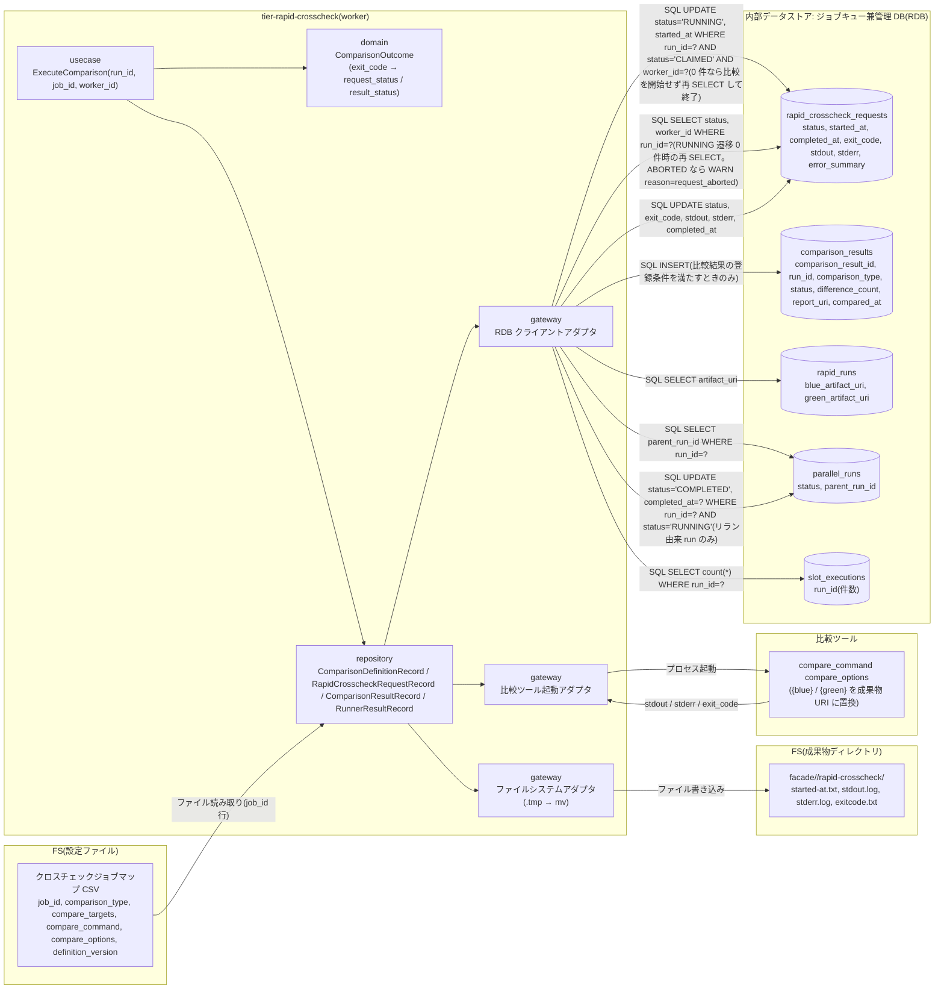
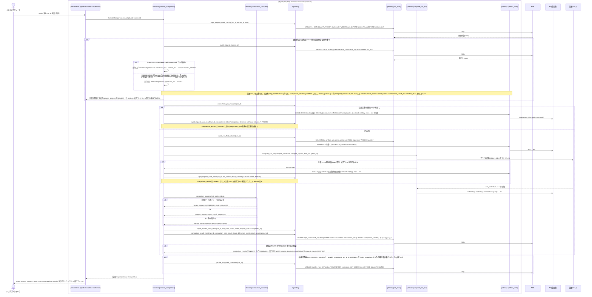

# 比較ツールでジョブ単位比較を実行して結果を登録する

## 概要

claim した速報クロスチェック worker が依頼を CLAIMED → RUNNING に条件付き UPDATE(`WHERE run_id = ? AND status = 'CLAIMED' AND worker_id = ?`)で遷移させ、更新件数が 1 のときだけクロスチェックジョブマップ(CSV)の job_id ごとの比較定義に従って比較ツールでジョブ単位比較を起動する。更新件数が 0 件(abort-rapid-crosscheck で ABORTED 済み、または lease 失効で別 worker に回収済み)なら比較ツールを起動せず、成果物ディレクトリと started-at.txt も作らず、comparison_results も INSERT せず終了コード 0 で終了する(条件「依頼中止可否判定」の worker 側の競合規則。arch LP-024)。比較ツールの stdout / stderr / exit_code を依頼レコードへ保存し、exit_code 0 → SUCCEEDED、3(比較 NG)/ 6(実行エラー)/ その他非 0 → FAILED とし、比較ツールを起動して終了コードを得たときだけ comparison_results に status(OK / NG / FAILED)・difference_count・report_uri・compared_at を INSERT する(条件「比較結果の登録条件」。比較定義なし・起動失敗では登録せず依頼だけを FAILED で終端する)。成果物ディレクトリ `facade/<run_id>/rapid-crosscheck/` にも started-at.txt / stdout.log / stderr.log / exitcode.txt を残す(hang-detector の走査対象)。速報比較依頼だけを新規作成したリラン由来(background-rerun --role rapid-crosscheck)の parallel_run は foreground slot を持たないため、依頼が終端した時点で worker が RUNNING → COMPLETED にする。結果はジョブスケジューラへの応答に影響させず、確報側(final_*)には触れない。

## データフロー



| レイヤー | データモデル | 変換内容 |
|---------|------------|---------|
| usecase | ExecuteComparison | RUNNING 遷移(条件付き UPDATE。0 件なら依頼を再 SELECT して実行ログに WARN を残し、比較を開始せず終了)→ 比較定義解決 → 成果物 dir 作成 → 比較ツール起動 → 結果保存 → comparison_result 登録 → リラン由来 run の COMPLETED 遷移 |
| domain | ComparisonOutcome | exit_code → 依頼状態(0=SUCCEEDED / 非 0=FAILED)と結果ステータス(0=OK / 3=NG / 6・その他=FAILED)の対応表 |
| repository | ComparisonDefinitionRecord | CSV の job_id 行 → 起動コマンド・オプション・比較種別(セルは二重引用符で囲める。囲んだセル内の二重引用符は `""`) |
| repository | ParallelRunRecord | 依頼終端後、`parallel_runs.parent_run_id IS NOT NULL` かつ当該 run_id の `slot_executions` 行が 0 件(速報比較依頼だけを新規作成したリラン由来)なら `status='RUNNING'` 条件付きで COMPLETED に更新 |
| gateway(比較ツール) | プロセス起動 | `compare_command` + compare_options(`{blue}` / `{green}` プレースホルダを成果物 URI に置換)。引数の渡し方は比較定義の compare_options が決め、gateway は連結して実行するだけ |
| gateway(FS) | Runner Result(role=rapid-crosscheck) | `.tmp` → `mv` で確定名へ |

## 処理フロー



## バリエーション一覧

| バリエーション名 | 値 | 処理内容 | 適用 tier | 適用箇所 |
|----------------|---|---------|----------|---------|
| 比較ツール終了コード | 0(比較 OK) | 依頼 SUCCEEDED、comparison_result.status=OK | tier-rapid-crosscheck | comparison_outcome |
| 比較ツール終了コード | 3(比較 NG・警告終了) | 依頼 FAILED、status=NG | tier-rapid-crosscheck | comparison_outcome |
| 比較ツール終了コード | 6(実行エラー・エラー終了) | 依頼 FAILED、status=FAILED | tier-rapid-crosscheck | comparison_outcome |
| 比較結果ステータス | 比較 OK / 比較 NG / FAILED | comparison_results.status に OK / NG / FAILED を登録 | tier-rapid-crosscheck | comparison_result_insert |
| 比較種別 | ジョブ単位比較 | 比較定義の comparison_type を comparison_results.comparison_type に転記 | tier-rapid-crosscheck | comparison_result_insert |
| クロスチェック依頼状態 | RUNNING / SUCCEEDED / FAILED | 本 UC で遷移する状態 | tier-rapid-crosscheck | rapid_request_mark_running / rapid_request_save_result |
| クロスチェック依頼状態 | ABORTED | RUNNING 遷移 0 件時の再 SELECT で観測する(遷移 UC は「実行を ABORTED へ遷移させる」)。比較を開始せず終了コード 0 | tier-rapid-crosscheck | rapid_request_find |
| run role(成果物ディレクトリ区分) | rapid-crosscheck | `facade/<run_id>/rapid-crosscheck/` に Runner Result を残す | tier-rapid-crosscheck | artifact_write |
| Runner Result 成果物種別 | started-at.txt / stdout.log / stderr.log / exitcode.txt | 4 ファイルを .tmp → mv で公開 | tier-rapid-crosscheck | artifact_write |
| 速報クロスチェックのプロセス役割 | worker | 本 UC の実行主体 | tier-rapid-crosscheck | rapid-crosscheck-worker.sh |

## 分岐条件一覧

| 条件名 | 判定ルール | 適用 tier | 適用箇所 | BDD Scenario |
|--------|----------|----------|---------|-------------|
| 依頼状態遷移規則 | CLAIMED → RUNNING(started_at 設定。条件付き UPDATE `status='CLAIMED' AND worker_id=?`。0 件なら比較を開始せず comparison_results も登録しない)、RUNNING → SUCCEEDED(exit_code 0)/ FAILED(非 0 または起動失敗)(条件付き UPDATE `status='RUNNING' AND worker_id=?`。0 件 = 比較中に ABORTED 済みで comparison_results を INSERT しない) | tier-rapid-crosscheck | execute_comparison(usecase) | 比較 OK で SUCCEEDED と OK を登録する / CLAIMED の依頼が ABORTED になった後の RUNNING 条件付き UPDATE は 0 件で比較を開始しない |
| 依頼中止可否判定 | worker 側の競合規則: claim 後・比較開始前の CLAIMED → RUNNING を `UPDATE rapid_crosscheck_requests SET status='RUNNING', started_at=? WHERE run_id=? AND status='CLAIMED' AND worker_id=?` の条件付き UPDATE で行い、更新件数 0 なら比較ツールを起動せず、成果物 dir と started-at.txt も作らず、comparison_results も INSERT せず終了コード 0。0 件のとき依頼を再 SELECT し、status=ABORTED(abort-rapid-crosscheck で中止済み)なら実行ログ `WARN comparison not started run_id=... worker_id=... reason=request_aborted`、それ以外(lease 失効で回収済み: REQUESTED / 他 worker の CLAIMED / RUNNING / 別 worker が終端まで進めた SUCCEEDED / FAILED)は `WARN request not owned run_id=... status=...`。stderr には出さない。stdout(--once)は claim の 4 行 + `request_status=<再 SELECT した現在の status>` / `result_status=-` / `exit_code=-` / `comparison_result_id=-` / `artifact_dir: -`。運用者側の中止可否(速報 = REQUESTED / CLAIMED / RUNNING、確報 = RUNNING のみ)は UC「実行を ABORTED へ遷移させる」 | tier-rapid-crosscheck | rapid_request_mark_running(repository)/ execute_comparison(usecase) | CLAIMED の依頼が ABORTED になった後の RUNNING 条件付き UPDATE は 0 件で比較を開始しない |
| 比較結果の登録条件 | comparison_results は比較ツールを起動して終了コードを得たときだけ INSERT する。比較定義なし・比較ツール起動失敗(exec 不可)では comparison_result を登録せず、依頼だけを FAILED(exit_code=6 相当、error_summary に理由)で終端する。終端 UPDATE 0 行(ABORTED 済み等)も INSERT しない | tier-rapid-crosscheck | comparison_result_insert(repository)/ execute_comparison | 比較ツールの起動に失敗する(SPEC-005-03) / 比較定義が無い job_id(SPEC-005-03) |
| 比較定義の選択 | クロスチェックジョブマップ CSV の job_id 行を使う。行が無ければ比較ツールを起動せず、依頼を exit_code=6, error_summary=`comparison definition not found job_id=...` で FAILED に終端する。comparison_results は INSERT しない(比較結果の登録条件) | tier-rapid-crosscheck | crosscheck_job_map_find(repository) | job_id の比較定義が使われる(SPEC-005-03) / 比較定義が無い job_id(SPEC-005-03) |
| 比較ツール終了コードの対応 | 0 → SUCCEEDED / OK、3 → FAILED / NG、6 → FAILED / FAILED、その他非 0 → FAILED / FAILED。値は変換せず保存 | tier-rapid-crosscheck | comparison_outcome(domain) | 比較 NG(3)で FAILED と NG を登録する |
| 速報結果の位置付け | 依頼の FAILED や worker の終了コードはジョブスケジューラ応答に影響しない。worker 自身は `--once` で処理できれば 0 | tier-rapid-crosscheck | rapid-crosscheck-worker.sh(presentation) | 比較 NG(3)で FAILED と NG を登録する |
| 速報と確報のモデル分離 | 書き込み先は rapid_crosscheck_requests / comparison_results のみ。final_* を触らない | tier-rapid-crosscheck | execute_comparison | 比較 OK で SUCCEEDED と OK を登録する |
| 成果物公開判定 | 4 ファイルは .tmp へ書いて mv。確定名があるときのみ完了 | tier-rapid-crosscheck | artifact_write(gateway) | 比較 OK で SUCCEEDED と OK を登録する |

## 計算ルール一覧

| 計算名 | 入力情報 | 計算式/ロジック | 出力情報 | 適用 tier |
|--------|---------|---------------|---------|----------|
| 依頼状態の決定 | exit_code | 0 → SUCCEEDED、それ以外 → FAILED | rapid_crosscheck_requests.status | tier-rapid-crosscheck |
| 結果ステータスの決定 | exit_code | 0 → OK、3 → NG、6 / その他 → FAILED | comparison_results.status | tier-rapid-crosscheck |
| 比較コマンドの連結 | compare_command, compare_options, blue_artifact_uri, green_artifact_uri | `compare_command` + compare_options(空白区切り。`{blue}` / `{green}` プレースホルダを URI に置換。仮採用) | 起動コマンド | tier-rapid-crosscheck |
| difference_count / report_uri | 比較ツールの stdout | stdout の `difference_count=N` / `report_uri=...` 行があれば転記、無ければ NULL(`-`)(仮採用: 比較ツール契約に stdout 形式の定めが無いため) | comparison_results | tier-rapid-crosscheck |
| comparison_result_id | 乱数 | 8 桁 hex 乱数(主キー。全体で一意。衝突時は取り直す。契約 shared_rules.comparison_result_id と同じ) | comparison_results.comparison_result_id | tier-rapid-crosscheck |
| error_summary | stderr | stderr の先頭 1 行(256 文字まで)。exit_code 0 なら NULL | rapid_crosscheck_requests.error_summary | tier-rapid-crosscheck |
| compared_at / completed_at | 比較ツール終了時刻 | ホストのローカルタイムゾーンの ISO 8601 秒精度(タイムゾーン指示子なし。run_id の時刻部と同じ時刻軸)。started-at.txt の中身だけは UTC Z 付き(Runner Result Contract) | 各列 | tier-rapid-crosscheck |

## 状態遷移一覧

| 状態モデル | 遷移元 | 遷移先 | トリガー | 事前条件 | 事後処理 | 適用 tier |
|-----------|--------|--------|---------|---------|---------|----------|
| クロスチェック依頼 | CLAIMED | RUNNING | 比較開始 | 自 worker が claim 済み(worker_id 一致)。条件付き UPDATE(`status='CLAIMED' AND worker_id=?`)で遷移し、0 件(abort-rapid-crosscheck で ABORTED 済み、または lease 失効で回収済み)なら比較を開始せず comparison_results も登録しない | started_at 設定、started-at.txt 出力(0 件のときは何も作らず終了コード 0) | tier-rapid-crosscheck |
| クロスチェック依頼 | RUNNING | SUCCEEDED | 比較ツール exit_code 0 | — | stdout / stderr / exit_code 保存、comparison_result OK 登録 | tier-rapid-crosscheck |
| クロスチェック依頼 | RUNNING | FAILED | 比較ツール exit_code 非 0(3 / 6 / その他)、起動失敗、または比較定義なし | — | 結果保存、comparison_result NG / FAILED 登録(比較定義なし・起動失敗は登録しない。比較結果の登録条件)。hang-detector が error 通知 | tier-rapid-crosscheck |
| 並行稼働実行 | RUNNING | COMPLETED | 依頼の終端(SUCCEEDED / FAILED) | `parallel_runs.parent_run_id IS NOT NULL` かつ当該 run_id の `slot_executions` 行が 0 件(速報比較依頼だけを新規作成したリラン由来。業務ジョブを再実行していない) | `UPDATE parallel_runs SET status='COMPLETED', completed_at=? WHERE run_id=? AND status='RUNNING'`(条件付き。0 行なら何もしない。実行ログ `INFO parallel_run status changed from=RUNNING to=COMPLETED run_id=...`)。通常 run(foreground slot あり)は facade の中継完了で COMPLETED になるため本 UC では更新しない | tier-rapid-crosscheck |

## 関連 RDRA モデル

| モデル種別 | 要素名 | 関連 |
|-----------|--------|------|
| 業務 | クロスチェック業務 | この UC が属する業務 |
| BUC | 速報クロスチェックフロー | この UC を含む BUC(アクティビティ: ジョブ単位比較の実行) |
| アクター | 運用者 | 受益者(自動) |
| 情報 | 速報比較依頼(rapid_crosscheck_request) | 更新する |
| 情報 | クロスチェックジョブマップ | 参照する |
| 情報 | 比較定義 | 参照する(job_id 行) |
| 情報 | 比較ツール実行結果 | 依頼レコードの列と成果物ファイルに保存 |
| 情報 | 比較結果(comparison_result) | 登録する |
| 情報 | 実行ログ | worker の実行ログ |
| 情報 | 並行稼働実行(parallel_run) | 速報比較依頼だけのリラン由来 run を依頼終端時に COMPLETED にする(状態.tsv の遷移 UC) |
| 状態 | クロスチェック依頼 | CLAIMED → RUNNING(条件付き UPDATE。0 件なら比較を開始しない)→ SUCCEEDED / FAILED。CLAIMED → ABORTED / RUNNING → ABORTED の遷移 UC は「実行を ABORTED へ遷移させる」 |
| 状態 | 並行稼働実行 | RUNNING → COMPLETED(リラン由来 run の終端) |
| 条件 | 依頼状態遷移規則 | 適用 |
| 条件 | 依頼中止可否判定 | 適用(worker 側の競合規則 = CLAIMED → RUNNING の条件付き UPDATE が 0 件なら比較を開始しない。tier-rapid-crosscheck) |
| 条件 | 比較定義の選択 | 適用 |
| 条件 | 比較ツール終了コードの対応 | 適用 |
| 条件 | 速報結果の位置付け | 適用 |
| 条件 | 比較結果の登録条件 | 適用(比較ツールの終了コードを得たときだけ comparison_result を登録) |
| 画面 | rapid-crosscheck worker 比較実行出力(→ CLI 出力) | stdout / 実行ログ |
| イベント | ジョブ単位比較の起動 | 比較ツールのプロセス起動 |
| イベント | comparison_result の登録 | 管理 DB(RDB)への INSERT |
| 外部システム | 比較ツール | 起動する |
| 内部データストア | ジョブキュー兼管理 DB(RDB) | 書き込み先(relay-gate 内部の構成要素。外部システムではない) |

## 関連 USDM

| REQ ID | SPEC ID | 対応 BDD Scenario |
|--------|---------|-----------------|
| REQ-005 | SPEC-005-03 | 比較 OK で SUCCEEDED と OK を登録する(SPEC-005-03) / job_id の比較定義が使われる(SPEC-005-03) / 比較定義が無い job_id(SPEC-005-03) / 比較ツールの起動に失敗する(SPEC-005-03) |
| REQ-007 | SPEC-007-01 | 比較 OK で SUCCEEDED と OK を登録する(SPEC-005-03) ※ RUNNING → SUCCEEDED |
| REQ-007 | SPEC-007-03 | 比較 NG(3)で FAILED と NG を登録する(SPEC-007-03) |
| REQ-011 | SPEC-011-02 | 比較 OK で SUCCEEDED と OK を登録する(SPEC-005-03) ※ comparison_result の列 |
| REQ-011 | SPEC-011-06 | 速報比較依頼だけのリラン由来 run は依頼終端で parallel_run を COMPLETED にする(SPEC-011-06) |
| REQ-010 | SPEC-010-02 | CLAIMED の依頼が ABORTED になった後の RUNNING 条件付き UPDATE は 0 件で比較を開始しない(SPEC-010-02) |

> 機械可読の正本は `spec-event.yaml` の `use_cases[].usdm`(本表と同内容)。「対応 BDD Scenario」列は本 UC の `Scenario:` 名(接尾の SPEC ID を含む完全名)を「 / 」で区切って列挙し、Scenario 名以外の補足は「※」以降に置く。区切りは人が読む用で、Scenario 名自体に「 / 」を含むものがあるため機械分割には使わず、機械照合は `spec-event.yaml` の `scenarios[]` を使う。

## E2E 完了条件(BDD)

### 正常系

```gherkin
Feature: 比較ツールでジョブ単位比較を実行して結果を登録する

  Scenario: 比較 OK で SUCCEEDED と OK を登録する(SPEC-005-03)
    Given RAPID_CROSSCHECK_MODE=background で rapid_crosscheck_requests に run_id=20260830T113000-JOB001-3f9a1c2e, job_id=JOB001, status=REQUESTED の行がある
    And rapid_runs の同 run_id に blue_artifact_uri=file:///var/relay-gate/facade/20260830T113000-JOB001-3f9a1c2e/blue, green_artifact_uri=file:///var/relay-gate/facade/20260830T113000-JOB001-3f9a1c2e/green がある
    And クロスチェックジョブマップ(crosscheck-job-map.csv)に `JOB001,job,output.csv,/opt/compare/compare.sh,"--blue {blue} --green {green}",v1` の行がある
    And 比較ツール /opt/compare/compare.sh は終了コード 0、stdout に `difference_count=0` を返す
    When ジョブスケジューラが `rapid-crosscheck-worker.sh --once --worker-id worker-01` を起動する
    Then 終了コードは 0 で stdout に `request_status=SUCCEEDED` と `result_status=OK` が出る
    And 依頼の status は `SUCCEEDED`、exit_code は 0、started_at と completed_at はローカル ISO 8601(タイムゾーン指示子なし)の値である
    And 依頼の stdout 列は `difference_count=0` を含み、stderr 列は空である(比較ツールの出力を依頼レコードへ保存する)
    And comparison_results に run_id=20260830T113000-JOB001-3f9a1c2e, comparison_type=job, status=OK, difference_count=0 の行が 1 件ある
    And facade/20260830T113000-JOB001-3f9a1c2e/rapid-crosscheck/ に started-at.txt, stdout.log, stderr.log, exitcode.txt(中身 `0`)が揃い `.tmp` ファイルは残っていない
    And final_crosscheck_requests は変更されない

  Scenario: job_id の比較定義が使われる(SPEC-005-03)
    Given クロスチェックジョブマップに JOB001 の行(compare_command=/opt/compare/compare.sh)と JOB002 の行(compare_command=/opt/compare/compare-v2.sh)がある
    And status=REQUESTED の依頼 run_id=20260830T113500-JOB002-1a2b3c4d, job_id=JOB002 がある
    When `rapid-crosscheck-worker.sh --once --worker-id worker-01` を起動する
    Then 起動される比較ツールは /opt/compare/compare-v2.sh であり、/opt/compare/compare.sh は起動されない

  Scenario: 速報比較依頼だけのリラン由来 run は依頼終端で parallel_run を COMPLETED にする(SPEC-011-06)
    Given background-rerun --role rapid-crosscheck が作成した parallel_runs に run_id=20260830T150000-JOB001-5e5e5e5e, parent_run_id=20260830T113000-JOB001-3f9a1c2e, status=RUNNING の行があり、同 run_id の slot_executions 行は 0 件である
    And rapid_crosscheck_requests に run_id=20260830T150000-JOB001-5e5e5e5e, job_id=JOB001, status=REQUESTED の行と JOB001 の比較定義があり、比較ツールは終了コード 0 を返す
    When `rapid-crosscheck-worker.sh --once --worker-id worker-01` を起動する
    Then 依頼の status は `SUCCEEDED` になり、parallel_runs の run_id=20260830T150000-JOB001-5e5e5e5e の status は `COMPLETED` になる
    And 実行ログに "INFO parallel_run status changed from=RUNNING to=COMPLETED run_id=20260830T150000-JOB001-5e5e5e5e" が残る
    And 元の run_id=20260830T113000-JOB001-3f9a1c2e の parallel_runs の status は変わらない
```

### 異常系

```gherkin
  Scenario: 比較 NG(3)で FAILED と NG を登録する(SPEC-007-03)
    Given status=REQUESTED の依頼 run_id=20260830T113000-JOB001-3f9a1c2e, job_id=JOB001 と JOB001 の比較定義がある
    And 比較ツールは終了コード 3、stdout に `difference_count=12` と `report_uri=file:///var/relay-gate/reports/20260830T113000-JOB001-3f9a1c2e/job.html` を返す
    When `rapid-crosscheck-worker.sh --once --worker-id worker-01` を起動する
    Then worker の終了コードは 0 で stdout に `request_status=FAILED` と `result_status=NG` が出て、依頼の status は `FAILED`、exit_code は 3 である
    And 依頼の stdout 列は `difference_count=12` と `report_uri=...` の行を含む
    And comparison_results に status=NG, difference_count=12, report_uri=file:///var/relay-gate/reports/20260830T113000-JOB001-3f9a1c2e/job.html の行がある
    And facade/20260830T113000-JOB001-3f9a1c2e/blue/exitcode.txt と業務ジョブのジョブスケジューラ応答は変わらない

  Scenario: 比較定義が無い job_id(SPEC-005-03)
    Given status=REQUESTED の依頼 run_id=20260830T114000-JOB009-9f9f9f9f, job_id=JOB009 があり、クロスチェックジョブマップに JOB009 の行が無い
    When `rapid-crosscheck-worker.sh --once --worker-id worker-01` を起動する
    Then 比較ツールは起動されず、依頼の status は `FAILED`、exit_code は 6、error_summary は `comparison definition not found job_id=JOB009` である
    And facade/20260830T114000-JOB009-9f9f9f9f/rapid-crosscheck/ に started-at.txt、stderr.log(`comparison definition not found job_id=JOB009`)、exitcode.txt(中身 `6`)が揃う
    And comparison_results に run_id=20260830T114000-JOB009-9f9f9f9f の行は無く、stdout に `request_status=FAILED`、`result_status=-`、`exit_code=6`、`comparison_result_id=-` が出て、worker の終了コードは 0 である(依頼を終端状態まで処理できたため。worker の 6 は比較ツールの起動自体の失敗など worker 側の実行エラーに限る)

  Scenario: 比較ツールの起動に失敗する(SPEC-005-03)
    Given status=REQUESTED の依頼 run_id=20260830T113000-JOB001-3f9a1c2e, job_id=JOB001 があり、JOB001 の比較定義の compare_command が実行できない(実行権限なし)
    When `rapid-crosscheck-worker.sh --once --worker-id worker-01` を起動する
    Then 依頼の status は `FAILED`、exit_code は 6、error_summary は `launch failed`、facade/20260830T113000-JOB001-3f9a1c2e/rapid-crosscheck/stderr.log に起動失敗の理由が残る
    And comparison_results に同 run_id の行は無い(比較ツールが終了コードを返していないため INSERT しない。比較結果の登録条件)
    And stdout に `request_status=FAILED`、`result_status=-`、`exit_code=6`、`comparison_result_id=-` が出て、stderr に `error: compare tool launch failed run_id=20260830T113000-JOB001-3f9a1c2e command=/opt/compare/compare.sh` が出て、worker の終了コードは 6 である

  Scenario: CLAIMED の依頼が ABORTED になった後の RUNNING 条件付き UPDATE は 0 件で比較を開始しない(SPEC-010-02)
    Given RAPID_CROSSCHECK_MODE=background で worker-01 が rapid_crosscheck_requests の run_id=20260830T113000-JOB001-3f9a1c2e, job_id=JOB001 を claim し、status=CLAIMED, worker_id=worker-01, started_at=NULL である
    And 比較開始前に運用者が `abort-rapid-crosscheck.sh --run-id 20260830T113000-JOB001-3f9a1c2e` を実行して yes と答え、依頼が status=ABORTED, completed_at 設定済みになった
    When worker-01 が `UPDATE rapid_crosscheck_requests SET status='RUNNING', started_at=? WHERE run_id='20260830T113000-JOB001-3f9a1c2e' AND status='CLAIMED' AND worker_id='worker-01'` を実行する
    Then 更新件数は 0 件で、比較ツールは起動されず、facade/20260830T113000-JOB001-3f9a1c2e/rapid-crosscheck/ と started-at.txt は作られず、comparison_results に同 run_id の行は無い
    And 依頼の status は `ABORTED` のまま、started_at は NULL のままである
    And stdout に claim の 4 行(`run_id=` / `job_id=` / `worker_id=` / `lease_until=`)に続けて `request_status=ABORTED`、`result_status=-`、`exit_code=-`、`comparison_result_id=-`、`artifact_dir: -` が出て、stderr には何も出ない
    And worker-01 の実行ログに `WARN comparison not started run_id=20260830T113000-JOB001-3f9a1c2e worker_id=worker-01 reason=request_aborted` が残り、終了コードは 0 である

  Scenario: 比較中に依頼が中止されていたら結果を登録しない
    Given worker-01 が run_id=20260830T113000-JOB001-3f9a1c2e を RUNNING にして比較ツールを起動中に、依頼が abort-rapid-crosscheck で ABORTED になっている
    When 比較ツールが終了コード 0 で終了する
    Then 依頼の status は `ABORTED` のまま、comparison_results に同 run_id の行は無く、成果物 dir の stdout.log / stderr.log / exitcode.txt は残る
    And stdout に `request_status=ABORTED`、`result_status=-`、`exit_code=-`、`comparison_result_id=-` が出る
    And worker-01 の実行ログに `WARN request already terminal run_id=20260830T113000-JOB001-3f9a1c2e status=ABORTED` が残り、終了コードは 0 である
```

## ティア別仕様

- [速報クロスチェックティア](tier-rapid-crosscheck.md)

### 統合 API Spec

- [CLI コマンド契約](../../../_cross-cutting/api/cli-command-contract.yaml)(`rapid-crosscheck-worker.sh`)
- [AsyncAPI Spec](../../../_cross-cutting/api/asyncapi.yaml)(channel `rapid-crosscheck-requests` を subscribe)
