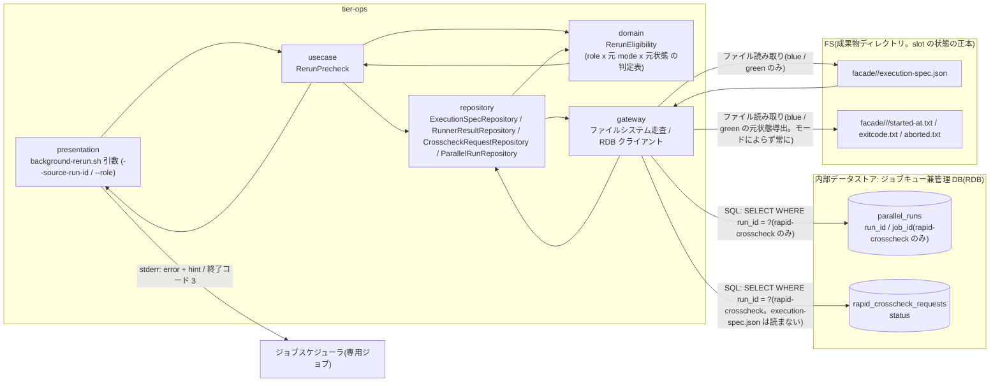
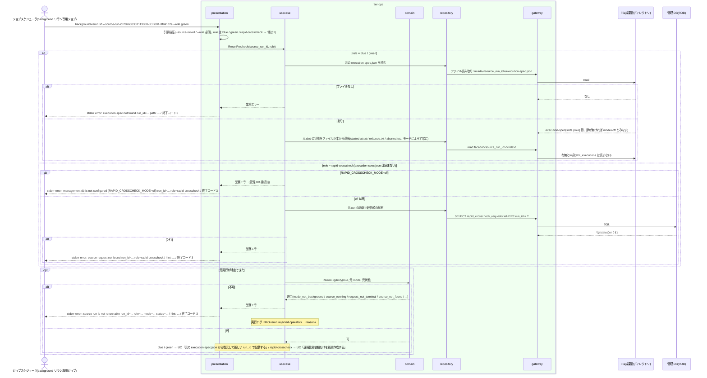

# リラン対象を検証する

## 概要

ジョブスケジューラの background リラン専用ジョブから `background-rerun.sh --source-run-id <RUN_ID> --role blue|green|rapid-crosscheck` で起動された background-rerun が、元の実行を事前検証する。元実行の特定元は role で分岐する: `--role blue / green` は元 run の `execution-spec.json` を読み、元の slot mode が background かつ元の状態が終端(SUCCEEDED / FAILED / ABORTED)のときだけ可とする。元の状態は RAPID_CROSSCHECK_MODE によらず **常に成果物のファイル正本**から導出する(条件「slot 実行の状態導出規則」: exitcode.txt があれば SUCCEEDED / FAILED、無く aborted.txt があれば ABORTED、どちらも無ければ RUNNING、started-at.txt が無ければ未起動)。管理 DB の `slot_executions` は事前検証に使わない(off 以外でも読まない。管理 DB は後続 UC が新 run の INSERT にだけ使う)。`--role rapid-crosscheck` は `execution-spec.json` を要求せず、管理 DB(off 以外が前提)の `rapid_crosscheck_requests`(と後続 UC が読む `rapid_runs`)だけで元実行を特定し、元 run の速報比較依頼が終端のときだけ可とする。これにより、rapid-crosscheck リランで作られた run(`execution-spec.json` を持たない)を再度 `--source-run-id` に指定でき、parent_run_id の数珠つなぎリランが成立する。foreground / off、RUNNING(exitcode.txt も aborted.txt も無い = 中止未確認)、未対応 role、元実行なし(blue / green: execution-spec.json なし、rapid-crosscheck: 依頼なし)はリランせず終了コード 3 で終了し、foreground slot と確報クロスチェックはジョブスケジューラの正規ジョブを再実行する旨をヒントに出す。検証を通過した後の処理は UC「元の execution-spec.json から復元して新しい run_id で起動する」(blue / green)と UC「速報比較依頼だけを新規作成する」(rapid-crosscheck)が担う。

## データフロー



| レイヤー | データモデル | 変換内容 |
|---------|------------|---------|
| ops presentation | 引数(`--source-run-id 20260830T113000-JOB001-3f9a1c2e`, `--role green`) | 引数検証(role 列挙・run_id 形式)→ RerunPrecheck |
| ops repository / gateway | blue / green: execution-spec.json(`slots.{role}` 節の有無と mode / host / user / script / work_dir / fixed_params)、成果物ファイル(started-at.txt / exitcode.txt / aborted.txt → 元状態。slot_executions は読まない)。rapid-crosscheck: rapid_crosscheck_requests(存在 / status)+ parallel_runs(job_id)。blue / green は管理 DB を読まない | 元実行の存在確認と状態取得(特定元は role で分岐) |
| ops domain | RerunEligibility: role × 元 mode × 元状態 の判定表 | 可 / 不可(理由コード) |
| ops presentation(出力) | 不可: `error: source run is not rerunnable ...` + `hint: ...`、終了コード 3。可: 後続 UC へ | 判定結果の提示 |

## 処理フロー



## バリエーション一覧

| バリエーション名 | 値 | 処理内容 | 適用 tier | 適用箇所 |
|----------------|---|---------|----------|---------|
| リラン対象 role | blue | 元 slot(blue)の mode が background かつ状態が終端なら可 | tier-ops | domain `is_rerunnable` |
| リラン対象 role | green | 同上(green) | tier-ops | domain `is_rerunnable` |
| リラン対象 role | rapid-crosscheck | 元 run の速報比較依頼が SUCCEEDED / FAILED / ABORTED(abort-rapid-crosscheck による REQUESTED / CLAIMED / RUNNING の中止、abort-blue / abort-green による未着手依頼の中止を含む)なら可。RUNNING / CLAIMED / REQUESTED は不可 | tier-ops | domain `is_rerunnable` |
| slot 実行モード | background | リラン可の前提 | tier-ops | domain `is_rerunnable` |
| slot 実行モード | foreground | 不可。ヒント: ジョブスケジューラの正規ジョブを再実行 | tier-ops | domain `is_rerunnable` |
| slot 実行モード | off | 不可(元の実行が存在しない。execution-spec.json に `slots.{role}` 節が無いことで判定する) | tier-ops | domain `is_rerunnable` |
| 再実行経路 | background 側リラン | background slot と速報比較依頼 | tier-ops | background-rerun.sh |
| 再実行経路 | ジョブスケジューラ正規ジョブ再実行 | foreground slot と確報クロスチェック(`--role final-crosscheck` は run role として存在するが background-rerun.sh の enum 外。`foo` 等と同じく引数不正 = 2) | tier-ops | background-rerun.sh の hint |
| クロスチェック依頼状態 | SUCCEEDED / FAILED / ABORTED | rapid-crosscheck リラン可 | tier-ops | domain `is_rerunnable` |
| クロスチェック依頼状態 | REQUESTED / CLAIMED / RUNNING | rapid-crosscheck リラン不可(RUNNING は中止を促す) | tier-ops | domain `is_rerunnable` |
| Runner Result 成果物種別 | started-at.txt / exitcode.txt / aborted.txt | blue / green の元状態の導出元(started-at.txt なし = 未起動、exitcode.txt あり = SUCCEEDED / FAILED、無く aborted.txt あり = ABORTED、どちらも無し = RUNNING) | tier-ops | repository `resolve_source_state` |
| 速報クロスチェックモード | foreground / background | blue / green の元状態はファイル正本だけで導出する(`slot_executions` は読まない)。rapid-crosscheck は管理 DB の依頼レコードで特定する | tier-ops | repository `resolve_source_state` / usecase |
| 速報クロスチェックモード | off | 元状態はファイル正本だけで導出する(aborted.txt があれば ABORTED としてリラン可)。off かつ `--role rapid-crosscheck` は管理 DB が無いため終了コード 3 | tier-ops | repository `resolve_source_state` / usecase の管理 DB 接続前判定 |
| 元実行の特定元 | blue / green | `facade/<source_run_id>/execution-spec.json`(必須)+ 成果物ファイル(状態)。管理 DB は使わない | tier-ops | repository `ExecutionSpecRepository` / `RunnerResultRepository` |
| 元実行の特定元 | rapid-crosscheck | `rapid_crosscheck_requests`(必須。execution-spec.json は読まない。rapid-crosscheck リランで作られた run も元にできる) | tier-ops | repository `CrosscheckRequestRepository` |
| ジョブスケジューラ起動ジョブ種別 | background リラン専用ジョブ | `background-rerun.sh` を業務ジョブとは別の専用ジョブ定義から起動する(run_id と role を引数に渡す) | tier-ops | background-rerun.sh の起動元 |

## 分岐条件一覧

| 条件名 | 判定ルール | 適用 tier | 適用箇所 | BDD Scenario |
|--------|----------|----------|---------|-------------|
| リラン事前検証 | 縦軸 role(blue / green / rapid-crosscheck)× 横軸 元 mode(foreground / background / off)× 元状態。blue / green: `background × {SUCCEEDED, FAILED, ABORTED}` のみ可。`background × RUNNING`(exitcode.txt も aborted.txt も無い)は中止未確認として不可(hint に abort-{role}.sh)。foreground / off は不可。rapid-crosscheck: 依頼 `{SUCCEEDED, FAILED, ABORTED}` のみ可。`final-crosscheck`(run role としては存在するが background-rerun.sh の enum 外。確報は正規ジョブで再実行)と enum に無い文字列(`foo` 等)は引数不正(2。事前検証に入らない)。元実行なしは不可(3)。元実行の特定元は role で分岐: blue / green は execution-spec.json(なしは `execution-spec not found`)、rapid-crosscheck は rapid_crosscheck_requests(なしは `source request not found`。execution-spec.json は要求しない) | tier-ops | domain `is_rerunnable`(判定表)、presentation `parse_args`(role 列挙)、usecase の特定元分岐 | background で完了した green は検証を通過する / foreground の blue は拒否する / RUNNING の green は中止を促して拒否する / ABORTED の速報比較依頼は検証を通過する / rapid-crosscheck リランで作られた run を再度リラン元にできる |
| slot 実行の状態導出規則 | blue / green の元状態は RAPID_CROSSCHECK_MODE によらず成果物ファイルから導出する: `started-at.txt` 無し → 未起動(`-`)、`exitcode.txt` あり → 0 = SUCCEEDED / 非 0 = FAILED、無く `aborted.txt` あり → ABORTED、どちらも無し → RUNNING(両方あれば exitcode.txt 優先)。off 以外でも `slot_executions` は読まない | tier-ops | repository `resolve_source_state` | RAPID_CROSSCHECK_MODE=off で aborted.txt がある元 run は ABORTED として通過する / RAPID_CROSSCHECK_MODE=off でも exitcode.txt から元状態を導出して通過する |
| 復旧手段の選択 | foreground slot と確報クロスチェックは background-rerun を使わずジョブスケジューラの正規ジョブを直接再実行する。該当時は stderr の hint に `rerun the scheduler job instead (foreground slot / final crosscheck are not handled by background-rerun.sh)` を出す | tier-ops | presentation のエラーヒント | foreground の blue は拒否する |
| 速報クロスチェック有効判定 | RAPID_CROSSCHECK_MODE=off では管理 DB(依頼)が存在しないため、`--role rapid-crosscheck` は管理 DB 接続前に `error: management db is not configured (RAPID_CROSSCHECK_MODE=off) run_id=... role=rapid-crosscheck` で終了コード 3(abort-rapid-crosscheck の off 時と同じ文言)。blue / green は off でも成果物ファイルだけで元状態を導出してリランできる | tier-ops | usecase の管理 DB 接続前判定 | RAPID_CROSSCHECK_MODE=off の rapid-crosscheck は管理 DB 無しとして拒否する |

## 計算ルール一覧

| 計算名 | 入力情報 | 計算式/ロジック | 出力情報 | 適用 tier |
|--------|---------|---------------|---------|----------|
| 元 mode の解決(blue / green) | execution-spec.json の `slots` | `slots.{role}` 節が存在しない → mode=off とみなす(契約 execution_spec_rules「mode が off の slot は節を持たない」)。存在すれば `slots.{role}.mode`(foreground / background。C1 の構造) | mode | tier-ops |
| 元状態の解決(blue / green。モードによらず) | `facade/<run_id>/<role>/started-at.txt`、`exitcode.txt`、`aborted.txt` | started-at.txt 無し → 未起動(status=`-`。不可 `source_not_started`)。exitcode.txt あり → `0` = SUCCEEDED、非 0 = FAILED。exitcode.txt 無く aborted.txt あり → ABORTED。どちらも無し → RUNNING(中止未確認扱い) | status | tier-ops |
| 元実行の特定(rapid-crosscheck) | rapid_crosscheck_requests | `SELECT status WHERE run_id = ?`。0 行 → `request_not_found`。execution-spec.json とファイルシステムは読まない(元 run が rapid-crosscheck リランで作られた run でも成立する) | 存在 / status | tier-ops |
| 可否判定 | role, mode, status | 判定表(分岐条件「リラン事前検証」) | eligible / reason | tier-ops |
| 指示日時 | now(ローカル時刻) | 情報「リラン指示」の属性「指示日時」= 後続 UC が作成する新 run の `parallel_runs.requested_at` および実行ログ行(`INFO rerun requested` / `INFO precheck passed`)の ローカル時刻列 | requested_at / 実行ログ | tier-ops |

## 状態遷移一覧

| 状態モデル | 遷移元 | 遷移先 | トリガー | 事前条件 | 事後処理 | 適用 tier |
|-----------|--------|--------|---------|---------|---------|----------|
| 該当なし(検証のみ。状態.tsv にこの UC を遷移 UC とする行は無い。通過後の遷移は後続 2 UC に載せる) | — | — | — | — | — | — |

## 関連 RDRA モデル

| モデル種別 | 要素名 | 関連 |
|-----------|--------|------|
| 業務 | 実行復旧業務 | この UC が属する業務 |
| BUC | background 側リランフロー | この UC を含む BUC(アクティビティ: リラン対象の事前検証) |
| アクター | 運用者 | 専用ジョブを起動し検証結果を読む(受益者) |
| 情報 | リラン指示 | source_run_id / role / 事前検証結果(元の mode / 元の状態 / role 妥当性) |
| 情報 | 実行設定(execution-spec) | 元 run の execution-spec.json の存在と mode の確認(blue / green のみ。rapid-crosscheck は読まない) |
| 情報 | 並行稼働実行(parallel_run) | rapid-crosscheck の元実行特定(job_id)。blue / green では読まない |
| 情報 | slot 実行 | 元 slot の mode / status(状態はファイル正本から導出) |
| 情報 | Runner Result | started-at.txt / exitcode.txt / aborted.txt の有無と値が元状態の導出元 |
| 情報 | 速報比較依頼(rapid_crosscheck_request) | 元 run の依頼 status |
| 条件 | リラン事前検証 | 判定表(RUNNING = exitcode.txt も aborted.txt も無い) |
| 条件 | slot 実行の状態導出規則 | blue / green の元状態の導出 |
| 条件 | 復旧手段の選択 | foreground / 確報はジョブスケジューラで再実行 |
| 条件 | 速報クロスチェック有効判定 | off かつ rapid-crosscheck は管理 DB 無しとして 3。blue / green は off でもファイル正本でリラン可 |
| バリエーション | 速報クロスチェックモード | blue / green はモードによらずファイル正本だけで判定する。off かつ rapid-crosscheck は管理 DB 無しとして拒否する |
| バリエーション | Runner Result 成果物種別 | started-at.txt / exitcode.txt / aborted.txt |
| バリエーション | ジョブスケジューラ起動ジョブ種別 | background リラン専用ジョブから起動 |
| 画面 | background-rerun 事前検証出力(→ CLI 出力: stderr の error / hint と終了コード) | 運用者が読む出力 |
| イベント | リラン専用ジョブの起動 | 外部システム: ジョブスケジューラ |
| 外部システム | ジョブスケジューラ | 専用ジョブの起動元 |
| 内部データストア | ジョブキュー兼管理 DB(RDB) | 依頼レコードの特定元(rapid-crosscheck。off 以外)。blue / green の事前検証では読まない |

## 関連 USDM

| REQ ID | SPEC ID | 対応 BDD Scenario |
|---|---|---|
| REQ-009 | SPEC-009-01 | rapid-crosscheck リランで作られた run を再度リラン元にできる(SPEC-009-01) ※ parent_run_id の数珠つなぎ |
| REQ-009 | SPEC-009-03 | foreground の blue は拒否する(SPEC-009-03 / SPEC-009-04) / RUNNING の green は中止を促して拒否する(SPEC-009-03) / ABORTED の速報比較依頼は検証を通過する(SPEC-009-03) |
| REQ-009 | SPEC-009-04 | foreground の blue は拒否する(SPEC-009-03 / SPEC-009-04) ※ hint で正規ジョブ再実行を案内 |
| REQ-010 | SPEC-010-01 | RAPID_CROSSCHECK_MODE=off で aborted.txt がある元 run は ABORTED として通過する(SPEC-010-01) |

> 機械可読の正本は `spec-event.yaml` の `use_cases[].usdm`(本表と同内容)。「対応 BDD Scenario」列は本 UC の `Scenario:` 名(接尾の SPEC ID を含む完全名)を「 / 」で区切って列挙し、Scenario 名以外の補足は「※」以降に置く。区切りは人が読む用で、Scenario 名自体に「 / 」を含むものがあるため機械分割には使わず、機械照合は `spec-event.yaml` の `scenarios[]` を使う。

## E2E 完了条件(BDD)

### 正常系

```gherkin
Feature: リラン対象を検証する

  Scenario: background で完了した green は検証を通過する
    Given facade/20260830T113000-JOB001-3f9a1c2e/execution-spec.json が存在し green の mode が background である
    And facade/20260830T113000-JOB001-3f9a1c2e/green/ に started-at.txt と aborted.txt があり exitcode.txt は無い
    And RAPID_CROSSCHECK_MODE=background である
    When ジョブスケジューラが `background-rerun.sh --source-run-id 20260830T113000-JOB001-3f9a1c2e --role green` を起動する
    Then 事前検証を通過し UC「元の execution-spec.json から復元して新しい run_id で起動する」へ進む
    And 実行ログ background-rerun.sh.log に `INFO precheck passed source_run_id=20260830T113000-JOB001-3f9a1c2e role=green mode=background status=ABORTED` が残る
    And 事前検証で slot_executions は読まれない

  Scenario: ABORTED の速報比較依頼は検証を通過する(SPEC-009-03)
    Given RAPID_CROSSCHECK_MODE=background で rapid_crosscheck_requests に run_id=20260830T113000-JOB001-3f9a1c2e status=ABORTED がある
    When ジョブスケジューラが `background-rerun.sh --source-run-id 20260830T113000-JOB001-3f9a1c2e --role rapid-crosscheck` を起動する
    Then 事前検証を通過し UC「速報比較依頼だけを新規作成する」へ進む
    And facade/20260830T113000-JOB001-3f9a1c2e/execution-spec.json は開かれない

  Scenario: rapid-crosscheck リランで作られた run を再度リラン元にできる(SPEC-009-01)
    Given RAPID_CROSSCHECK_MODE=background で run_id=20260830T130000-JOB001-a1b2c3d4 は `background-rerun.sh --role rapid-crosscheck` で作られた run であり、facade/20260830T130000-JOB001-a1b2c3d4/execution-spec.json は存在しない
    And rapid_crosscheck_requests に run_id=20260830T130000-JOB001-a1b2c3d4 status=FAILED があり、parallel_runs の同 run_id の parent_run_id が 20260830T113000-JOB001-3f9a1c2e である
    When ジョブスケジューラが `background-rerun.sh --source-run-id 20260830T130000-JOB001-a1b2c3d4 --role rapid-crosscheck` を起動する
    Then 事前検証を通過し UC「速報比較依頼だけを新規作成する」へ進む(新 run の parent_run_id は 20260830T130000-JOB001-a1b2c3d4 になる)
    And stderr に `execution-spec not found` は出ない

  Scenario: RAPID_CROSSCHECK_MODE=off で aborted.txt がある元 run は ABORTED として通過する(SPEC-010-01)
    Given RAPID_CROSSCHECK_MODE=off で facade/20260830T113000-JOB001-3f9a1c2e/execution-spec.json の blue の mode が background、facade/20260830T113000-JOB001-3f9a1c2e/blue/ に started-at.txt と aborted.txt(abort-blue.sh が書いた中止日時 1 行)があり exitcode.txt は無い
    When `background-rerun.sh --source-run-id 20260830T113000-JOB001-3f9a1c2e --role blue` を起動する
    Then 元状態 ABORTED として事前検証を通過し、管理 DB への接続は行われない
    And 実行ログに `INFO precheck passed source_run_id=20260830T113000-JOB001-3f9a1c2e role=blue mode=background status=ABORTED` が残る

  Scenario: RAPID_CROSSCHECK_MODE=off でも exitcode.txt から元状態を導出して通過する
    Given RAPID_CROSSCHECK_MODE=off で facade/20260830T113000-JOB001-3f9a1c2e/execution-spec.json の green の mode が background、facade/20260830T113000-JOB001-3f9a1c2e/green/started-at.txt が存在し exitcode.txt の中身が 6 である
    When `background-rerun.sh --source-run-id 20260830T113000-JOB001-3f9a1c2e --role green` を起動する
    Then 元状態 FAILED として事前検証を通過する
```

### 異常系

```gherkin
  Scenario: foreground の blue は拒否する(SPEC-009-03 / SPEC-009-04)
    Given facade/20260830T113000-JOB001-3f9a1c2e/execution-spec.json の blue の mode が foreground で、blue/ に started-at.txt と exitcode.txt(中身 0)がある
    When `background-rerun.sh --source-run-id 20260830T113000-JOB001-3f9a1c2e --role blue` を起動する
    Then 終了コード 3 で stderr に `error: source run is not rerunnable run_id=20260830T113000-JOB001-3f9a1c2e role=blue mode=foreground status=SUCCEEDED` と `hint: rerun the scheduler job instead (foreground slot / final crosscheck are not handled by background-rerun.sh)` が出る
    And 新しい run_id は発行されない

  Scenario: RUNNING の green は中止を促して拒否する(SPEC-009-03)
    Given facade/20260830T113000-JOB001-3f9a1c2e/execution-spec.json の green の mode が background で、green/ に started-at.txt だけがあり exitcode.txt も aborted.txt も無い
    When `background-rerun.sh --source-run-id 20260830T113000-JOB001-3f9a1c2e --role green` を起動する
    Then 終了コード 3 で stderr に `error: source run is not rerunnable run_id=20260830T113000-JOB001-3f9a1c2e role=green status=RUNNING` と `hint: abort the run with abort-green.sh --run-id 20260830T113000-JOB001-3f9a1c2e before rerun` が出る

  Scenario: enum 外の role(final-crosscheck)は引数エラー
    When `background-rerun.sh --source-run-id 20260830T113000-JOB001-3f9a1c2e --role final-crosscheck` を起動する
    Then 終了コード 2 で stderr に `error: invalid value option=--role value=final-crosscheck` が出る(確報はジョブスケジューラの正規ジョブで再実行する)

  Scenario: 列挙外の role 文字列は引数エラー
    When `background-rerun.sh --source-run-id 20260830T113000-JOB001-3f9a1c2e --role foo` を起動する
    Then 終了コード 2 で stderr に `error: invalid value option=--role value=foo` が出る

  Scenario: 元の実行が見つからない(blue / green は execution-spec.json で特定する)
    Given facade/20260830T000000-JOB999-00000000/execution-spec.json が存在しない
    When `background-rerun.sh --source-run-id 20260830T000000-JOB999-00000000 --role green` を起動する
    Then 終了コード 3 で stderr に `error: execution-spec not found run_id=20260830T000000-JOB999-00000000 path: /var/relay-gate/facade/20260830T000000-JOB999-00000000/execution-spec.json` が出る

  Scenario: 元の速報比較依頼が見つからない(rapid-crosscheck は依頼レコードで特定する)
    Given RAPID_CROSSCHECK_MODE=background で rapid_crosscheck_requests に run_id=20260830T000000-JOB999-00000000 の行が無い
    When `background-rerun.sh --source-run-id 20260830T000000-JOB999-00000000 --role rapid-crosscheck` を起動する
    Then 終了コード 3 で stderr に `error: source request not found run_id=20260830T000000-JOB999-00000000 role=rapid-crosscheck` と `hint: rapid crosscheck request is created only when both slots succeeded` が出る
    And facade/20260830T000000-JOB999-00000000/execution-spec.json は開かれない

  Scenario: started-at.txt が無い元 run は未起動として拒否する
    Given facade/20260830T113000-JOB001-3f9a1c2e/execution-spec.json の green の mode が background、facade/20260830T113000-JOB001-3f9a1c2e/green/started-at.txt が存在しない
    When `background-rerun.sh --source-run-id 20260830T113000-JOB001-3f9a1c2e --role green` を起動する
    Then 終了コード 3 で stderr に `error: source run is not rerunnable run_id=20260830T113000-JOB001-3f9a1c2e role=green mode=background status=-` と `hint: source run has not started; rerun the scheduler job instead` が出る

  Scenario: RUNNING の速報比較依頼は拒否する
    Given rapid_crosscheck_requests に run_id=20260830T113000-JOB001-3f9a1c2e status=RUNNING がある
    When `background-rerun.sh --source-run-id 20260830T113000-JOB001-3f9a1c2e --role rapid-crosscheck` を起動する
    Then 終了コード 3 で stderr に `error: source request is not rerunnable run_id=20260830T113000-JOB001-3f9a1c2e role=rapid-crosscheck status=RUNNING` と `hint: abort the request with abort-rapid-crosscheck.sh --run-id 20260830T113000-JOB001-3f9a1c2e before rerun` が出る

  Scenario: RAPID_CROSSCHECK_MODE=off の rapid-crosscheck は管理 DB 無しとして拒否する
    Given RAPID_CROSSCHECK_MODE=off である
    When `background-rerun.sh --source-run-id 20260830T113000-JOB001-3f9a1c2e --role rapid-crosscheck` を起動する
    Then 終了コード 3 で stderr に `error: management db is not configured (RAPID_CROSSCHECK_MODE=off) run_id=20260830T113000-JOB001-3f9a1c2e role=rapid-crosscheck` が出て、管理 DB への接続は行われない
```

## ティア別仕様

- [tier-ops](tier-ops.md)(`background-rerun.sh` の事前検証表)

### 統合契約

- [CLI コマンド契約](../../../_cross-cutting/api/cli-command-contract.yaml)
- [AsyncAPI Spec](../../../_cross-cutting/api/asyncapi.yaml)(この UC は publish / subscribe しない)
