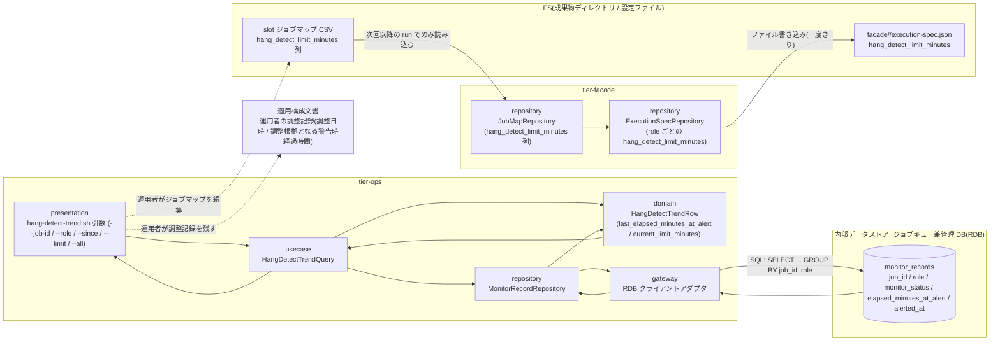
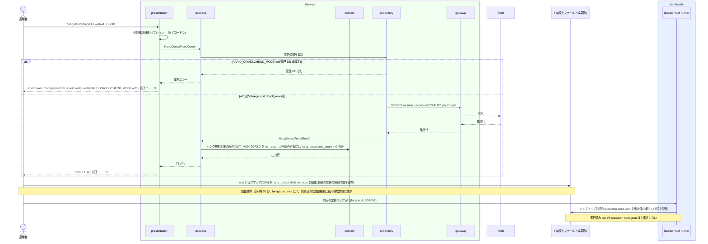

# hang_detect_limit_minutes をジョブごとに調整する

## 概要

運用者が `hang-detect-trend.sh` で監視記録(`monitor_records`)の警告傾向を job_id × role ごとに TSV で参照し、正常終了パターンの警告が出そろった時点で slot ジョブマップ(CSV)の `hang_detect_limit_minutes` 列をジョブごとに調整する。導入時は全ジョブ 60 分、foreground role は 0(検知対象外)とする。調整の記録(調整日時・調整根拠となる警告時経過時間)はジョブマップの列に持たず、適用構成文書またはそのコミット履歴に残す。調整は次回以降の run の `execution-spec.json` にのみ反映され、実行済みの run には影響しない。

## データフロー



| レイヤー | データモデル | 変換内容 |
|---------|------------|---------|
| ops presentation | 引数(`--job-id JOB001`, `--role green`, `--since 2026-06-01T00:00:00`(ローカル日時。指示子なし), `--limit 100`, `--all`) | 引数検証 → HangDetectTrendQuery |
| ops usecase | HangDetectTrendQuery(job_id / role / since / limit / all) | 監視記録を集計し HangDetectTrendRow のリストへ変換 |
| ops repository / gateway | `monitor_records` を job_id × role で集計する SELECT(`monitor_records.job_id` 列を直接使い、parallel_runs と JOIN しない) | 集計行(run_count / hang_suspected_count / completed_after_alert_count / max / last / current_limit) |
| ops presentation(出力) | TSV(ヘッダー行 + 1 行 1 job_id × role) | `data-visualization.md` 2. の 8 列 |
| facade repository | slot ジョブマップ CSV の `hang_detect_limit_minutes` 列 → execution-spec.json | 次回以降の run 開始時にのみ解決・確定保存する(実行済み run は不変) |
| 運用者(文書) | 適用構成文書の「運用者の調整記録」 | 調整日時と調整根拠となる警告時経過時間(`last_elapsed_minutes_at_alert`)を残す。ジョブマップの列・管理 DB には持たない |

## 処理フロー



## バリエーション一覧

| バリエーション名 | 値 | 処理内容 | 適用 tier | 適用箇所 |
|----------------|---|---------|----------|---------|
| ハング検知上限設定 | 60 分(導入時既定) | ジョブマップの初期値。全ジョブに設定する | tier-facade | slot ジョブマップ `hang_detect_limit_minutes` 列 |
| ハング検知上限設定 | ジョブごとの調整値 | `last_elapsed_minutes_at_alert` を基準に運用者が設定する | tier-facade | slot ジョブマップ `hang_detect_limit_minutes` 列 |
| ハング検知上限設定 | 0(検知対象外) | foreground role に設定し hang-detector の対象から除外する | tier-facade / tier-ops | slot ジョブマップ / `monitor_records.monitor_status=NOT_MONITORED` |
| run role(成果物ディレクトリ区分) | blue | `--role blue` で絞り込み。TSV の `role` 列 | tier-ops | `hang-detect-trend.sh` |
| run role(成果物ディレクトリ区分) | green | 同上 | tier-ops | `hang-detect-trend.sh` |
| run role(成果物ディレクトリ区分) | rapid-crosscheck | 同上(速報比較依頼の監視記録) | tier-ops | `hang-detect-trend.sh` |
| 監視状態 | 正常終了(通知後正常終了 = ハング疑い通知済み → 正常終了の遷移) | `completed_after_alert_count` と `elapsed_minutes_at_alert` の集計元 | tier-ops | `hang-detect-trend.sh`(monitor_status=COMPLETED かつ alerted_at 非 NULL) |
| 監視状態 | 監視対象外 | `run_count` から除外 | tier-ops | `hang-detect-trend.sh`(monitor_status <> 'NOT_MONITORED') |
| 設定所有区分 | slot ジョブマップ | `hang_detect_limit_minutes` の正本はジョブマップ(CSV)。RDB は変更しない | tier-facade | slot ジョブマップ |
| 設定所有区分 | 適用文書 | hang_detect_limit_minutes の調整記録(調整日時・調整根拠となる警告時経過時間)の正本は適用構成文書 | — | 適用構成文書(運用者の調整記録) |

## 分岐条件一覧

| 条件名 | 判定ルール | 適用 tier | 適用箇所 | BDD Scenario |
|--------|----------|----------|---------|-------------|
| ハング検知上限の調整基準 | 導入時は全ジョブ 60 分。正常終了パターンの警告が出そろった時点(`completed_after_alert_count` が増えなくなった時点)で、`last_elapsed_minutes_at_alert` を基準にジョブごとに調整する。変更は次回以降の run の execution-spec.json にのみ反映する | tier-ops / tier-facade | `hang-detect-trend.sh` 出力の `last_elapsed_minutes_at_alert` と `current_limit_minutes` の隣接列 / ジョブマップ編集手順 | 警告傾向を参照して上限を調整する |
| ハング検知対象の除外 | `hang_detect_limit_minutes = 0` の role と foreground role は監視対象外(`NOT_MONITORED`)。傾向集計の `run_count` から除外する | tier-ops | `hang-detect-trend.sh` の集計 WHERE 句(`monitor_status <> 'NOT_MONITORED'`) | foreground role は傾向に現れない |
| 設定所有区分 | `hang_detect_limit_minutes` は該当 slot のジョブマップが所有する。運用者はジョブマップを編集し、管理 DB・execution-spec.json を直接編集しない。調整の記録(調整日時・調整根拠となる警告時経過時間)は適用構成文書が所有し、ジョブマップの列には持たない | tier-facade | slot ジョブマップ CSV(`validate-config.sh --job-map` で検証)/ 適用構成文書 | 警告傾向を参照して上限を調整する / 調整の記録を適用構成文書に残す |
| 実行設定の確定条件 | run 開始時に解決した `hang_detect_limit_minutes` を execution-spec.json に一度だけ保存する。run 開始後のジョブマップ変更は同じ run に影響しない | tier-facade | slot runner の `ExecutionSpecRepository`(一度きり保存) | 調整は実行済み run に影響しない |
| 速報クロスチェック有効判定 | RAPID_CROSSCHECK_MODE=off では監視記録が実行ログにのみ残るため `hang-detect-trend.sh` は終了コード 3 で終了する(C2 の `job_id` 列は parallel_runs 非依存の集計のためであり、off で管理 DB 自体が無い場合は集計対象が無い) | tier-ops | `hang-detect-trend.sh` の管理 DB 接続前判定 | 管理 DB が無い構成では傾向を出せない |

## 計算ルール一覧

| 計算名 | 入力情報 | 計算式/ロジック | 出力情報 | 適用 tier |
|--------|---------|---------------|---------|----------|
| run_count | monitor_records.monitor_status | `COUNT(*) WHERE monitor_status <> 'NOT_MONITORED' AND judged_at >= since` | run_count | tier-ops |
| hang_suspected_count | monitor_records.hang_suspected_at | `COUNT(*) WHERE hang_suspected_at IS NOT NULL` | hang_suspected_count | tier-ops |
| completed_after_alert_count | monitor_records.monitor_status, alerted_at | `COUNT(*) WHERE monitor_status = 'COMPLETED' AND alerted_at IS NOT NULL` | completed_after_alert_count | tier-ops |
| max_elapsed_minutes_at_alert | monitor_records.elapsed_minutes_at_alert | `MAX(elapsed_minutes_at_alert) WHERE monitor_status = 'COMPLETED' AND alerted_at IS NOT NULL`。該当なしは `-` | max_elapsed_minutes_at_alert | tier-ops |
| last_elapsed_minutes_at_alert | monitor_records.elapsed_minutes_at_alert, alerted_at | `alerted_at` が最新の行の `elapsed_minutes_at_alert`。該当なしは `-` | last_elapsed_minutes_at_alert | tier-ops |
| current_limit_minutes | monitor_records.hang_detect_limit_minutes, monitor_records.judged_at | job_id × role で集計期間内の `judged_at` が最大の監視記録行の `hang_detect_limit_minutes`(正本: data-visualization.md 2.。background slot は execution-spec.json 由来、rapid-crosscheck は hang-detector.env の RAPID_HANG_DETECT_LIMIT_MINUTES 由来) | current_limit_minutes | tier-ops |
| 集計期間既定 | now | `since = now - 3 ヶ月`(`--since` 未指定時。NFR C.6.1.1 と同じ保管期間。利用者確定の既定値で適用側で上書き可)。`--since` の入力と `judged_at` の比較はホストのローカルタイムゾーンの ISO 8601 秒精度・指示子なし(表示・監視記録と同じ時刻軸。変換しない) | since | tier-ops |

## 状態遷移一覧

| 状態モデル | 遷移元 | 遷移先 | トリガー | 事前条件 | 事後処理 | 適用 tier |
|-----------|--------|--------|---------|---------|---------|----------|
| 該当なし(参照系。状態.tsv にこの UC を遷移 UC とする行は無い) | — | — | — | — | — | — |

## 関連 RDRA モデル

| モデル種別 | 要素名 | 関連 |
|-----------|--------|------|
| 業務 | 実行監視業務 | この UC が属する業務 |
| BUC | background 実行監視フロー | この UC を含む BUC(アクティビティ: ハング検知上限の調整) |
| アクター | 運用者 | 警告傾向を参照しジョブマップを調整する(受益者) |
| 情報 | 監視記録 | 警告時経過時間(elapsed_minutes_at_alert)・alerted_at・monitor_status を集計する |
| 情報 | ハング検知上限設定 | job_id × role ごとの hang_detect_limit_minutes(導入時 60 分、foreground role は 0)。調整日時・調整根拠はこの情報の属性ではなく適用構成文書に置く |
| 情報 | ジョブマップ | CSV の `hang_detect_limit_minutes` 列を運用者が編集する正本 |
| 情報 | 実行設定(execution-spec) | 次回以降の run で新しい上限が記録される |
| 情報 | 適用構成文書 | 運用者の調整記録(hang_detect_limit_minutes の調整日時、調整根拠となる警告時経過時間)の正本(文書またはそのコミット履歴) |
| 情報 | 速報クロスチェック設定 | rapid-crosscheck.env の管理 DB 接続参照名(RAPID_DB_CONN_REF)を `hang-detect-trend.sh` の読み取り接続に使う(BUC.tsv 上この UC への紐づけは無く、契約 config_files.rapid-crosscheck.env.readers による参照) |
| バリエーション | 監視状態 | 正常終了(通知後正常終了)の行を集計する。監視対象外は run_count から除外 |
| バリエーション | ハング検知上限設定 | 60 分(導入時既定)/ ジョブごとの調整値 / 0(検知対象外) |
| バリエーション | 設定所有区分 | slot ジョブマップ(上限値)/ 適用文書(調整記録) |
| 条件 | ハング検知上限の調整基準 | 導入時 60 分 / 最後の警告の経過時間を基準 / 次回以降の run に反映 |
| 条件 | ハング検知対象の除外 | 0 の role・foreground role は対象外 |
| 条件 | 設定所有区分 | 上限の正本は slot ジョブマップ、調整記録の正本は適用構成文書 |
| 条件 | 実行設定の確定条件 | 実行済み run の execution-spec.json は上書きしない |
| 画面 | hang-detect 警告傾向出力(→ CLI 出力: `hang-detect-trend.sh` の stdout TSV) | 運用者が読む出力 |
| 内部データストア | ジョブキュー兼管理 DB(RDB) | BUC.tsv 上の紐づけは無いが、監視記録(`monitor_records`)の参照先として使用する(relay-gate 内部の構成要素) |

## 関連 USDM

| REQ ID | SPEC ID | 対応 BDD Scenario |
|---|---|---|
| REQ-008 | SPEC-008-05 | 調整は実行済み run に影響しない(SPEC-008-05) / 調整の記録はジョブマップの列に持たない(SPEC-008-05) ※ 調整日時・調整根拠は適用構成文書に運用者が残す。relay-gate 外のため BDD では検証しない |
| REQ-008 | SPEC-008-03 | 警告傾向を参照して上限を調整する(SPEC-008-03) |

> 機械可読の正本は `spec-event.yaml` の `use_cases[].usdm`(本表と同内容)。「対応 BDD Scenario」列は本 UC の `Scenario:` 名(接尾の SPEC ID を含む完全名)を「 / 」で区切って列挙し、Scenario 名以外の補足は「※」以降に置く。区切りは人が読む用で、Scenario 名自体に「 / 」を含むものがあるため機械分割には使わず、機械照合は `spec-event.yaml` の `scenarios[]` を使う。

## E2E 完了条件(BDD)

### 正常系

```gherkin
Feature: hang_detect_limit_minutes をジョブごとに調整する

  Scenario: 警告傾向を参照して上限を調整する(SPEC-008-03)
    Given RAPID_CROSSCHECK_MODE=background で管理 DB に monitor_records が 3 件ある
      | run_id | role | monitor_status | hang_detect_limit_minutes | hang_suspected_at | elapsed_minutes_at_alert | alerted_at | judged_at |
      | 20260801T020000-JOB001-1a2b3c4d | green | COMPLETED | 60 | 2026-08-01T03:15:00 | 75 | 2026-08-01T03:15:00 | 2026-08-01T03:30:00 |
      | 20260815T020000-JOB001-5e6f7a8b | green | COMPLETED | 60 | 2026-08-15T03:22:00 | 82 | 2026-08-15T03:22:00 | 2026-08-15T03:40:00 |
      | 20260829T020000-JOB001-9c0d1e2f | green | COMPLETED | 60 | - | - | - | 2026-08-29T02:50:00 |
    And 各行の monitor_records.job_id が JOB001 であり、judged_at(ローカル時刻。TZ=UTC 前提)はすべて既定の集計期間(実行時刻の 3 ヶ月前以降)に含まれる
    When 運用者が `hang-detect-trend.sh --job-id JOB001` を実行する
    Then 終了コード 0 で stdout に次の TSV が出る
      | job_id | role | run_count | hang_suspected_count | completed_after_alert_count | max_elapsed_minutes_at_alert | last_elapsed_minutes_at_alert | current_limit_minutes |
      | JOB001 | green | 3 | 2 | 2 | 82 | 82 | 60 |
    And 運用者は green slot ジョブマップ(CSV)の JOB001 行の hang_detect_limit_minutes を 82 を基準に 90 へ編集する
    And `validate-config.sh --job-map /etc/relay-gate/green-job-map.csv` が終了コード 0 で stdout に `map_path: /etc/relay-gate/green-job-map.csv` / `rows=` / `map_version=`(任意列が無ければ `map_version=-`)の 3 行を出す

  Scenario: 調整の記録はジョブマップの列に持たない(SPEC-008-05)
    Given 運用者が green slot ジョブマップ /etc/relay-gate/green-job-map.csv の JOB001 行の hang_detect_limit_minutes を 60 から 90 へ調整した(調整日時と調整根拠 last_elapsed_minutes_at_alert=82 は適用構成文書またはそのコミット履歴に運用者が残す。relay-gate は保持しない)
    And ジョブマップのヘッダーは job_id,host,user,work_dir,script,fixed_params,hang_detect_limit_minutes,map_version である
    When `validate-config.sh --job-map /etc/relay-gate/green-job-map.csv` を実行する
    Then 終了コード 0 で stdout に `map_path: /etc/relay-gate/green-job-map.csv` / `rows=` / `map_version=` の 3 行が出て、stderr に `warn: unknown column` は出ない
    And ジョブマップの必須列・任意列に調整日時・調整根拠の列は無く、ジョブマップに `adjusted_at` 列を追加して同コマンドを再実行すると stderr に `warn: unknown column column=adjusted_at path: /etc/relay-gate/green-job-map.csv` が出る(終了コード 0。列は無視される)

  Scenario: 調整は実行済み run に影響しない(SPEC-008-05)
    Given run_id=20260829T020000-JOB001-9c0d1e2f の execution-spec.json に green の hang_detect_limit_minutes=60 が記録されている
    And green slot ジョブマップの JOB001 行の hang_detect_limit_minutes を 90 に変更した
    And RELAY_GATE_NOW=2026-08-30T02:00:00Z(TZ=UTC 前提)である
    When 次回の業務ジョブとして `facade.sh JOB001` を実行する
    Then 発行された run_id({新 run_id})は `^20260830T020000-JOB001-[0-9a-f]{8}$` に一致し、facade/{新 run_id}/execution-spec.json の green の hang_detect_limit_minutes は 90 である
    And facade/20260829T020000-JOB001-9c0d1e2f/execution-spec.json の green の hang_detect_limit_minutes は 60 のままである

  Scenario: foreground role は傾向に現れない
    Given blue が foreground(hang_detect_limit_minutes=0)で monitor_records に run_id=20260829T020000-JOB001-9c0d1e2f role=blue monitor_status=NOT_MONITORED がある
    When 運用者が `hang-detect-trend.sh --job-id JOB001 --role blue --all` を実行する
    Then 終了コード 0 で stdout はヘッダー行のみ(データ行 0 行)である

  Scenario: --since をローカル日時で指定して集計期間を絞る
    Given 「警告傾向を参照して上限を調整する」と同じ monitor_records 3 件がある(judged_at はローカル時刻。TZ=UTC 前提)
    When 運用者が `hang-detect-trend.sh --job-id JOB001 --since 2026-08-10T00:00:00` を実行する
    Then 終了コード 0 で、judged_at >= 2026-08-10T00:00:00 の 2 件だけが集計され、データ行は `JOB001	green	2	1	1	82	82	60` である(`--since` は表示・監視記録と同じローカル時刻軸。変換しない)
```

### 異常系

```gherkin
  Scenario: 管理 DB が無い構成では傾向を出せない
    Given RAPID_CROSSCHECK_MODE=off で管理 DB の接続設定が無い
    When 運用者が `hang-detect-trend.sh` を実行する
    Then 終了コード 3 で stderr に `error: management db is not configured (RAPID_CROSSCHECK_MODE=off)` が出る

  Scenario: 未知の role を指定する
    When 運用者が `hang-detect-trend.sh --role final-crosscheck` を実行する
    Then 終了コード 2 で stderr に `error: invalid value option=--role value=final-crosscheck` が出る

  Scenario: --since にタイムゾーン指示子付きの日時を指定する
    When 運用者が `hang-detect-trend.sh --since 2026-06-01T00:00:00Z` を実行する
    Then 終了コード 2 で stderr に `error: invalid value option=--since value=2026-06-01T00:00:00Z` が出る(`--since` はローカル ISO 8601 秒精度・指示子なし。表示・監視記録と同じ時刻軸)
```

## ティア別仕様

- [tier-ops](tier-ops.md)(`hang-detect-trend.sh` の警告傾向参照)
- [tier-facade](tier-facade.md)(slot ジョブマップ(CSV)の `hang_detect_limit_minutes` 列の更新手順と反映タイミング)

### 統合契約

- [CLI コマンド契約](../../../_cross-cutting/api/cli-command-contract.yaml)
- [AsyncAPI Spec](../../../_cross-cutting/api/asyncapi.yaml)(この UC は publish / subscribe しない)
