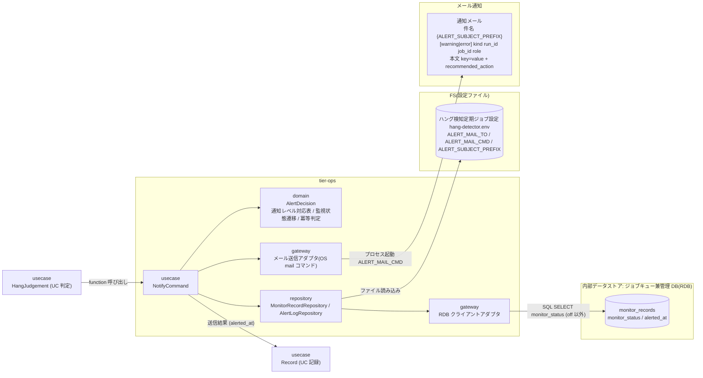
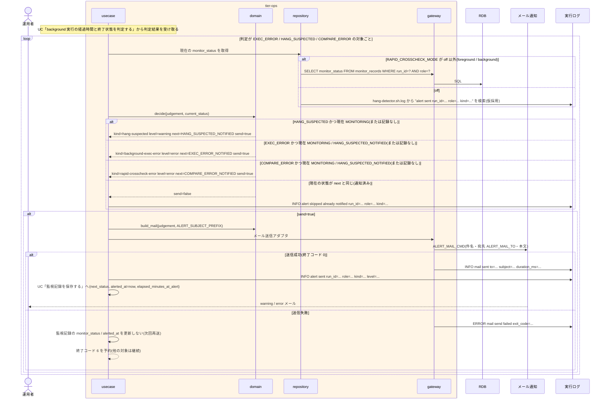

# ハング疑い・実行エラー・比較異常を通知する

## 概要

`hang-detector.sh` が UC「background 実行の経過時間と終了状態を判定する」の判定結果に応じて、ハング疑いを warning、background 実行エラーと速報クロスチェック異常を error のメールとして OS のメール送信コマンドで運用者へ送る。宛先・送信コマンド・件名プレフィックスはハング検知定期ジョブ設定(`hang-detector.env` の `ALERT_MAIL_TO` / `ALERT_MAIL_CMD` / `ALERT_SUBJECT_PREFIX`。所有者は基盤適用設計者)から取得する。同じ監視対象(run_id + role)・同じ通知種別のメールは 1 回だけ送る(監視記録の monitor_status が遷移するときだけ送り、送信成功時に alerted_at を更新する)。ハング疑い通知後に対象が終端した場合は再判定し、実行エラー / 比較異常を追加通知するか、正常終了(中止済みを含む)で監視記録を終端する(終端は UC「background 実行の経過時間と終了状態を判定する」)。監視は通知のみで、RUNNING を ABORTED へ変更せず、プロセスを止めず、依頼を作らない。

## データフロー



| レイヤー | データモデル | 変換内容 |
|---------|------------|---------|
| usecase | NotifyCommand(HangJudgement, current monitor_status) | 遷移判定 → メール組み立て → 送信 → 結果を記録 UC へ |
| domain | AlertDecision(kind, level, next_status, should_send) | 判定結果 → 通知種別 / レベル / 次の監視状態。現在の監視状態が次の状態と同じなら送らない(冪等) |
| domain | HangAlertMail(subject, body) | ui-design.md「通知メール規約」の件名・本文(件名の先頭は `ALERT_SUBJECT_PREFIX`(既定 `[relay-gate]`)。key 行 12 + 空行 + recommended_action 1 行。80 桁制限は 1〜13 行目のうち 11 行目 artifact_dir を除く行に適用(artifact_dir と 14 行目は折り返さず 80 桁を超えてよい)) |
| repository | MonitorRecordRepository(off 以外)/ AlertLogRepository(off) | 現在の monitor_status(off 以外)または実行ログ内の送信済み記録(off。仮採用)を読む |
| repository | ハング検知定期ジョブ設定(hang-detector.env) | `ALERT_MAIL_TO` / `ALERT_MAIL_CMD` / `ALERT_SUBJECT_PREFIX` を読む(認証情報の値は含まない) |
| gateway | メール送信アダプタ | `ALERT_MAIL_CMD` を宛先 `ALERT_MAIL_TO`・件名付きで起動し本文を stdin で渡す。終了コードで成否を判定 |

## 処理フロー



## バリエーション一覧

| バリエーション名 | 値 | 処理内容 | 適用 tier | 適用箇所 |
|----------------|---|---------|----------|---------|
| 通知レベル | warning | ハング疑い。件名 `{ALERT_SUBJECT_PREFIX}[warning]`(既定 `[relay-gate][warning]`)、本文 `level=warning`。静観候補 | tier-ops | `decide_alert` |
| 通知レベル | error | background 実行エラー・速報クロスチェック異常。件名 `{ALERT_SUBJECT_PREFIX}[error]`。対処必須 | tier-ops | `decide_alert` |
| ハング検知判定結果 | ハング疑い | kind=hang-suspected、level=warning | tier-ops | `decide_alert` |
| ハング検知判定結果 | 実行エラー | kind=background-exec-error、level=error | tier-ops | `decide_alert` |
| ハング検知判定結果 | 比較異常 | kind=rapid-crosscheck-error、level=error | tier-ops | `decide_alert` |
| ハング検知判定結果 | 監視対象外 / 正常終了または中止済み / 監視中 | hang_judgement=NOT_TARGET / COMPLETED / MONITORING は通知しない(中止済みは通知せず終端) | tier-ops | `decide_alert` |
| 速報クロスチェック監視判定 | 速報クロスチェック異常(FAILED / 比較 NG) | kind=rapid-crosscheck-error、level=error | tier-ops | `decide_alert` |
| 速報クロスチェック監視判定 | ハング疑い(RUNNING 継続) | kind=hang-suspected、level=warning、role=rapid-crosscheck。状態は変更しない | tier-ops | `decide_alert` |
| 速報クロスチェック監視判定 | 正常 | 通知しない | tier-ops | `decide_alert` |
| 監視状態 | ハング疑い通知済み / 実行エラー通知済み / 比較異常通知済み(HANG_SUSPECTED_NOTIFIED / EXEC_ERROR_NOTIFIED / COMPARE_ERROR_NOTIFIED) | 同じ種別は再送しない。ハング疑い通知済み → 実行エラー通知済み / 比較異常通知済みは別種別として 1 回送る(状態モデル「監視状態」の 6 値と同じ) | tier-ops | `decide_alert` |
| run role(成果物ディレクトリ区分) | blue / green / rapid-crosscheck | 件名・本文の `role=`、推奨対処の `abort-{role}.sh` | tier-ops | `build_mail` |
| 速報クロスチェックモード | foreground / background(off 以外)/ off | 冪等判定の記録元(monitor_records / 実行ログ) | tier-ops | `MonitorRecordRepository` / `AlertLogRepository` |
| 設定所有区分 | ハング検知定期ジョブ設定 | 宛先・送信コマンド・件名プレフィックスの正本(hang-detector.env)。所有者は基盤適用設計者 | tier-ops | `hang-detector.env` |

## 分岐条件一覧

| 条件名 | 判定ルール | 適用 tier | 適用箇所 | BDD Scenario |
|--------|----------|----------|---------|-------------|
| 通知レベルの判定 | ハング疑い → warning、background 実行エラー → error、速報クロスチェック異常 → error。件名 `{ALERT_SUBJECT_PREFIX}[{level}] {kind} run_id={run_id} job_id={job_id} role={role}`(プレフィックス既定 `[relay-gate]`) | tier-ops | `decide_alert`(domain) | ハング疑いを warning メールで通知する / 実行エラーを error メールで通知する |
| 設定所有区分 | 通知先(ALERT_MAIL_TO)・送信コマンド(ALERT_MAIL_CMD)・件名プレフィックス(ALERT_SUBJECT_PREFIX)・管理 DB 接続参照名(HANG_DB_CONN_REF)はハング検知定期ジョブ設定(hang-detector.env)が所有する。認証情報は値を置かず参照名のみ | tier-ops | `hang-detector.env`(repository) | ハング検知定期ジョブ設定の宛先と送信コマンドで送る(SPEC-008-06) |
| 速報比較依頼の異常判定 | 依頼 FAILED / 比較 NG → kind=rapid-crosscheck-error(error)。RUNNING で上限超過 → kind=hang-suspected(warning)。依頼の状態は変更しない | tier-ops | `decide_alert` / `build_mail` | 速報比較依頼の FAILED を error メールで通知する |
| 監視は通知のみ | 送信後も RUNNING を ABORTED にせず、プロセスを停止せず、依頼を作成しない。usecase は abort / rerun の repository を呼ばない | tier-ops | `NotifyCommand`(LP-017) | 通知後も状態は RUNNING のままである |

## 計算ルール一覧

| 計算名 | 入力情報 | 計算式/ロジック | 出力情報 | 適用 tier |
|--------|---------|---------------|---------|----------|
| 通知種別・レベル・次状態 | ハング検知判定結果 / 速報クロスチェック監視判定 | HANG_SUSPECTED → (hang-suspected, warning, HANG_SUSPECTED_NOTIFIED) / EXEC_ERROR → (background-exec-error, error, EXEC_ERROR_NOTIFIED) / COMPARE_ERROR → (rapid-crosscheck-error, error, COMPARE_ERROR_NOTIFIED) | 通知メール.重要度 / 通知種別、監視記録.monitor_status | tier-ops |
| 冪等判定(送信要否) | 現在の monitor_status、次状態 | should_send = (current ≠ next) かつ current ∈ {なし, MONITORING, HANG_SUSPECTED_NOTIFIED(next=EXEC_ERROR_NOTIFIED または COMPARE_ERROR_NOTIFIED のときのみ)}。COMPARE_ERROR_NOTIFIED / EXEC_ERROR_NOTIFIED / COMPLETED / NOT_MONITORED からは送らない | 送信フラグ | tier-ops |
| 件名 | ALERT_SUBJECT_PREFIX、level、kind、run_id、job_id、role | `{ALERT_SUBJECT_PREFIX}[{level}] {kind} run_id={run_id} job_id={job_id} role={role}`。ALERT_SUBJECT_PREFIX はハング検知定期ジョブ設定の値(未設定なら `[relay-gate]`) | 通知メール.件名 | tier-ops |
| 本文 | 判定結果、成果物パス、現在時刻 | ui-design.md「通知メール規約」の 12 行(kind / level / run_id / job_id / role / started_at / elapsed_minutes / hang_detect_limit_minutes / exit_code / request_status / artifact_dir / detected_at)+ 空行 + `recommended_action: <定型文>` 1 行(折り返さない。80 桁制限は 1〜13 行目のうち 11 行目 artifact_dir を除く行に適用(artifact_dir と 14 行目は折り返さず 80 桁を超えてよい)) | 通知メール.本文 | tier-ops |
| detected_at | 現在時刻(ローカル時刻) | now(ホストのローカルタイムゾーンの ISO 8601 秒精度・指示子なし。テスト専用環境変数 `RELAY_GATE_NOW` 設定時はその UTC 値をローカル時刻へ変換した値。判定 UC と同じ now) | 通知メール.detected_at | tier-ops |
| started_at(本文) | Runner Result.started-at.txt(background slot)/ 速報比較依頼.started_at(未開始は requested_at) | started-at.txt の中身(UTC ISO 8601 Z 付き)はローカル時刻へ変換して載せる。依頼の列はそのまま。いずれもローカル ISO 8601 秒精度・指示子なし(detected_at と同じ時刻軸) | 通知メール.started_at | tier-ops |
| 通知 ID | run_id、role、kind | `{run_id}:{role}:{kind}`(実行ログ上の識別。仮採用: メールにも DB にも別 ID は持たない) | 通知メール.通知 ID | tier-ops |

## 状態遷移一覧

| 状態モデル | 遷移元 | 遷移先 | トリガー | 事前条件 | 事後処理 | 適用 tier |
|-----------|--------|--------|---------|---------|---------|----------|
| 監視状態 | 監視中(MONITORING) | ハング疑い通知済み(HANG_SUSPECTED_NOTIFIED) | warning メール送信成功 | exitcode.txt 未出力かつ elapsed > limit(依頼は RUNNING で上限超過) | hang_suspected_at、alerted_at、elapsed_minutes_at_alert を記録(UC「監視記録を保存する」)。実行状態は変更しない | tier-ops |
| 監視状態 | 監視中(MONITORING) | 実行エラー通知済み(EXEC_ERROR_NOTIFIED) | error メール送信成功 | exitcode.txt が非 0 | alerted_at を記録 | tier-ops |
| 監視状態 | 監視中(MONITORING) | 比較異常通知済み(COMPARE_ERROR_NOTIFIED) | error メール送信成功 | 速報比較依頼が FAILED または比較 NG | alerted_at を記録 | tier-ops |
| 監視状態 | ハング疑い通知済み(HANG_SUSPECTED_NOTIFIED) | 実行エラー通知済み(EXEC_ERROR_NOTIFIED) | error メール送信成功(追加通知) | 通知後に exitcode.txt が非 0 で出力された | alerted_at を更新(hang_suspected_at と elapsed_minutes_at_alert は保持) | tier-ops |
| 監視状態 | ハング疑い通知済み(HANG_SUSPECTED_NOTIFIED) | 比較異常通知済み(COMPARE_ERROR_NOTIFIED) | error メール送信成功(追加通知) | 通知後に速報比較依頼が FAILED(比較 NG(exit_code=3)/ 実行エラー(exit_code=6))で終端した | alerted_at を更新(hang_suspected_at と elapsed_minutes_at_alert は保持) | tier-ops |

- HANG_SUSPECTED_NOTIFIED → COMPARE_ERROR_NOTIFIED は状態.tsv「監視状態」に定義された遷移(ハング疑い通知後に終端した依頼の比較異常を取りこぼさず、通知済み run が未終端のまま残る欠陥を防ぐ)
- (`[*]` → NOT_MONITORED / MONITORING、MONITORING → COMPLETED、HANG_SUSPECTED_NOTIFIED → COMPLETED(通知後正常終了・通知後の中止済み)は UC「background 実行の経過時間と終了状態を判定する」に記載)

## 関連 RDRA モデル

| モデル種別 | 要素名 | 関連 |
|-----------|--------|------|
| 業務 | 実行監視業務 | この UC が属する業務 |
| BUC | background 実行監視フロー | この UC を含む BUC |
| アクター | 運用者 | メールの受け手 |
| 情報 | 監視記録 | 冪等判定と遷移先の記録 |
| 情報 | 通知メール | 送信するメール |
| 情報 | slot 実行 | 通知対象(background) |
| 情報 | 速報比較依頼(rapid_crosscheck_request) | 通知対象(off 以外) |
| 情報 | ハング検知定期ジョブ設定 | 入力。通知先 ALERT_MAIL_TO / 送信コマンド ALERT_MAIL_CMD / 件名プレフィックス ALERT_SUBJECT_PREFIX(hang-detector.env。所有者: 基盤適用設計者) |
| 状態 | 監視状態 | MONITORING → *_NOTIFIED、HANG_SUSPECTED_NOTIFIED → EXEC_ERROR_NOTIFIED / COMPARE_ERROR_NOTIFIED(6 値。状態.tsv の遷移) |
| バリエーション | 監視状態 | 6 値(監視対象外 / 監視中 / ハング疑い通知済み / 実行エラー通知済み / 比較異常通知済み / 正常終了)。状態モデルと一致 |
| バリエーション | ハング検知判定結果 / 速報クロスチェック監視判定 / 通知レベル | 判定結果 → 通知種別 / レベルの対応 |
| バリエーション | 設定所有区分 | ハング検知定期ジョブ設定(所有者: 基盤適用設計者) |
| 条件 | 通知レベルの判定 | warning / error |
| 条件 | 速報比較依頼の異常判定 | 依頼の異常通知 |
| 条件 | 監視は通知のみ | 状態変更・停止・依頼作成をしない |
| 条件 | 設定所有区分 | 通知先・送信コマンド・件名プレフィックス・管理 DB 接続参照名の正本 |
| 画面 | hang-detect 異常通知出力(→ CLI 出力) | 実行ログの `alert sent` / `alert skipped` |
| イベント | warning / error メールの送信 | OS メールコマンドの起動 |
| 外部システム | メール通知 | 送信先 |

## 関連 USDM

| REQ ID | SPEC ID | 対応 BDD Scenario |
|--------|---------|------------------|
| REQ-008 | SPEC-008-01 | ハング疑いを warning メールで通知する(SPEC-008-01) / 実行エラーを error メールで通知する(SPEC-008-01) |
| REQ-008 | SPEC-008-02 | 速報比較依頼の FAILED を error メールで通知する(SPEC-008-02) |
| REQ-008 | SPEC-008-03 | ハング疑い通知後の速報比較依頼の比較異常は別種別として 1 回送る(SPEC-008-03) |
| REQ-008 | SPEC-008-04 | 通知後も状態は RUNNING のままである(SPEC-008-04) |
| REQ-008 | SPEC-008-06 | ハング検知定期ジョブ設定の宛先と送信コマンドで送る(SPEC-008-06) |
| REQ-012 | SPEC-012-01 | ハング疑いを warning メールで通知する(SPEC-008-01) |

> 機械可読の正本は `spec-event.yaml` の `use_cases[].usdm`(本表と同内容)。「対応 BDD Scenario」列は本 UC の `Scenario:` 名(接尾の SPEC ID を含む完全名)を「 / 」で区切って列挙し、Scenario 名以外の補足は「※」以降に置く。区切りは人が読む用で、Scenario 名自体に「 / 」を含むものがあるため機械分割には使わず、機械照合は `spec-event.yaml` の `scenarios[]` を使う。

## E2E 完了条件(BDD)

### 正常系

```gherkin
Feature: ハング疑い・実行エラー・比較異常を通知する

  Scenario: ハング疑いを warning メールで通知する(SPEC-008-01)
    Given ハング検知定期ジョブ設定(hang-detector.env)に ALERT_MAIL_TO=ops@example.invalid ALERT_MAIL_CMD=/usr/bin/mail があり ALERT_SUBJECT_PREFIX は未設定(既定 [relay-gate])である
    And run_id=20260830T113000-JOB001-3f9a1c2e job_id=JOB001 role=green の判定が HANG_SUSPECTED(started_at=2026-08-30T11:30:05 elapsed_minutes=74 hang_detect_limit_minutes=60)で、monitor_records に該当行が無い
    And RELAY_GATE_ARTIFACT_ROOT=/var/relay-gate、RELAY_GATE_NOW=2026-08-30T12:45:00Z である
    When hang-detector.sh が通知処理を実行する
    Then 件名 "[relay-gate][warning] hang-suspected run_id=20260830T113000-JOB001-3f9a1c2e job_id=JOB001 role=green" のメールが ops@example.invalid へ 1 通送られる
    And 本文の 1〜12 行目は kind=hang-suspected / level=warning / run_id=... / job_id=JOB001 / role=green / started_at=2026-08-30T11:30:05 / elapsed_minutes=74 / hang_detect_limit_minutes=60 / exit_code=- / request_status=- / "artifact_dir: /var/relay-gate/facade/20260830T113000-JOB001-3f9a1c2e/green" / detected_at=2026-08-30T12:45:00 である
    And 13 行目は空行、14 行目は "recommended_action: check the process on the execution host; if it is still running normally, wait. if it is hung, stop the process, then run: abort-green.sh --run-id 20260830T113000-JOB001-3f9a1c2e" の 1 行で、15 行目は無い(11 行目 artifact_dir を除く 1〜13 行目は 80 桁以内。artifact_dir と 14 行目は折り返さず 80 桁を超えてよい)

  Scenario: 実行エラーを error メールで通知する(SPEC-008-01)
    Given 同じ run の green/exitcode.txt の中身が 1 で判定が EXEC_ERROR、monitor_records の該当行が monitor_status=MONITORING である
    When hang-detector.sh が通知処理を実行する
    Then 件名 "[relay-gate][error] background-exec-error run_id=20260830T113000-JOB001-3f9a1c2e job_id=JOB001 role=green" のメールが 1 通送られ、本文に exit_code=1 と "recommended_action: inspect /var/relay-gate/facade/20260830T113000-JOB001-3f9a1c2e/green/stderr.log; after fixing the cause, run the rerun job: background-rerun.sh --source-run-id 20260830T113000-JOB001-3f9a1c2e --role green" が含まれる

  Scenario: 速報比較依頼の FAILED を error メールで通知する(SPEC-008-02)
    Given RAPID_CROSSCHECK_MODE=background で rapid_crosscheck_requests に run_id=20260830T113000-JOB001-3f9a1c2e job_id=JOB001 status=FAILED exit_code=3 の行があり、判定が COMPARE_ERROR である
    When hang-detector.sh が通知処理を実行する
    Then 件名 "[relay-gate][error] rapid-crosscheck-error run_id=20260830T113000-JOB001-3f9a1c2e job_id=JOB001 role=rapid-crosscheck" のメールが 1 通送られ、本文に exit_code=3 request_status=FAILED と "recommended_action: inspect the comparison result: rapid-crosscheck-result.sh --run-id 20260830T113000-JOB001-3f9a1c2e; this result is for investigation only and does not affect the scheduler response" が含まれる

  Scenario: 同じ対象に同じ通知を二重送信しない
    Given monitor_records に run_id=20260830T113000-JOB001-3f9a1c2e role=green monitor_status=HANG_SUSPECTED_NOTIFIED alerted_at=2026-08-30T12:45:00 の行がある
    And 判定が引き続き HANG_SUSPECTED で、RELAY_GATE_NOW=2026-08-30T12:50:00Z(5 分後)である
    When hang-detector.sh が通知処理を実行する
    Then メールは送られず、実行ログに "INFO alert skipped already notified run_id=20260830T113000-JOB001-3f9a1c2e role=green kind=hang-suspected" が残る

  Scenario: ハング疑い通知後の実行エラーは別種別として 1 回送る
    Given monitor_records の該当行が monitor_status=HANG_SUSPECTED_NOTIFIED で、green/exitcode.txt が 1 になり判定が EXEC_ERROR である
    When hang-detector.sh が通知処理を実行する
    Then 件名が "[relay-gate][error] background-exec-error" で始まるメールが 1 通送られ、monitor_status は EXEC_ERROR_NOTIFIED になる

  Scenario: ハング疑い通知後の速報比較依頼の比較異常は別種別として 1 回送る(SPEC-008-03)
    Given RAPID_CROSSCHECK_MODE=background で monitor_records に run_id=20260830T113000-JOB001-3f9a1c2e role=rapid-crosscheck monitor_status=HANG_SUSPECTED_NOTIFIED の行がある
    And rapid_crosscheck_requests の該当行が status=FAILED exit_code=3 になり comparison_results に status=NG の行があり、判定が COMPARE_ERROR である
    When hang-detector.sh が通知処理を実行する
    Then 件名が "[relay-gate][error] rapid-crosscheck-error" で始まるメールが 1 通送られ、monitor_status は COMPARE_ERROR_NOTIFIED になる
    And RELAY_GATE_NOW を 5 分進めて再実行しても rapid-crosscheck-error のメールは送られない

  Scenario: ハング検知定期ジョブ設定の宛先と送信コマンドで送る(SPEC-008-06)
    Given 基盤適用設計者が所有するハング検知定期ジョブ設定(hang-detector.env)に ALERT_MAIL_TO=ops-a@example.invalid,ops-b@example.invalid ALERT_MAIL_CMD=/usr/sbin/sendmail ALERT_SUBJECT_PREFIX=[relay-gate-prod] HANG_DB_CONN_REF=relaygate-db がある
    And hang-detector.env に DB パスワード等の認証情報の値は含まれない(管理 DB 接続は参照名 HANG_DB_CONN_REF だけで指定する)
    And run_id=20260830T113000-JOB001-3f9a1c2e role=green の判定が HANG_SUSPECTED で monitor_records に該当行が無い
    When hang-detector.sh が通知処理を実行する
    Then /usr/sbin/sendmail が起動され、宛先 ops-a@example.invalid と ops-b@example.invalid へ件名 "[relay-gate-prod][warning] hang-suspected run_id=20260830T113000-JOB001-3f9a1c2e job_id=JOB001 role=green" のメールが 1 通送られる
```

### 異常系

```gherkin
  Scenario: メール送信に失敗したら alerted_at を更新せず終了コード 6 で終了する
    Given ALERT_MAIL_CMD が終了コード 1 を返す
    And 判定が HANG_SUSPECTED で monitor_records の該当行が MONITORING である
    When hang-detector.sh が通知処理を実行する
    Then hang-detector.sh は終了コード 6 で終了し stderr に "error: mail send failed run_id=20260830T113000-JOB001-3f9a1c2e role=green kind=hang-suspected cmd_exit_code=1" が出る
    And monitor_records の該当行は monitor_status=MONITORING のままで alerted_at は NULL である(次回の定期実行で再送する)

  Scenario: 通知後も状態は RUNNING のままである(SPEC-008-04)
    Given RAPID_CROSSCHECK_MODE=background で rapid_crosscheck_requests の run_id=20260830T113000-JOB001-3f9a1c2e が status=RUNNING started_at=2026-08-30T11:40:00、ハング検知定期ジョブ設定(hang-detector.env)の RAPID_HANG_DETECT_LIMIT_MINUTES=60、RELAY_GATE_NOW=2026-08-30T12:45:00Z である
    When hang-detector.sh が通知処理を実行する
    Then role=rapid-crosscheck の warning メールが 1 通送られる
    And rapid_crosscheck_requests の該当行は status=RUNNING のままで、新しい依頼は作成されず、worker プロセスは停止されていない
```

## ティア別仕様

- [実行監視・復旧ティア](tier-ops.md)

### 統合 API Spec

- [CLI コマンド契約](../../../_cross-cutting/api/cli-command-contract.yaml)(`hang-detector.sh`)
- [AsyncAPI Spec](../../../_cross-cutting/api/asyncapi.yaml)(`channels.hang-alert-mail` publish)
