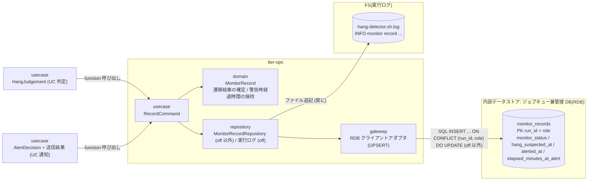
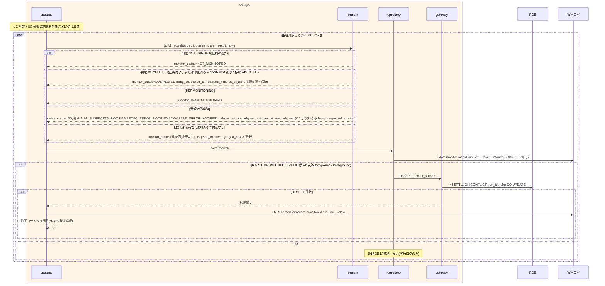

# 監視記録を保存する

## 概要

`hang-detector.sh` が、UC「background 実行の経過時間と終了状態を判定する」の判定と UC「ハング疑い・実行エラー・比較異常を通知する」の送信結果を、監視対象(run_id + role)ごとに `monitor_records` へ UPSERT する。monitor_status(NOT_MONITORED / MONITORING / HANG_SUSPECTED_NOTIFIED / EXEC_ERROR_NOTIFIED / COMPARE_ERROR_NOTIFIED / COMPLETED = 状態モデル「監視状態」の 6 値: 監視対象外 / 監視中 / ハング疑い通知済み / 実行エラー通知済み / 比較異常通知済み / 正常終了)、started_at、elapsed_minutes、hang_detect_limit_minutes、hang_suspected_at、alerted_at、elapsed_minutes_at_alert(警告時の経過時間)、judged_at を記録する。通知後に正常終了した実行(通知後正常終了)も警告時経過時間を残し、hang_detect_limit_minutes の調整根拠にする。監視対象が中止済み(exitcode.txt が無く aborted.txt がある / 依頼 ABORTED)になった場合は COMPLETED で終端する。RAPID_CROSSCHECK_MODE=off では管理 DB に接続せず実行ログにのみ残す。

## データフロー



| レイヤー | データモデル | 変換内容 |
|---------|------------|---------|
| usecase | RecordCommand(target, judgement, alert_result) | 判定と送信結果から MonitorRecord を組み立てて保存 |
| domain | MonitorRecord(run_id, role, job_id, target_type, monitor_status, started_at, elapsed_minutes, hang_detect_limit_minutes, hang_suspected_at, alerted_at, elapsed_minutes_at_alert, judged_at) | monitor_status は UC 判定 / UC 通知の遷移結果。hang_suspected_at / alerted_at / elapsed_minutes_at_alert は一度設定したら COMPLETED 遷移後も保持する |
| repository | MonitorRecordRepository(off 以外) | UPSERT(主キー run_id + role)。既存行の hang_suspected_at / elapsed_minutes_at_alert は NULL で上書きしない。接続参照名はハング検知定期ジョブ設定の HANG_DB_CONN_REF |
| repository | 実行ログ(off。および off 以外でも常に) | `INFO monitor record run_id=... role=... job_id=... target_type=... monitor_status=... started_at=... elapsed_minutes=... limit_minutes=... hang_suspected_at=... alerted_at=... elapsed_minutes_at_alert=... judged_at=...`(NULL は `-`。tier-ops.md 出力契約と同形)を追記 |

## 処理フロー



## バリエーション一覧

| バリエーション名 | 値 | 処理内容 | 適用 tier | 適用箇所 |
|----------------|---|---------|----------|---------|
| 監視状態 | 監視対象外 | monitor_status=NOT_MONITORED(バリエーションの値は状態モデル「監視状態」の 6 値と一致する) | tier-ops | `build_record` |
| 監視状態 | 監視中 | monitor_status=MONITORING | tier-ops | `build_record` |
| 監視状態 | ハング疑い通知済み | monitor_status=HANG_SUSPECTED_NOTIFIED(hang_suspected_at / alerted_at / elapsed_minutes_at_alert を記録) | tier-ops | `build_record` |
| 監視状態 | 実行エラー通知済み | monitor_status=EXEC_ERROR_NOTIFIED | tier-ops | `build_record` |
| 監視状態 | 比較異常通知済み | monitor_status=COMPARE_ERROR_NOTIFIED | tier-ops | `build_record` |
| 監視状態 | 正常終了 | monitor_status=COMPLETED。通知後正常終了(ハング疑い通知済み → 正常終了の別名)は COMPLETED かつ elapsed_minutes_at_alert が非 NULL。中止済み(aborted.txt / 依頼 ABORTED。abort-blue / abort-green による未着手依頼の中止を含む)も COMPLETED で終端 | tier-ops | `build_record` |
| ハング検知判定結果 | 監視対象外 / 正常終了または中止済み / 監視中 / ハング疑い / 実行エラー / 比較異常 | hang_judgement(6 値)から monitor_status への写像: NOT_TARGET → NOT_MONITORED / COMPLETED(正常終了・中止済み)→ COMPLETED / MONITORING → MONITORING / HANG_SUSPECTED → HANG_SUSPECTED_NOTIFIED(送信成功時)/ EXEC_ERROR → EXEC_ERROR_NOTIFIED(送信成功時)/ COMPARE_ERROR → COMPARE_ERROR_NOTIFIED(送信成功時) | tier-ops | `build_record` |
| 速報クロスチェック監視判定 | 速報クロスチェック異常 / ハング疑い / 正常 | COMPARE_ERROR → COMPARE_ERROR_NOTIFIED / HANG_SUSPECTED → HANG_SUSPECTED_NOTIFIED / MONITORING または COMPLETED(SUCCEEDED かつ OK、中止済み) | tier-ops | `build_record` |
| run role(成果物ディレクトリ区分) | blue / green / rapid-crosscheck | 主キー role | tier-ops | `monitor_records.role` |
| ハング検知上限設定 | 60 分 / 調整値 / 0 | hang_detect_limit_minutes 列にそのまま記録(0 は NOT_MONITORED) | tier-ops | `monitor_records.hang_detect_limit_minutes` |
| 速報クロスチェックモード | foreground / background(off 以外) | monitor_records に UPSERT + 実行ログ | tier-ops | `MonitorRecordRepository` |
| 速報クロスチェックモード | off | 実行ログにのみ残す(管理 DB に接続しない) | tier-ops | `MonitorRecordRepository` |

## 分岐条件一覧

| 条件名 | 判定ルール | 適用 tier | 適用箇所 | BDD Scenario |
|--------|----------|----------|---------|-------------|
| 警告傾向の記録 | monitor_status / hang_suspected_at / alerted_at を記録する。通知後に正常終了した実行も elapsed_minutes_at_alert(警告時の経過時間)を保持したまま COMPLETED にする(NULL で上書きしない)。通知後に中止済みになった実行も同様に保持したまま COMPLETED で終端する | tier-ops | `build_record` / `MonitorRecordRepository`(UPSERT の COALESCE) | 通知後に正常終了した実行の警告時経過時間を残す / 通知後に中止された slot 実行を中止済みで終端する |
| 監視は通知のみ | 監視記録の保存は relay-gate 自身のテーブルにのみ書き、slot 実行・依頼・parallel_run の状態は変更しない | tier-ops | `RecordCommand`(LP-017) | 監視記録の保存で他テーブルは変更されない |
| 速報クロスチェック有効判定 | off では管理 DB に接続せず、実行ログにのみ記録する | tier-ops | `MonitorRecordRepository`(LP-020) | off では実行ログにのみ残す |

## 計算ルール一覧

| 計算名 | 入力情報 | 計算式/ロジック | 出力情報 | 適用 tier |
|--------|---------|---------------|---------|----------|
| 警告時の経過時間 | 監視記録.経過時間(通知時点) | 通知送信成功時の elapsed_minutes を elapsed_minutes_at_alert に設定。以後の判定で上書きしない(最初の警告時の値を保持。ハング疑い → 実行エラーの追加通知でも保持) | 監視記録.警告時の経過時間 | tier-ops |
| hang_suspected_at | 現在時刻 | ハング疑い通知の送信成功時に now(判定時刻ではない。rdb-schema.yaml の列説明と同じ)。既存値があれば保持 | 監視記録.hang_suspected_at | tier-ops |
| alerted_at | 現在時刻 | 通知送信成功のたびに now(ハング疑い → 実行エラーで更新される) | 監視記録.alerted_at | tier-ops |
| judged_at | 現在時刻 | 毎回の判定で now(ローカル時刻。ISO 8601 秒精度・指示子なし) | 監視記録.判定日時 | tier-ops |
| 現在時刻(now) | システム時刻(ホストのローカルタイムゾーン)、テスト専用環境変数 `RELAY_GATE_NOW` | `RELAY_GATE_NOW` 設定時はその UTC 値をローカル時刻へ変換した値、未設定ならシステム時刻(判定 UC・通知 UC と同じ now を 1 回の実行で共有する)。hang_suspected_at / alerted_at / judged_at はローカル時刻(指示子なし)で記録する。started_at は started-at.txt の UTC 値をローカル時刻へ変換して記録する | hang_suspected_at / alerted_at / judged_at / started_at | tier-ops |
| target_type | 監視対象の種別 | background slot なら `background_slot`、速報比較依頼なら `rapid_request` | 監視記録.監視対象種別 | tier-ops |

## 状態遷移一覧

| 状態モデル | 遷移元 | 遷移先 | トリガー | 事前条件 | 事後処理 | 適用 tier |
|-----------|--------|--------|---------|---------|---------|----------|
| 監視状態 | (UC 判定 / UC 通知の遷移結果) | (同左) | `hang-detector.sh` の記録処理 | この UC は状態遷移を判定しない。UC「background 実行の経過時間と終了状態を判定する」(`[*]` → NOT_MONITORED / MONITORING、MONITORING → COMPLETED(正常終了・中止済み)、HANG_SUSPECTED_NOTIFIED → COMPLETED(通知後正常終了・通知後の中止済み))と UC「ハング疑い・実行エラー・比較異常を通知する」(MONITORING → *_NOTIFIED、HANG_SUSPECTED_NOTIFIED → EXEC_ERROR_NOTIFIED / COMPARE_ERROR_NOTIFIED)の遷移結果(いずれも状態.tsv「監視状態」の遷移)を monitor_records に保存する | UPSERT(off 以外)/ 実行ログ(off) | tier-ops |

## 関連 RDRA モデル

| モデル種別 | 要素名 | 関連 |
|-----------|--------|------|
| 業務 | 実行監視業務 | この UC が属する業務 |
| BUC | background 実行監視フロー | この UC を含む BUC |
| アクター | 運用者 | 受益者(警告傾向を `hang-detect-trend.sh` で読む) |
| 情報 | 監視記録 | 保存対象(monitor_status は状態モデル「監視状態」の 6 値) |
| 情報 | 実行ログ | off 時の記録先(off 以外でも追記) |
| 情報 | ハング検知定期ジョブ設定 | UPSERT の管理 DB 接続参照名 HANG_DB_CONN_REF の出所(BUC.tsv 上の紐づけは判定 UC 経由) |
| 状態 | 監視状態 | 遷移結果の永続化(6 値。通知後・中止後の終端を含む) |
| バリエーション | 監視状態 | 6 値。状態モデルと一致(通知後正常終了は遷移の別名) |
| 条件 | 警告傾向の記録 | 通知後正常終了の警告時経過時間 |
| 条件 | 監視は通知のみ | 他の状態を変更しない |
| 画面 | hang-detect 監視記録出力(→ CLI 出力) | 実行ログの `monitor record` 行 |
| イベント | 監視記録の保存 | 管理 DB への UPSERT |
| 内部データストア | ジョブキュー兼管理 DB(RDB) | monitor_records(relay-gate 内部の構成要素。外部システムではない) |

## 関連 USDM

| REQ ID | SPEC ID | 対応 BDD Scenario |
|--------|---------|------------------|
| REQ-008 | SPEC-008-03 | 通知後に正常終了した実行の警告時経過時間を残す(SPEC-008-03) / off では実行ログにのみ残す(SPEC-008-03) / 通知後に中止された slot 実行を中止済みで終端する(SPEC-008-03) |
| REQ-008 | SPEC-008-04 | 監視記録の保存で他テーブルは変更されない(SPEC-008-04) |
| REQ-008 | SPEC-008-05 | 通知後に正常終了した実行の警告時経過時間を残す(SPEC-008-03) ※ 調整根拠 |

> 機械可読の正本は `spec-event.yaml` の `use_cases[].usdm`(本表と同内容)。「対応 BDD Scenario」列は本 UC の `Scenario:` 名(接尾の SPEC ID を含む完全名)を「 / 」で区切って列挙し、Scenario 名以外の補足は「※」以降に置く。区切りは人が読む用で、Scenario 名自体に「 / 」を含むものがあるため機械分割には使わず、機械照合は `spec-event.yaml` の `scenarios[]` を使う。

## E2E 完了条件(BDD)

### 正常系

```gherkin
Feature: 監視記録を保存する

  Scenario: 監視中の対象を初回記録する
    Given RAPID_CROSSCHECK_MODE=background で monitor_records に run_id=20260830T113000-JOB001-3f9a1c2e role=green の行が無い
    And 判定が MONITORING(job_id=JOB001 started_at=2026-08-30T11:30:05 elapsed_minutes=29 hang_detect_limit_minutes=60)で RELAY_GATE_NOW=2026-08-30T12:00:00Z である
    When hang-detector.sh が記録処理を実行する
    Then monitor_records に run_id=20260830T113000-JOB001-3f9a1c2e role=green job_id=JOB001 target_type=background_slot monitor_status=MONITORING started_at=2026-08-30T11:30:05 elapsed_minutes=29 hang_detect_limit_minutes=60 hang_suspected_at=NULL alerted_at=NULL elapsed_minutes_at_alert=NULL judged_at=2026-08-30T12:00:00 の行が 1 件できる

  Scenario: ハング疑い通知の送信成功を記録する
    Given 同じ行が MONITORING で、判定が HANG_SUSPECTED(elapsed_minutes=74)、warning メールの送信が成功し、RELAY_GATE_NOW=2026-08-30T12:45:00Z である
    When hang-detector.sh が記録処理を実行する
    Then 該当行は monitor_status=HANG_SUSPECTED_NOTIFIED hang_suspected_at=2026-08-30T12:45:00 alerted_at=2026-08-30T12:45:00 elapsed_minutes_at_alert=74 elapsed_minutes=74 になる

  Scenario: 通知後に正常終了した実行の警告時経過時間を残す(SPEC-008-03)
    Given 該当行が monitor_status=HANG_SUSPECTED_NOTIFIED elapsed_minutes_at_alert=74 で、green/exitcode.txt が 0 になり判定が COMPLETED(正常終了)、RELAY_GATE_NOW=2026-08-30T12:55:00Z である
    When hang-detector.sh が記録処理を実行する
    Then 該当行は monitor_status=COMPLETED elapsed_minutes=84 judged_at=2026-08-30T12:55:00 になり、hang_suspected_at=2026-08-30T12:45:00 と elapsed_minutes_at_alert=74 は保持される

  Scenario: 通知後に中止された slot 実行を中止済みで終端する(SPEC-008-03)
    Given 該当行が monitor_status=HANG_SUSPECTED_NOTIFIED elapsed_minutes_at_alert=74 で、abort-green.sh により green/aborted.txt が書かれ(green/exitcode.txt は無い)、判定が COMPLETED(中止済み)である
    When hang-detector.sh が記録処理を実行する
    Then 該当行は monitor_status=COMPLETED になり hang_suspected_at と elapsed_minutes_at_alert=74 は保持され、以後の定期実行でこの run_id / role は再判定されない

  Scenario: off では実行ログにのみ残す(SPEC-008-03)
    Given RAPID_CROSSCHECK_MODE=off で管理 DB が存在しない
    And run_id=20260830T113000-JOB001-3f9a1c2e(job_id=JOB001)の green/started-at.txt が 2026-08-30T11:30:05Z で RELAY_GATE_NOW=2026-08-30T11:59:30Z であり、判定が MONITORING(elapsed_minutes=29 hang_detect_limit_minutes=60)である
    When hang-detector.sh が記録処理を実行する
    Then 管理 DB への接続は行われず、hang-detector.sh.log に "INFO monitor record run_id=20260830T113000-JOB001-3f9a1c2e role=green job_id=JOB001 target_type=background_slot monitor_status=MONITORING started_at=2026-08-30T11:30:05 elapsed_minutes=29 limit_minutes=60 hang_suspected_at=- alerted_at=- elapsed_minutes_at_alert=- judged_at=2026-08-30T11:59:30" が残る
```

### 異常系

```gherkin
  Scenario: 監視記録の保存で他テーブルは変更されない(SPEC-008-04)
    Given RAPID_CROSSCHECK_MODE=background で slot_executions / rapid_crosscheck_requests / parallel_runs の該当行が status=RUNNING である
    When hang-detector.sh が HANG_SUSPECTED の判定を記録する
    Then monitor_records だけが更新され、slot_executions / rapid_crosscheck_requests / parallel_runs の該当行は status=RUNNING のままである

  Scenario: UPSERT に失敗しても他の対象の記録は継続する
    Given RAPID_CROSSCHECK_MODE=background で監視対象が 2 件あり、1 件目の UPSERT 中に管理 DB がエラーを返す
    When hang-detector.sh が記録処理を実行する
    Then 2 件目の記録は行われ、hang-detector.sh は終了コード 6 で終了し stderr に "error: monitor record save failed run_id=20260830T113000-JOB001-3f9a1c2e role=green" が出る
```

## ティア別仕様

- [実行監視・復旧ティア](tier-ops.md)

### 統合 API Spec

- [CLI コマンド契約](../../../_cross-cutting/api/cli-command-contract.yaml)(`hang-detector.sh`)
- [AsyncAPI Spec](../../../_cross-cutting/api/asyncapi.yaml)(本 UC は publish / subscribe しない)
