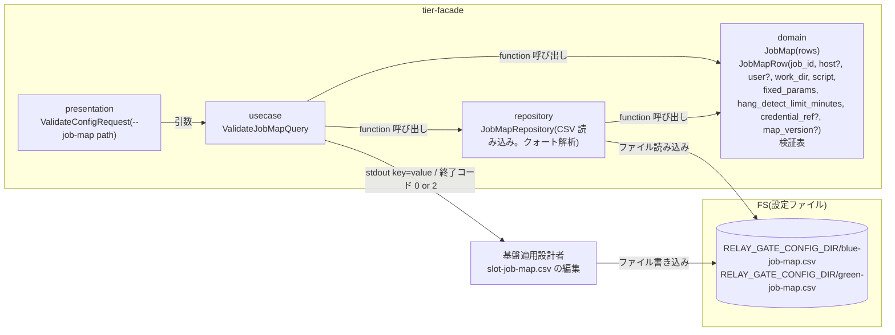
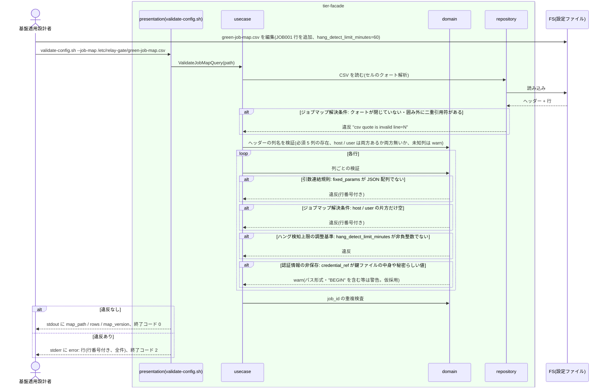

# slot ごとのジョブマップを定義する

## 概要

基盤適用設計者が、slot(blue / green)ごとに JOB_ID から解決するホスト・実行ユーザー・作業ディレクトリ・スクリプト・固定引数(JSON 配列)・hang_detect_limit_minutes(導入時 60 分、foreground role は 0)を slot ジョブマップ(CSV。1 行目ヘッダー、1 行 1 job_id)として定義し、`validate-config.sh --job-map <path>` で検証する。列名は元の方針資料の `job_id,host,user,work_dir,script,fixed_params,hang_detect_limit_minutes` を用いる。host / user はローカル実行の slot では省略できる。認証情報参照名(credential_ref)とマップ版(map_version)は末尾の任意列。実装版の列は持たず、実装版は feature flag(`BLUE_IMPL` / `GREEN_IMPL`)が所有する。認証情報は参照名で指定し、ジョブスケジューラ側のジョブ定義には実行先を持たせない。

## データフロー



| レイヤー | データモデル | 変換内容 |
|---------|------------|---------|
| presentation | ValidateConfigRequest | `--job-map <path>` の引数検証 |
| usecase | ValidateJobMapQuery | CSV 読み込み → ヘッダー検証(必須列・host / user の対) → 行ごとの列検証 → job_id 重複検査 → 集計出力 |
| domain | JobMap / JobMapRow | 列ごとの型・必須・値域の検証表(純粋関数)。fixed_params の JSON 配列判定、hang_detect_limit_minutes の非負整数判定、絶対パス判定、host / user の対の判定(両方空 = ローカル実行) |
| repository | JobMapRepository | ヘッダー行付き CSV の読み込みと CSV セルのクォート解析(bash 単独の 1 文字ずつの状態機械)。UC「ジョブマップで JOB_ID から実行先を解決する」と同じ関数 |

## 処理フロー



## バリエーション一覧

| バリエーション名 | 値 | 処理内容 | 適用 tier | 適用箇所 |
|----------------|---|---------|----------|---------|
| 実装スロット | blue | `blue-job-map.csv` | tier-facade | repository `job_map_repo` |
| 実装スロット | green | `green-job-map.csv` | tier-facade | repository `job_map_repo` |
| 設定所有区分 | slot ジョブマップ | host・user・work_dir・script・fixed_params・hang_detect_limit_minutes・認証情報参照名の正本。実装版は持たない(feature flag の所有) | tier-facade | domain `JobMapRow` |
| 設定所有区分 | 適用文書 | ホスト配置・実行ユーザー方針の根拠(relay-gate は読まない) | — | — |
| ハング検知上限設定 | 60 分(導入時既定) | 導入時は全行 60 を推奨。検証は値域のみ(推奨値との差は `info:`) | tier-facade | domain `validate_job_map_row` |
| ハング検知上限設定 | ジョブごとの調整値 | 0 以上の整数 | tier-facade | domain `validate_job_map_row` |
| ハング検知上限設定 | 0(検知対象外) | foreground で動く slot の行に設定する。検証は値域のみ | tier-facade | domain `validate_job_map_row` |

## 分岐条件一覧

| 条件名 | 判定ルール | 適用 tier | 適用箇所 | BDD Scenario |
|--------|----------|----------|---------|-------------|
| 設定所有区分 | ジョブマップの列は必須 5 列(job_id / work_dir / script / fixed_params / hang_detect_limit_minutes)+ 任意列(host / user の対、末尾の credential_ref / map_version)だけ。runner・mode・実装版・比較対象の列は置かない。必須列が欠けたヘッダーは検証 NG、未知列は `warn:` | tier-facade | domain `validate_job_map_header` | ヘッダーに必須列が無いジョブマップは拒否される |
| ジョブマップ解決条件 | CSV(1 行目ヘッダー、1 行 1 job_id、行頭 `#` はコメント)。列はヘッダー名で対応付ける。セルは二重引用符で囲め、囲んだセル内の二重引用符は `""` と二重化する。job_id は行内で一意(重複は検証 NG)。job_id は `^[A-Za-z0-9_-]+$`。host / user は両方無いか両方空でローカル実行、片方だけは検証 NG | tier-facade | domain `validate_job_map` / repository `csv_parse` | 元資料の列名の CSV ジョブマップを検証する(SPEC-004-04) / host と user の列を持たないローカル実行用ジョブマップを検証する(SPEC-004-04) / job_id が重複するジョブマップは拒否される |
| 引数連結規則 | fixed_params は JSON 配列(文字列要素のみ)を格納する CSV セル。必ず二重引用符で囲む(例: `"[""p1"",""p2 p3""]"`)。空は `"[]"` または `[]`。要素内の空白・カンマは許可 | tier-facade | domain `validate_job_map_row` | fixed_params セルの JSON 配列を CSV クォート規則で解析する(SPEC-004-04) / 固定引数が JSON 配列でない行は拒否される(SPEC-004-02) |
| 認証情報の非保存 | credential_ref は参照名(`^[A-Za-z0-9_.-]+$`)。パス形式(`/` を含む)や `BEGIN` を含む値は `warn: credential_ref looks like a secret or path`(拒否はしない。仮採用) | tier-facade | domain `validate_job_map_row` | 認証情報らしい値は警告される |
| ハング検知上限の調整基準 | hang_detect_limit_minutes は `^[0-9]+$`。変更は次回以降の run の execution-spec.json にのみ反映される(実行中の run には影響しない)。調整の記録(調整日時・調整根拠となる警告時経過時間)はジョブマップの列に持たず適用構成文書に残す | tier-facade | domain `validate_job_map_row` | hang_detect_limit_minutes の変更は次回以降の run に反映される(SPEC-008-05) |

## 計算ルール一覧

| 計算名 | 入力情報 | 計算式/ロジック | 出力情報 | 適用 tier |
|--------|---------|---------------|---------|----------|
| 行数集計 | CSV | コメント・空行を除くデータ行数 | rows | tier-facade |
| 版の集計 | map_version 列(任意) | 列があれば全行の distinct 値。複数あれば `warn: mixed map_version values=...`(仮採用: 1 ファイル 1 版を推奨)。列が無い・全行空なら `-` | map_version | tier-facade |

## 状態遷移一覧

| 状態モデル | 遷移元 | 遷移先 | トリガー | 事前条件 | 事後処理 | 適用 tier |
|-----------|--------|--------|---------|---------|---------|----------|
| 該当なし | — | — | 設定 UC。状態を遷移させない | — | — | — |

## 関連 RDRA モデル

| モデル種別 | 要素名 | 関連 |
|-----------|--------|------|
| 業務 | 適用構成業務 | この UC が属する業務 |
| BUC | 適用構成定義フロー | この UC を含む BUC |
| アクター | 基盤適用設計者 | 提供者 |
| 情報 | ジョブマップ | 定義対象。属性: job_id / host(省略可)/ user(省略可)/ work_dir / script / fixed_params(JSON 配列を格納する CSV セル)/ hang_detect_limit_minutes / credential_ref(末尾の任意列)/ map_version(末尾の任意列) |
| 情報 | ハング検知上限設定 | hang_detect_limit_minutes 列 |
| 情報 | 適用構成文書 | ホスト配置・実行ユーザー方針の根拠。hang_detect_limit_minutes の調整記録(調整日時・調整根拠となる警告時経過時間)の置き場 |
| 条件 | 設定所有区分 / ジョブマップ解決条件 / 引数連結規則 / 認証情報の非保存 / ハング検知上限の調整基準 | 分岐条件一覧を参照 |
| 画面 | slot ジョブマップ検証出力(→ CLI 出力) | validate-config.sh の stdout / stderr / 終了コード |
| イベント | 実行先ホスト接続の定義 | host / user / credential_ref |
| 外部システム | リモート実行ホスト(SSH) | 接続先の定義(host / user を両方空にした行はローカル実行で SSH しない) |

## 関連 USDM

| REQ ID | SPEC ID | 対応 BDD Scenario |
|---|---|---|
| REQ-004 | SPEC-004-01 | 有効なジョブマップを検証する(SPEC-004-01) |
| REQ-004 | SPEC-004-02 | 固定引数が JSON 配列でない行は拒否される(SPEC-004-02) ※ 定義側。AC「固定引数の後ろに PARAM を順序保持で連結」の実行側は UC〈ジョブマップで JOB_ID から実行先を解決する〉の Scenario「固定引数の後ろに PARAM を順序保持で連結する」で覆う |
| REQ-004 | SPEC-004-03 | 認証情報らしい値は警告される ※ 定義側。AC「認証情報の値を保存しない」の実行側は UC〈execution-spec.json を確定保存する〉の Scenario「認証情報の値を保存しない」で覆う |
| REQ-004 | SPEC-004-04 | 元資料の列名の CSV ジョブマップを検証する(SPEC-004-04) / fixed_params セルの JSON 配列を CSV クォート規則で解析する(SPEC-004-04) / host と user の列を持たないローカル実行用ジョブマップを検証する(SPEC-004-04) / credential_ref と map_version の列が無くてもエラーにならない(SPEC-004-04) ※ 定義側。AC「runner が列名の読み替えなしに解決する」「ローカル実行として解決される」の実行側は UC〈ジョブマップで JOB_ID から実行先を解決する〉、AC「クロスチェックジョブマップと対象カタログも同じ CSV 形式」は UC〈クロスチェックのジョブマップと比較定義を定義する〉で覆う |
| REQ-008 | SPEC-008-05 | hang_detect_limit_minutes の変更は次回以降の run に反映される(SPEC-008-05) ※ 検証側(変更後のジョブマップが検証を通過し、実行中の run の execution-spec.json は変わらない)。AC「次回以降の run を実行すると新しい上限が execution-spec.json に反映される」の実行側は UC〈hang_detect_limit_minutes をジョブごとに調整する〉の Scenario「調整は実行済み run に影響しない(SPEC-008-05)」とそのティア完了条件「変更後の run にだけ新しい上限が記録される」で覆う |
| REQ-013 | SPEC-013-01 | 有効なジョブマップを検証する(SPEC-004-01) |

> 機械可読の正本は `spec-event.yaml` の `use_cases[].usdm`(本表と同内容)。「対応 BDD Scenario」列は本 UC の `Scenario:` 名(接尾の SPEC ID を含む完全名)を「 / 」で区切って列挙し、Scenario 名以外の補足は「※」以降に置く。区切りは人が読む用で、Scenario 名自体に「 / 」を含むものがあるため機械分割には使わず、機械照合は `spec-event.yaml` の `scenarios[]` を使う。

## E2E 完了条件(BDD)

### 正常系

```gherkin
Feature: slot ごとのジョブマップを定義する

  Scenario: 有効なジョブマップを検証する(SPEC-004-01)
    Given /etc/relay-gate/green-job-map.csv のヘッダーが "job_id,host,user,work_dir,script,fixed_params,hang_detect_limit_minutes,credential_ref,map_version" である
    And 行 'JOB001,host-green-01,batch,/var/app/work,/opt/app/bin/job001.sh,"[""--mode"",""full""]",60,ssh-key-green,map-v3' と 'JOB002,host-green-01,batch,/var/app/work,/opt/app/bin/job002.sh,"[]",0,ssh-key-green,map-v3' がある
    When 基盤適用設計者が validate-config.sh --job-map /etc/relay-gate/green-job-map.csv を実行する
    Then 終了コード 0 で stdout に "map_path: /etc/relay-gate/green-job-map.csv" "rows=2" "map_version=map-v3" が出る

  Scenario: 元資料の列名の CSV ジョブマップを検証する(SPEC-004-04)
    Given green-job-map.csv のヘッダーが元資料どおりの "job_id,host,user,work_dir,script,fixed_params,hang_detect_limit_minutes" の 7 列である
    And 行 'JOB001,host-green-01,batch,/var/app/work,/opt/app/bin/job001.sh,"[]",60' がある
    When validate-config.sh --job-map を実行する
    Then 終了コード 0 で stdout に "rows=1" "map_version=-" が出る
    And stderr に "warn: unknown column" で始まる行は出ない

  Scenario: fixed_params セルの JSON 配列を CSV クォート規則で解析する(SPEC-004-04)
    Given green-job-map.csv の JOB001 行の fixed_params セルが '"[""p1"",""p2 p3""]"' である(二重引用符で囲み、内部の二重引用符を二重化)
    When validate-config.sh --job-map --verbose を実行する
    Then 終了コード 0 で stderr に 'info: resolved job_id=JOB001' と 'fixed_params=["p1","p2 p3"]' を含む 1 行が出る(固定引数は p1 と "p2 p3" の 2 要素)

  Scenario: host と user の列を持たないローカル実行用ジョブマップを検証する(SPEC-004-04)
    Given blue-job-map.csv のヘッダーが "job_id,work_dir,script,fixed_params,hang_detect_limit_minutes" で host / user 列が無い
    And 行 'JOB001,/var/app/work,/opt/app/bin/job001.sh,"[]",0' がある
    When validate-config.sh --job-map /etc/relay-gate/blue-job-map.csv --verbose を実行する
    Then 終了コード 0 で stderr に "info: resolved job_id=JOB001 host=- user=- exec=local" で始まる行が出る

  Scenario: credential_ref と map_version の列が無くてもエラーにならない(SPEC-004-04)
    Given green-job-map.csv のヘッダーが "job_id,host,user,work_dir,script,fixed_params,hang_detect_limit_minutes" である
    When validate-config.sh --job-map を実行する
    Then 終了コード 0 で stdout に "map_version=-" が出る
    When ヘッダー末尾に credential_ref,map_version を加え各行に ssh-key-green,map-v3 を追記して再実行する
    Then 終了コード 0 で stdout に "map_version=map-v3" が出る

  Scenario: hang_detect_limit_minutes の変更は次回以降の run に反映される(SPEC-008-05)
    Given run_id=20260830T113000-JOB001-3f9a1c2e が execution-spec.json の slots.green.hang_detect_limit_minutes=60 で実行中である
    And green-job-map.csv の JOB001 行の hang_detect_limit_minutes を 60 から 90 に変更した
    When validate-config.sh --job-map /etc/relay-gate/green-job-map.csv --verbose を実行する
    Then 終了コード 0 で stderr に "info: resolved job_id=JOB001" と "hang_detect_limit_minutes=90" を含む 1 行が出る
    And 20260830T113000-JOB001-3f9a1c2e の execution-spec.json の slots.green.hang_detect_limit_minutes は 60 のままである

  Scenario: 導入時は全ジョブ 60 分・foreground slot の行は 0 で定義する
    Given 並行稼働モード(blue foreground / green background)で導入する
    When blue-job-map.csv の全行に hang_detect_limit_minutes=0、green-job-map.csv の全行に 60 を定義して validate-config.sh を実行する
    Then 両ファイルとも終了コード 0 で検証を通過する
```

### 異常系

```gherkin
  Scenario: 固定引数が JSON 配列でない行は拒否される(SPEC-004-02)
    Given green-job-map.csv の 3 行目(JOB003)の fixed_params セルが '"p1,p2"' である
    When validate-config.sh --job-map を実行する
    Then 終了コード 2 で stderr に "error: fixed_params is not a json array of strings line=3 job_id=JOB003 value=p1,p2" が出る

  Scenario: クォートが不正な CSV は拒否される
    Given green-job-map.csv の 2 行目の fixed_params セルが '"[""--mode"",""full""]' で閉じ引用符が無い
    When validate-config.sh --job-map を実行する
    Then 終了コード 2 で stderr に "error: csv quote is invalid line=2 path: /etc/relay-gate/green-job-map.csv" が出る

  Scenario: job_id が重複するジョブマップは拒否される
    Given green-job-map.csv に job_id=JOB001 の行が 2 行目と 5 行目にある
    When validate-config.sh --job-map を実行する
    Then 終了コード 2 で stderr に "error: duplicate job_id job_id=JOB001 lines=2,5" が出る

  Scenario: ヘッダーに必須列が無いジョブマップは拒否される
    Given green-job-map.csv のヘッダーに hang_detect_limit_minutes 列が無い
    When validate-config.sh --job-map を実行する
    Then 終了コード 2 で stderr に "error: job map header mismatch missing=hang_detect_limit_minutes path: /etc/relay-gate/green-job-map.csv" が出る

  Scenario: host と user の片方だけの列は拒否される
    Given green-job-map.csv のヘッダーに host 列はあるが user 列が無い
    When validate-config.sh --job-map を実行する
    Then 終了コード 2 で stderr に "error: job map header mismatch missing=user path: /etc/relay-gate/green-job-map.csv" が出る

  Scenario: host と user の片方だけが空の行は拒否される
    Given green-job-map.csv の 2 行目(JOB001)の host が host-green-01 で user が空である
    When validate-config.sh --job-map を実行する
    Then 終了コード 2 で stderr に "error: user is empty line=2 job_id=JOB001 value=" が出る

  Scenario: hang_detect_limit_minutes が非負整数でない行は拒否される
    Given green-job-map.csv の 2 行目の hang_detect_limit_minutes が "60m" である
    When validate-config.sh --job-map を実行する
    Then 終了コード 2 で stderr に "error: hang_detect_limit_minutes is not a non-negative integer line=2 job_id=JOB001 value=60m" が出る

  Scenario: 実装版の列は未知列として警告される
    Given green-job-map.csv のヘッダー末尾に impl_version 列がある
    When validate-config.sh --job-map を実行する
    Then 終了コード 0 で stderr に "warn: unknown column column=impl_version path: /etc/relay-gate/green-job-map.csv" が出る

  Scenario: 認証情報らしい値は警告される
    Given green-job-map.csv の credential_ref が /home/batch/.ssh/id_green である
    When validate-config.sh --job-map を実行する
    Then 終了コード 0 で stderr に "warn: credential_ref looks like a secret or path line=2 job_id=JOB001" が出る
```

## ティア別仕様

- [facade / slot runner ティア](tier-facade.md)

### 統合契約

- [CLI コマンド契約](../../../_cross-cutting/api/cli-command-contract.yaml)(`validate-config.sh --job-map` を uses。validate-config.sh の定義元は UC「feature flag を設定する」。本 UC は --job-map の検証ルールを定義する)
- [AsyncAPI Spec](../../../_cross-cutting/api/asyncapi.yaml)(この UC は publish / subscribe しない)
- 読み手: [ジョブマップで JOB_ID から実行先を解決する](../../../実装切替業務/実装切替ジョブ実行フロー/ジョブマップで%20JOB_ID%20から実行先を解決する/spec.md) / [hang_detect_limit_minutes をジョブごとに調整する](../../../実行監視業務/background%20実行監視フロー/hang_detect_limit_minutes%20をジョブごとに調整する/spec.md)
