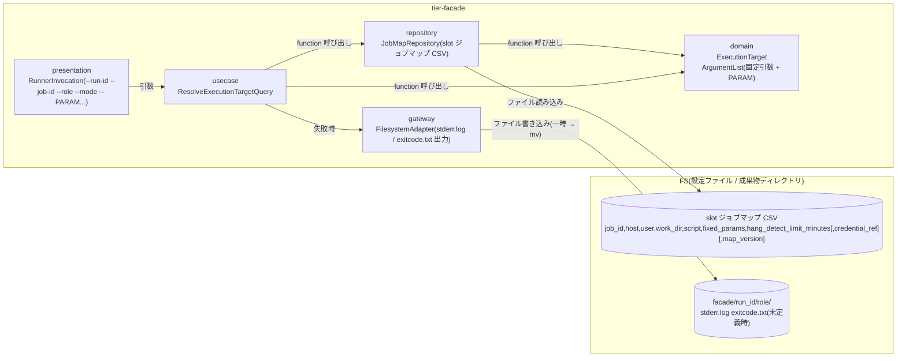
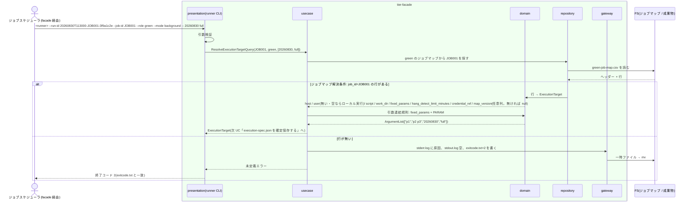

# ジョブマップで JOB_ID から実行先を解決する

## 概要

slot runner(`$BLUE_RUNNER` / `$GREEN_RUNNER`)が、自 slot のジョブマップ(CSV。1 行目ヘッダー、1 行 1 job_id)から JOB_ID に対応する host・user・script・work_dir・fixed_params(JSON 配列を格納する CSV セル)・hang_detect_limit_minutes と、末尾の任意列 credential_ref・map_version を解決する。host / user はローカル実行の slot では省略でき、両方無い(または両方空)ならローカル実行として解決する。実装版はジョブマップに持たず feature flag(BLUE_IMPL / GREEN_IMPL)が所有する。固定引数の後ろに facade から渡された PARAM... を順序を変えずに連結する。ジョブマップに JOB_ID の行が無い場合も Runner Result の 3 ファイルを可能な限り出力して非 0 で終了する。

## データフロー



| レイヤー | データモデル | 変換内容 |
|---------|------------|---------|
| presentation | RunnerInvocation | runner IF の引数検証(`--run-id` / `--job-id` / `--role` / `--mode` 必須、`--` 以降を PARAM 列に保持) |
| usecase | ResolveExecutionTargetQuery | ジョブマップ読み込み → 行検索 → 引数連結 → ExecutionTarget を返す。未定義なら Runner Result 3 ファイルを揃えて非 0 終了 |
| domain | ExecutionTarget / ArgumentList | CSV 1 行 → 実行先(host / user が無い・空ならローカル実行)。`fixed_params`(JSON 配列)を要素単位に展開し、PARAM... を末尾に順序保持で連結する純粋関数 |
| repository | JobMapRepository | `$RELAY_GATE_CONFIG_DIR/<slot>-job-map.csv` をヘッダー行付き CSV として読む(セルの二重引用符と `""` 二重化を 1 文字ずつの状態機械で解析。ヘッダー名で列を対応付ける)。job_id 完全一致で 1 行を返す |
| gateway | FilesystemAdapter | 未定義時の `stderr.log`(原因)/ `stdout.log`(空)/ `exitcode.txt`(`2`)の一時ファイル書き込みと `mv` |

## 処理フロー



## バリエーション一覧

| バリエーション名 | 値 | 処理内容 | 適用 tier | 適用箇所 |
|----------------|---|---------|----------|---------|
| 実装スロット | blue | `$RELAY_GATE_CONFIG_DIR/blue-job-map.csv` を読む | tier-facade | repository `job_map_repo` |
| 実装スロット | green | `$RELAY_GATE_CONFIG_DIR/green-job-map.csv` を読む | tier-facade | repository `job_map_repo` |
| 設定所有区分 | slot ジョブマップ | host・user・script・work_dir・fixed_params・hang_detect_limit_minutes(と任意列 credential_ref・map_version)の正本 | tier-facade | repository `job_map_repo` |
| 設定所有区分 | feature flag | runner 実体・slot・実装版(BLUE_IMPL / GREEN_IMPL)の正本。この UC では参照しない(facade が解決済みで、実装版は環境変数で runner に渡る。ジョブマップに実装版の列は無い) | tier-facade | — |
| Runner Result 成果物種別 | stderr.log | 未定義時に `error: job_id=JOB001 not found in job map slot=green map=<path>` を書く | tier-facade | gateway `filesystem_adapter` |
| Runner Result 成果物種別 | exitcode.txt | 未定義時に `2` | tier-facade | gateway `filesystem_adapter` |
| Runner Result 成果物種別 | stdout.log | 未定義時に空ファイル | tier-facade | gateway `filesystem_adapter` |
| ハング検知上限設定 | 60 分(導入時既定) | 列 `hang_detect_limit_minutes` をそのまま解決結果に含める | tier-facade | domain `ExecutionTarget` |
| ハング検知上限設定 | 0(検知対象外) | foreground role 用。値の意味は監視側で解釈し、runner は変換しない | tier-facade | domain `ExecutionTarget` |

## 分岐条件一覧

| 条件名 | 判定ルール | 適用 tier | 適用箇所 | BDD Scenario |
|--------|----------|----------|---------|-------------|
| ジョブマップ解決条件 | slot のジョブマップ(CSV。1 行目ヘッダー。列はヘッダー名で対応付け、必須列 `job_id` / `work_dir` / `script` / `fixed_params` / `hang_detect_limit_minutes`、任意列 `host` / `user`(両方あるか両方無い)/ `credential_ref` / `map_version`)に `job_id` 列が JOB_ID と完全一致する行が 1 行あるときだけ解決できる。`host` / `user` が両方無い、または両方の値が空ならローカル実行(runner のプロセスユーザーで実行し SSH しない)。片方だけある / 片方だけ空は検証 NG(exitcode.txt=2)。`fixed_params` セルは二重引用符で囲まれ内部の `""` を `"` に戻した JSON 配列文字列として解析する。無ければ exitcode.txt=2 と原因を含む stderr.log を出力して終了。重複行は先頭行を採用し実行ログに WARN(仮採用: validate-config.sh が重複を拒否するため実行時は発生しない前提) | tier-facade | usecase `resolve_execution_target` / repository `job_map_repo` | ジョブマップ未定義でも 3 ファイルを揃えて非 0 終了する(SPEC-003-02) / CSV の列名で読み替えなしに実行先を解決する(SPEC-004-04) / host と user の列が無いジョブマップはローカル実行として解決する(SPEC-004-04) |
| 引数連結規則 | `fixed_params` を JSON 配列として要素ごとに 1 引数に展開し、その後ろに PARAM... を順序どおり追加する。要素内の空白・カンマは 1 引数のまま維持。`[]` なら PARAM... だけ | tier-facade | domain `build_argument_list` | 固定引数の後ろに PARAM を順序保持で連結する(SPEC-004-02) |
| 設定所有区分 | 実行先は slot ジョブマップからだけ読む。feature flag・ジョブスケジューラのジョブ定義・runner 引数からは読まない | tier-facade | repository `job_map_repo` | ジョブマップの行から実行先を解決する(SPEC-004-01) |
| Runner Result 完備条件 | 解決失敗でも `stdout.log` / `stderr.log` / `exitcode.txt` を揃える。exitcode.txt は runner の終了コードと一致 | tier-facade | gateway `filesystem_adapter` | ジョブマップ未定義でも 3 ファイルを揃えて非 0 終了する(SPEC-003-02) |

## 計算ルール一覧

| 計算名 | 入力情報 | 計算式/ロジック | 出力情報 | 適用 tier |
|--------|---------|---------------|---------|----------|
| 引数連結 | fixed_params(JSON 配列文字列)、PARAM... | `args = parse_json_array(fixed_params) ++ PARAM...`。JSON 文字列要素のエスケープ(`\"` `\\`)を解除して 1 要素 = 1 引数。bash では配列 `"${args[@]}"` として保持する | ArgumentList | tier-facade |
| ジョブマップパス | RELAY_GATE_CONFIG_DIR、slot | `$RELAY_GATE_CONFIG_DIR/<slot>-job-map.csv`(仮採用) | map path | tier-facade |
| CSV 行の分解 | ヘッダー行、データ行 | カンマ区切り。セルは二重引用符で囲める(囲まない場合はカンマ・二重引用符を含められない)。囲んだセル内の `""` は `"` 1 文字。bash 単独の 1 文字ずつの状態機械で解析し、ネスト・複数行セルは不可(`error: csv quote is invalid line=N path: ...`)。行頭 `#` はコメント行、文字コード UTF-8、改行コードは LF。ヘッダー列名で位置を決める(列順に依存しない)。形式から外れた入力(NUL / 不正な文字コード / BOM / CR)の拒否、1 時点の内容だけで解決する保証、補助コマンドの失敗(exitcode.txt=6)は CLI 契約 `config_input_rules` に従う。候補行の絞り込みに `grep` などを使ってよい | ExecutionTarget | tier-facade |
| fixed_params セルの解析 | fixed_params セル | CSV 解析後の文字列(例 `"[""p1"",""p2 p3""]"` → `["p1","p2 p3"]`)を JSON 配列として解析する。空は `"[]"` または `[]` | fixed_params(JSON 配列) | tier-facade |

## 状態遷移一覧

| 状態モデル | 遷移元 | 遷移先 | トリガー | 事前条件 | 事後処理 | 適用 tier |
|-----------|--------|--------|---------|---------|---------|----------|
| 該当なし | — | — | この UC は状態を遷移させない(未定義時の slot 実行 FAILED は UC「実装スクリプトを実行して Runner Result を出力する」の exitcode 判定に含める) | — | — | — |

## 関連 RDRA モデル

| モデル種別 | 要素名 | 関連 |
|-----------|--------|------|
| 業務 | 実装切替業務 | この UC が属する業務 |
| BUC | 実装切替ジョブ実行フロー | この UC を含む BUC |
| アクター | 運用者 | 受益者 |
| 情報 | ジョブ起動要求 | JOB_ID と PARAM... |
| 情報 | ジョブマップ | 解決元。CSV(1 行目ヘッダー、1 行 1 job_id)。属性 job_id / host(省略可)/ user(省略可)/ work_dir / script / fixed_params(JSON 配列を格納する CSV セル)/ hang_detect_limit_minutes / credential_ref(末尾の任意列)/ map_version(末尾の任意列)。実装版の列は無い |
| 情報 | ハング検知上限設定 | 解決結果に含める hang_detect_limit_minutes |
| 情報 | Runner Result | 未定義時の 3 ファイル |
| 条件 | ジョブマップ解決条件 / 引数連結規則 / 設定所有区分 / Runner Result 完備条件 | 分岐条件一覧を参照 |
| バリエーション | 実装スロット / 設定所有区分 / Runner Result 成果物種別 / ハング検知上限設定 | バリエーション一覧を参照 |
| 画面 | slot runner ジョブマップ解決出力(→ CLI 出力) | stderr.log / exitcode.txt / 実行ログ |

## 関連 USDM

| REQ ID | SPEC ID | 対応 BDD Scenario |
|---|---|---|
| REQ-004 | SPEC-004-01 | ジョブマップの行から実行先を解決する(SPEC-004-01) |
| REQ-004 | SPEC-004-02 | 固定引数の後ろに PARAM を順序保持で連結する(SPEC-004-02) |
| REQ-004 | SPEC-004-04 | CSV の列名で読み替えなしに実行先を解決する(SPEC-004-04) / 二重引用符で囲んだ fixed_params セルを 2 引数として解析する(SPEC-004-04) / host と user の列が無いジョブマップはローカル実行として解決する(SPEC-004-04) / credential_ref と map_version の列が無くても解決できる(SPEC-004-04) |
| REQ-003 | SPEC-003-02 | ジョブマップ未定義でも 3 ファイルを揃えて非 0 終了する(SPEC-003-02) |

> 機械可読の正本は `spec-event.yaml` の `use_cases[].usdm`(本表と同内容)。「対応 BDD Scenario」列は本 UC の `Scenario:` 名(接尾の SPEC ID を含む完全名)を「 / 」で区切って列挙し、Scenario 名以外の補足は「※」以降に置く。区切りは人が読む用で、Scenario 名自体に「 / 」を含むものがあるため機械分割には使わず、機械照合は `spec-event.yaml` の `scenarios[]` を使う。

## E2E 完了条件(BDD)

### 正常系

```gherkin
Feature: ジョブマップで JOB_ID から実行先を解決する

  Scenario: ジョブマップの行から実行先を解決する(SPEC-004-01)
    Given green-job-map.csv のヘッダーが "job_id,host,user,work_dir,script,fixed_params,hang_detect_limit_minutes,credential_ref,map_version" である
    And 行 "JOB001,host-green-01,batch,/var/app/work,/opt/app/bin/job001.sh,[],60,ssh-key-green,map-v3" がある
    When facade が green runner を --run-id 20260830T113000-JOB001-3f9a1c2e --job-id JOB001 --role green --mode background で起動する
    Then runner は host=host-green-01 user=batch script=/opt/app/bin/job001.sh work_dir=/var/app/work hang_detect_limit_minutes=60 credential_ref=ssh-key-green map_version=map-v3 を解決する
    And 実行ログに "job map resolved job_id=JOB001 slot=green host=host-green-01 map_version=map-v3" が出る

  Scenario: CSV の列名で読み替えなしに実行先を解決する(SPEC-004-04)
    Given green-job-map.csv のヘッダーが元資料どおりの "job_id,host,user,work_dir,script,fixed_params,hang_detect_limit_minutes" である
    And 行 "JOB001,host-green-01,batch,/var/app/work,/opt/app/bin/job001.sh,[],60" がある
    When facade が green runner を --run-id 20260830T113000-JOB001-3f9a1c2e --job-id JOB001 --role green --mode background で起動する
    Then 列名の読み替えなしに host=host-green-01 user=batch script=/opt/app/bin/job001.sh work_dir=/var/app/work fixed_params=[] hang_detect_limit_minutes=60 が得られる
    And credential_ref と map_version は null として扱われる

  Scenario: 固定引数の後ろに PARAM を順序保持で連結する(SPEC-004-02)
    Given blue-job-map.csv の JOB001 行の fixed_params が ["p1","p2 p3"] である
    When facade が blue runner を --run-id 20260830T113000-JOB001-3f9a1c2e --job-id JOB001 --role blue --mode foreground -- a b で起動する
    Then 実装へ渡す引数は 4 個で、順に p1 / "p2 p3" / a / b である

  Scenario: 二重引用符で囲んだ fixed_params セルを 2 引数として解析する(SPEC-004-04)
    Given blue-job-map.csv の JOB001 行の fixed_params セルが "[""p1"",""p2 p3""]" と書かれている
    When facade が blue runner を --run-id 20260830T113000-JOB001-3f9a1c2e --job-id JOB001 --role blue --mode foreground で起動する
    Then 固定引数は p1 と "p2 p3" の 2 引数として得られ、空白とカンマは維持される

  Scenario: host と user の列が無いジョブマップはローカル実行として解決する(SPEC-004-04)
    Given blue-job-map.csv のヘッダーが "job_id,work_dir,script,fixed_params,hang_detect_limit_minutes" である
    And 行 "JOB001,/var/app/work,/opt/app/bin/job001.sh,[],0" がある
    When facade が blue runner を --run-id 20260830T113000-JOB001-3f9a1c2e --job-id JOB001 --role blue --mode foreground で起動する
    Then runner は host=null user=null のローカル実行として解決する(SSH しない)

  Scenario: credential_ref と map_version の列が無くても解決できる(SPEC-004-04)
    Given green-job-map.csv のヘッダーに credential_ref と map_version が無い
    When facade が green runner を --run-id 20260830T113000-JOB001-3f9a1c2e --job-id JOB001 --role green --mode background で起動する
    Then エラーにならず credential_ref=null map_version=null で解決する
    And 実行ログの "job map resolved" 行は map_version=- を含む

  Scenario: 空の固定引数は PARAM だけを渡す
    Given blue-job-map.csv の JOB002 行の fixed_params が [] である
    When facade が blue runner を --run-id 20260830T113000-JOB002-5c7d9e0f --job-id JOB002 --role blue --mode foreground -- 20260830 で起動する
    Then 実装へ渡す引数は 1 個で 20260830 である
```

### 異常系

```gherkin
  Scenario: ジョブマップ未定義でも 3 ファイルを揃えて非 0 終了する(SPEC-003-02)
    Given RELAY_GATE_CONFIG_DIR は /etc/relay-gate である
    And green-job-map.csv に job_id=JOB999 の行が無い
    When facade が green runner を --run-id 20260830T113000-JOB999-a1b2c3d4 --job-id JOB999 --role green --mode background で起動する
    Then runner は終了コード 2 で終了する
    And facade/20260830T113000-JOB999-a1b2c3d4/green/ に stdout.log(空)・stderr.log・exitcode.txt が揃う
    And exitcode.txt の中身は "2" である
    And stderr.log に "error: job_id=JOB999 not found in job map slot=green map=/etc/relay-gate/green-job-map.csv" が含まれる

  Scenario: ジョブマップファイルが無い場合も 3 ファイルを揃える
    Given RELAY_GATE_CONFIG_DIR は /etc/relay-gate である
    And /etc/relay-gate/green-job-map.csv が存在しない
    When facade が green runner を --run-id 20260830T113000-JOB001-3f9a1c2e --job-id JOB001 --role green --mode background で起動する
    Then runner は終了コード 2 で終了し、exitcode.txt の中身は "2" である
    And stderr.log に "error: job map not found slot=green map=/etc/relay-gate/green-job-map.csv" が含まれる

  Scenario: fixed_params が JSON 配列でない行は解決失敗にする
    Given green-job-map.csv の 3 行目 JOB003 の fixed_params セルが "p1 p2"(配列でない)である
    When facade が green runner を --run-id 20260830T113000-JOB003-6d8e0f1a --job-id JOB003 --role green --mode background で起動する
    Then runner は終了コード 2 で終了し、stderr.log に "error: fixed_params is not a json array of strings line=3 job_id=JOB003 value=p1 p2" が含まれる

  Scenario: host と user の片方だけが空の行は解決失敗にする
    Given green-job-map.csv の 2 行目 JOB004 の host が host-green-01 で user が空である
    When facade が green runner を --run-id 20260830T113000-JOB004-7e9f1a2b --job-id JOB004 --role green --mode background で起動する
    Then runner は終了コード 2 で終了し、stderr.log に "error: user is empty line=2 job_id=JOB004 value=" が含まれる

  Scenario: 閉じていない二重引用符のセルは解決失敗にする
    Given RELAY_GATE_CONFIG_DIR は /etc/relay-gate である
    And green-job-map.csv の 2 行目の fixed_params セルが "[""p1"" で閉じていない
    When facade が green runner を --run-id 20260830T113000-JOB001-3f9a1c2e --job-id JOB001 --role green --mode background で起動する
    Then runner は終了コード 2 で終了し、stderr.log に "error: csv quote is invalid line=2 path: /etc/relay-gate/green-job-map.csv" が含まれる
```

## ティア別仕様

- [facade / slot runner ティア](tier-facade.md)

### 統合契約

- [CLI コマンド契約](../../../_cross-cutting/api/cli-command-contract.yaml)(runner IF を uses)
- [AsyncAPI Spec](../../../_cross-cutting/api/asyncapi.yaml)(この UC は publish / subscribe しない)
- 設定契約の正本: [slot ごとのジョブマップを定義する](../../../適用構成業務/適用構成定義フロー/slot%20ごとのジョブマップを定義する/tier-facade.md)。設定ファイル共通の入力の守備範囲は CLI 契約 `config_input_rules`、bash の最低版(5.0)と行単位の外部コマンド利用の許容は `conventions.runtime_prerequisites`
