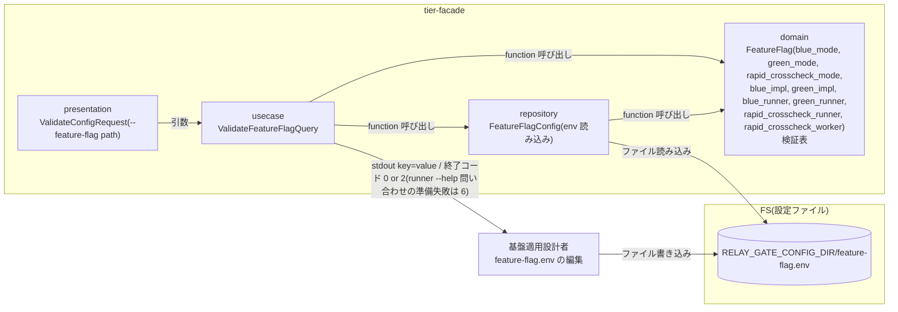
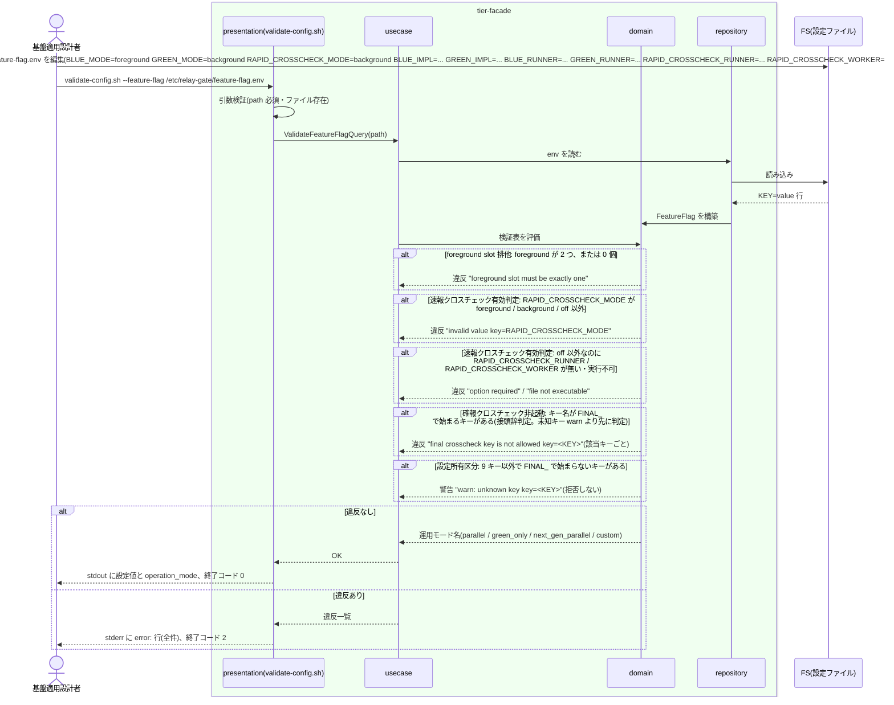

# feature flag を設定する

## 概要

基盤適用設計者が、slot(blue / green)ごとの実行モード(foreground / background / off)、実装版(`BLUE_IMPL` / `GREEN_IMPL`)、runner 実体スクリプト(`BLUE_RUNNER` / `GREEN_RUNNER`)、速報クロスチェックの制御(`RAPID_CROSSCHECK_MODE`: foreground / background / off)とその runner / worker 実体(`RAPID_CROSSCHECK_RUNNER` / `RAPID_CROSSCHECK_WORKER`)を、元の方針資料どおりの 9 キーの feature flag 設定(env 形式)として定義し、`validate-config.sh --feature-flag <path>` で検証する。設定版は持たない。両 slot が foreground にならない組合せで並行稼働・単独本番・次世代実装との並行稼働を表現し、ジョブスケジューラのジョブ定義を改修せずに運用モードを切り替える。確報クロスチェックの制御は feature flag に含めない。確報の制御キーの範囲は「キー名が `FINAL_` で始まるすべてのキー」(接頭辞判定。正本は CLI 契約 `config_files.feature-flag.env.validation_rules`)で、feature-flag.env にあれば検証 NG にする。

## データフロー



| レイヤー | データモデル | 変換内容 |
|---------|------------|---------|
| presentation | ValidateConfigRequest | `--feature-flag <path>` の引数検証。検証結果を終了コード 0 / 2 へ |
| usecase | ValidateFeatureFlagQuery | ファイル読み込み → 検証表の全項目を評価 → 違反を全件収集(最初の 1 件で止めない)→ 結果出力 |
| domain | FeatureFlag | 9 キーの列挙・必須・foreground 排他・foreground 存在・実体パス(runner / 速報 runner / worker)の実行可否・運用モード名の導出(純粋関数) |
| repository | FeatureFlagConfig | env 形式(`KEY=value`、`#` コメント、空行)の読み込み。シェル展開は行わない |

## 処理フロー



## バリエーション一覧

| バリエーション名 | 値 | 処理内容 | 適用 tier | 適用箇所 |
|----------------|---|---------|----------|---------|
| 実装スロット | blue | `BLUE_MODE` / `BLUE_IMPL` / `BLUE_RUNNER` | tier-facade | domain `FeatureFlag` |
| 実装スロット | green | `GREEN_MODE` / `GREEN_IMPL` / `GREEN_RUNNER` | tier-facade | domain `FeatureFlag` |
| slot 実行モード | foreground | 同時に 1 slot だけ許可。対応する `<SLOT>_IMPL` と `<SLOT>_RUNNER` が必須 | tier-facade | domain `validate_feature_flag` |
| slot 実行モード | background | 許可。対応する `<SLOT>_IMPL` と `<SLOT>_RUNNER` が必須 | tier-facade | domain `validate_feature_flag` |
| slot 実行モード | off | 許可。`<SLOT>_IMPL` / `<SLOT>_RUNNER` の検証をスキップ | tier-facade | domain `validate_feature_flag` |
| 運用モード | 並行稼働 | foreground / background / background → `operation_mode=parallel` | tier-facade | domain `derive_operation_mode` |
| 運用モード | 新実装の単独本番 | off / foreground / off → `operation_mode=green_only` | tier-facade | domain `derive_operation_mode` |
| 運用モード | 次世代実装との並行稼働 | background / foreground / background → `operation_mode=next_gen_parallel` | tier-facade | domain `derive_operation_mode` |
| 速報クロスチェックモード | foreground | 速報有効。`RAPID_CROSSCHECK_RUNNER` / `RAPID_CROSSCHECK_WORKER` が必須(存在・実行可能) | tier-facade | domain `validate_feature_flag` |
| 速報クロスチェックモード | background | 速報有効。検証は foreground と同じ(両値の挙動差は RDRA に定義が無いため spec では区別しない) | tier-facade | domain `validate_feature_flag` |
| 速報クロスチェックモード | off | 速報無効。管理 DB 不要。`RAPID_CROSSCHECK_RUNNER` / `RAPID_CROSSCHECK_WORKER` の検証をスキップ | tier-facade | domain `validate_feature_flag` |
| 設定所有区分 | feature flag | 実装スロット・runner の割当・実装版・速報クロスチェックの制御と実体の正本 | tier-facade | repository `feature_flag_config` |

## 分岐条件一覧

| 条件名 | 判定ルール | 適用 tier | 適用箇所 | BDD Scenario |
|--------|----------|----------|---------|-------------|
| foreground slot 排他 | `BLUE_MODE=foreground` かつ `GREEN_MODE=foreground` は検証 NG(終了コード 2)。表: 縦 blue × 横 green で foreground × foreground のみ拒否。foreground が 0 個も同じ文言で NG | tier-facade | domain `validate_feature_flag` | 両 slot foreground の feature flag は検証で拒否される(SPEC-001-02) |
| 設定所有区分 | feature flag には元資料の 9 キー(実装スロットの mode・実装版・runner、RAPID_CROSSCHECK_MODE と速報 runner / worker 実体)だけを置く。設定版は持たない。実行先・ハング検知上限・比較対象は置かない(ジョブマップ / クロスチェックジョブマップの所有)。9 キー以外の未知キーは `warn:`(拒否しない。ただしキー名が `FINAL_` で始まるキーは未知キーではなく条件「確報クロスチェック非起動」の違反) | tier-facade | domain `validate_feature_flag` | 元資料の 9 キーの feature flag は未知キー警告なしで検証を通過する(SPEC-001-01) |
| 速報クロスチェック有効判定 | `RAPID_CROSSCHECK_MODE` は foreground / background / off の 3 値。判定は「off か off 以外か」で行う: off 以外(foreground / background)は runner が完了通知を送信し速報管理 DB へ書き込むため `RAPID_CROSSCHECK_RUNNER` / `RAPID_CROSSCHECK_WORKER` を必須にする。off は完了通知を送信せず速報管理 DB へ接続も書込みもしない(parallel_run も作らない) | tier-facade | domain `validate_feature_flag` | RAPID_CROSSCHECK_MODE の列挙外は拒否される / 速報有効時は速報 runner と worker の実体が必須である(SPEC-005-04) |
| 確報クロスチェック非起動 | キー名が `FINAL_` で始まるキー(接頭辞判定。キー名の列挙ではない。大文字小文字を区別)が 1 つでもあれば検証 NG(該当キーごとに `error: final crosscheck key is not allowed key=<KEY>`、終了コード 2)。`FINAL_CROSSCHECK_MODE` のような制御キーも、確報クロスチェック設定(final-crosscheck.env)のキー `FINAL_DB_CONN_REF` 等の誤配置も同じ。`FINAL_` で始まるキーは未知キー(warn)にしない。範囲の正本は CLI 契約 `config_files.feature-flag.env.validation_rules` | tier-facade | domain `validate_feature_flag` | 確報の制御キーは拒否される(SPEC-001-01) / FINAL_ で始まる確報設定のキーは未知キーではなく拒否される(SPEC-001-01) |

## 計算ルール一覧

| 計算名 | 入力情報 | 計算式/ロジック | 出力情報 | 適用 tier |
|--------|---------|---------------|---------|----------|
| 運用モード名 | BLUE_MODE、GREEN_MODE、RAPID_CROSSCHECK_MODE | (foreground, background, background) → parallel / (off, foreground, off) → green_only / (background, foreground, background) → next_gen_parallel / それ以外の有効な組合せ → custom(RDRA バリエーション「運用モード」) | operation_mode | tier-facade |
| foreground 数 | BLUE_MODE、GREEN_MODE | foreground の個数。1 → OK、2 または 0 → `error: foreground slot must be exactly one blue_mode=<v> green_mode=<v>` | 検証結果 | tier-facade |

## 状態遷移一覧

| 状態モデル | 遷移元 | 遷移先 | トリガー | 事前条件 | 事後処理 | 適用 tier |
|-----------|--------|--------|---------|---------|---------|----------|
| 該当なし | — | — | 設定 UC。状態を遷移させない | — | — | — |

## 関連 RDRA モデル

| モデル種別 | 要素名 | 関連 |
|-----------|--------|------|
| 業務 | 適用構成業務 | この UC が属する業務 |
| BUC | 適用構成定義フロー | この UC を含む BUC |
| アクター | 基盤適用設計者 | 提供者(定義する) |
| 情報 | feature flag 設定 | 定義対象。属性は 9 キー(BLUE_MODE / GREEN_MODE / RAPID_CROSSCHECK_MODE / BLUE_IMPL / GREEN_IMPL / BLUE_RUNNER / GREEN_RUNNER / RAPID_CROSSCHECK_RUNNER / RAPID_CROSSCHECK_WORKER)。設定版は持たない |
| 情報 | slot runner 割当 | BLUE_RUNNER / GREEN_RUNNER(詳細は UC「slot runner の実体スクリプトを割り当てる」) |
| 情報 | 実行設定(execution-spec) | `slots.<role>.impl_version` の出所が BLUE_IMPL / GREEN_IMPL(保存は UC「execution-spec.json を確定保存する」) |
| 条件 | foreground slot 排他 / 設定所有区分 / 速報クロスチェック有効判定 / 確報クロスチェック非起動 | 分岐条件一覧を参照 |
| バリエーション | 速報クロスチェックモード(foreground / background / off)/ 運用モード / slot 実行モード / 実装スロット / 設定所有区分 | バリエーション一覧を参照 |
| 画面 | feature flag 設定検証出力(→ CLI 出力) | validate-config.sh の stdout / stderr / 終了コード |

## 関連 USDM

| REQ ID | SPEC ID | 対応 BDD Scenario |
|---|---|---|
| REQ-001 | SPEC-001-01 | 並行稼働モードの feature flag を検証する(SPEC-001-01) / 元資料の 9 キーの feature flag は未知キー警告なしで検証を通過する(SPEC-001-01) / off でない slot の実装版が無い feature flag は拒否される(SPEC-001-01) / 確報の制御キーは拒否される(SPEC-001-01) / FINAL_ で始まる確報設定のキーは未知キーではなく拒否される(SPEC-001-01) ※ AC「確報クロスチェックの制御設定は feature flag に含まれない」の定義側(拒否するキーの範囲 = キー名が `FINAL_` で始まるキー)は本 UC の 2 Scenario で覆い、実行側(facade は確報クロスチェックを起動しない)は UC〈slot 実行モードを選択して runner を起動する〉で覆う。AC「実装版は BLUE_IMPL / GREEN_IMPL を出所とする」の実行側は UC〈execution-spec.json を確定保存する〉、AC「完了通知は RAPID_CROSSCHECK_RUNNER へ送る」の実行側は UC〈速報クロスチェック runner へ完了通知を送信する〉で覆う |
| REQ-001 | SPEC-001-02 | 両 slot foreground の feature flag は検証で拒否される(SPEC-001-02) |
| REQ-001 | SPEC-001-03 | 単独本番モードの feature flag を検証する(SPEC-001-03) / 次世代並行稼働モードの feature flag を検証する(SPEC-001-03) / ジョブ定義を変えずに feature flag だけで運用モードを切り替える(SPEC-001-03) ※ 検証側。AC「ジョブ定義を変更しないで feature flag だけを変更すると並行稼働と単独本番を切り替えられる」の実行側(green の結果が返り、blue は起動されず、管理 DB へ接続しない)は UC〈slot 実行モードを選択して runner を起動する〉の Scenario「新実装の単独本番モードでは green だけを起動し管理 DB に触れない(SPEC-001-03)」で覆う |
| REQ-005 | SPEC-005-04 | 単独本番モードの feature flag を検証する(SPEC-001-03) / 速報有効時は速報 runner と worker の実体が必須である(SPEC-005-04) ※ 定義側。AC「off では DB へ何も書き込まれない」「background / foreground では完了通知を送信し速報管理 DB へ書き込む」の実行側は UC〈slot 実行モードを選択して runner を起動する〉〈速報クロスチェック runner へ完了通知を送信する〉で覆う |

> 機械可読の正本は `spec-event.yaml` の `use_cases[].usdm`(本表と同内容)。「対応 BDD Scenario」列は本 UC の `Scenario:` 名(接尾の SPEC ID を含む完全名)を「 / 」で区切って列挙し、Scenario 名以外の補足は「※」以降に置く。区切りは人が読む用で、Scenario 名自体に「 / 」を含むものがあるため機械分割には使わず、機械照合は `spec-event.yaml` の `scenarios[]` を使う。

## E2E 完了条件(BDD)

### 正常系

```gherkin
Feature: feature flag を設定する

  Scenario: 並行稼働モードの feature flag を検証する(SPEC-001-01)
    Given /etc/relay-gate/feature-flag.env に BLUE_MODE=foreground GREEN_MODE=background RAPID_CROSSCHECK_MODE=background BLUE_IMPL=blue-2.3.1 GREEN_IMPL=green-1.4.0 BLUE_RUNNER=/opt/relay-gate/runners/blue-runner.sh GREEN_RUNNER=/opt/relay-gate/runners/green-runner.sh RAPID_CROSSCHECK_RUNNER=/opt/relay-gate/bin/rapid-crosscheck-runner.sh RAPID_CROSSCHECK_WORKER=/opt/relay-gate/bin/rapid-crosscheck-worker.sh がある
    And 両 runner・速報 runner・速報 worker は実行可能ファイルで、両 runner は --help に "runner-if-version=1" を返す
    And /etc/relay-gate/blue-job-map.csv と /etc/relay-gate/green-job-map.csv が存在する
    When 基盤適用設計者が validate-config.sh --feature-flag /etc/relay-gate/feature-flag.env を実行する
    Then 終了コード 0 で終了する
    And stdout に blue_mode=foreground green_mode=background blue_impl=blue-2.3.1 green_impl=green-1.4.0 rapid_crosscheck_mode=background operation_mode=parallel が出る

  Scenario: 元資料の 9 キーの feature flag は未知キー警告なしで検証を通過する(SPEC-001-01)
    Given feature-flag.env に BLUE_MODE / GREEN_MODE / RAPID_CROSSCHECK_MODE / BLUE_IMPL / GREEN_IMPL / BLUE_RUNNER / GREEN_RUNNER / RAPID_CROSSCHECK_RUNNER / RAPID_CROSSCHECK_WORKER の 9 キーだけを有効な値で書いた
    When validate-config.sh --feature-flag を実行する
    Then 終了コード 0 で終了する
    And stderr に "warn: unknown key" で始まる行は 1 行も出ない

  Scenario: 単独本番モードの feature flag を検証する(SPEC-001-03)
    Given feature-flag.env に BLUE_MODE=off GREEN_MODE=foreground RAPID_CROSSCHECK_MODE=off GREEN_IMPL=green-1.4.0 GREEN_RUNNER=/opt/relay-gate/runners/green-runner.sh がある
    And BLUE_IMPL / BLUE_RUNNER / RAPID_CROSSCHECK_RUNNER / RAPID_CROSSCHECK_WORKER は未設定である
    And green runner は実行可能で --help に "runner-if-version=1" を返し、/etc/relay-gate/green-job-map.csv が存在する
    When validate-config.sh --feature-flag を実行する
    Then 終了コード 0 で stdout に operation_mode=green_only が出る

  Scenario: 次世代並行稼働モードの feature flag を検証する(SPEC-001-03)
    Given feature-flag.env に BLUE_MODE=background GREEN_MODE=foreground RAPID_CROSSCHECK_MODE=background BLUE_IMPL=green-1.4.0 GREEN_IMPL=green-2.0.0 BLUE_RUNNER=/opt/relay-gate/runners/blue-runner.sh GREEN_RUNNER=/opt/relay-gate/runners/green-runner.sh RAPID_CROSSCHECK_RUNNER=/opt/relay-gate/bin/rapid-crosscheck-runner.sh RAPID_CROSSCHECK_WORKER=/opt/relay-gate/bin/rapid-crosscheck-worker.sh がある
    And 両 runner・速報 runner・速報 worker は実行可能で、両 runner は --help に "runner-if-version=1" を返し、/etc/relay-gate/blue-job-map.csv と green-job-map.csv が存在する
    When validate-config.sh --feature-flag を実行する
    Then 終了コード 0 で stdout に operation_mode=next_gen_parallel が出る

  Scenario: ジョブ定義を変えずに feature flag だけで運用モードを切り替える(SPEC-001-03)
    Given ジョブスケジューラのジョブ定義は facade.sh JOB001 のままである
    And feature-flag.env は並行稼働の組合せ(BLUE_MODE=foreground GREEN_MODE=background RAPID_CROSSCHECK_MODE=background)で、validate-config.sh --feature-flag が終了コード 0 で stdout に operation_mode=parallel を返した
    When feature-flag.env を単独本番の組合せ(BLUE_MODE=off GREEN_MODE=foreground RAPID_CROSSCHECK_MODE=off)へ変更して validate-config.sh --feature-flag を実行する
    Then 終了コード 0 で stdout に operation_mode=green_only が出る
    And stderr に "error:" で始まる行は出ない
    And ジョブスケジューラのジョブ定義は変更していない
```

> 切り替え後の実行(green の結果が返り、blue は起動されず、管理 DB へ接続しない)は UC「slot 実行モードを選択して runner を起動する」の Scenario「新実装の単独本番モードでは green だけを起動し管理 DB に触れない(SPEC-001-03)」で検証する。本 UC の Scenario が判定する出力は `validate-config.sh --feature-flag` の終了コード・stdout・stderr だけで、「ジョブ定義は変更していない」はテストが facade.sh の起動やジョブ定義に触れないことを表す前提条件である。

### 異常系

```gherkin
  Scenario: 両 slot foreground の feature flag は検証で拒否される(SPEC-001-02)
    Given feature-flag.env に BLUE_MODE=foreground GREEN_MODE=foreground がある
    When validate-config.sh --feature-flag を実行する
    Then 終了コード 2 で stderr に "error: foreground slot must be exactly one blue_mode=foreground green_mode=foreground" が出る

  Scenario: RAPID_CROSSCHECK_MODE の列挙外は拒否される
    Given feature-flag.env に RAPID_CROSSCHECK_MODE=on がある
    When validate-config.sh --feature-flag を実行する
    Then 終了コード 2 で stderr に "error: invalid value key=RAPID_CROSSCHECK_MODE value=on" と "hint: use foreground, background or off" が出る

  Scenario: 速報有効時は速報 runner と worker の実体が必須である(SPEC-005-04)
    Given feature-flag.env に RAPID_CROSSCHECK_MODE=background があり RAPID_CROSSCHECK_RUNNER が未設定、RAPID_CROSSCHECK_WORKER=/opt/relay-gate/bin/missing-worker.sh は存在しない
    When validate-config.sh --feature-flag を実行する
    Then 終了コード 2 で stderr に "error: option required option=RAPID_CROSSCHECK_RUNNER path: /etc/relay-gate/feature-flag.env" と "error: file not executable key=RAPID_CROSSCHECK_WORKER path=/opt/relay-gate/bin/missing-worker.sh" の両方が出る

  Scenario: off でない slot の実装版が無い feature flag は拒否される(SPEC-001-01)
    Given feature-flag.env に GREEN_MODE=foreground があり GREEN_IMPL が未設定である
    When validate-config.sh --feature-flag を実行する
    Then 終了コード 2 で stderr に "error: option required option=GREEN_IMPL path: /etc/relay-gate/feature-flag.env" が出る

  Scenario: 確報の制御キーは拒否される(SPEC-001-01)
    Given feature-flag.env に FINAL_CROSSCHECK_MODE=background がある
    When validate-config.sh --feature-flag を実行する
    Then 終了コード 2 で stderr に "error: final crosscheck key is not allowed key=FINAL_CROSSCHECK_MODE" が出る

  Scenario: FINAL_ で始まる確報設定のキーは未知キーではなく拒否される(SPEC-001-01)
    Given feature-flag.env の 9 キー・両 runner と速報 runner / worker の実体・blue / green のジョブマップは、Scenario「並行稼働モードの feature flag を検証する(SPEC-001-01)」の Given と同じ有効な状態である(単体なら終了コード 0 になる)
    And feature-flag.env に FINAL_DB_CONN_REF=final-db の 1 行を加えた(FINAL_ で始まるが FINAL_CROSSCHECK_ で始まらないキー)
    When validate-config.sh --feature-flag を実行する
    Then 終了コード 2 で stderr に "error: final crosscheck key is not allowed key=FINAL_DB_CONN_REF" が出る
    And stderr の "error:" で始まる行はその 1 行だけである
    And stderr に "warn: unknown key key=FINAL_DB_CONN_REF" で始まる行は出ない

  Scenario: 違反は全件まとめて報告される
    Given feature-flag.env に BLUE_MODE=parallel GREEN_MODE=foreground RAPID_CROSSCHECK_MODE=maybe がある
    When validate-config.sh --feature-flag を実行する
    Then 終了コード 2 で stderr に "error: invalid value key=BLUE_MODE value=parallel" と "error: invalid value key=RAPID_CROSSCHECK_MODE value=maybe" の両方が出る(各行に "hint: use foreground, background or off" が続く)
```

## ティア別仕様

- [facade / slot runner ティア](tier-facade.md)

### 統合契約

- [CLI コマンド契約](../../../_cross-cutting/api/cli-command-contract.yaml)(`validate-config.sh --feature-flag` を defines。feature-flag.env の入力の守備範囲(バイト・改行の異常の拒否、1 時点の内容だけで判定、内部障害の終了コード 6)は `config_input_rules`(`env_files`)に従う。bash の最低版は `conventions.runtime_prerequisites`)
- [出力規約](../../../_cross-cutting/ux-ui/ui-design.md)(stderr の `key=` / `value=` / `path:` に出す任意入力は「制御文字の表記」の可視表記にする。tier-facade.md の出力契約と Scenario「値に含まれる制御文字を可視表記で出力する」)
- [AsyncAPI Spec](../../../_cross-cutting/api/asyncapi.yaml)(この UC は publish / subscribe しない)
- 読み手: [slot 実行モードを選択して runner を起動する](../../../実装切替業務/実装切替ジョブ実行フロー/slot%20実行モードを選択して%20runner%20を起動する/spec.md)
